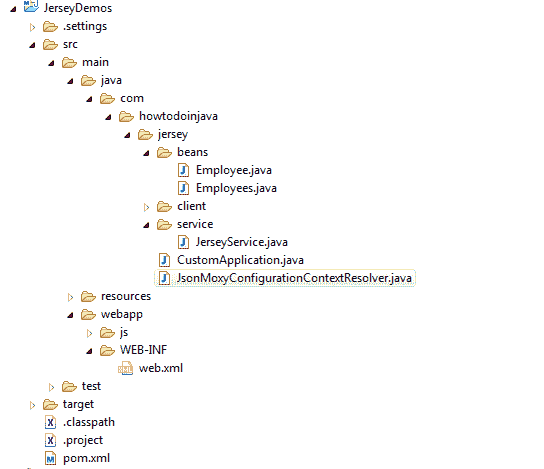

# Jersey + MOXy JSON 示例

> 原文： [https://howtodoinjava.com/jersey/jax-rs-jersey-moxy-json-example/](https://howtodoinjava.com/jersey/jax-rs-jersey-moxy-json-example/)

本教程说明**如何在 Jersey 2.x** 中使用 MOXy JSON 功能。 MOXy 是 Jersey 2.x 中的**默认 JSON 绑定供应器**。 尽管由于性能原因，我个人还是更喜欢 [**Jackson**](http://jersey.576304.n2.nabble.com/Jackson-vs-MOXy-td7581625.html)，而不是 MOXy。

```java
Table of Contents

MOXy maven dependencies/changes
REST API code
Model bean changes
Manually adding MoxyJsonFeature
Customize behavior using MoxyJsonConfig
Demo
```

## MOXy Maven 依赖项/更改

MOXy 媒体模块是 Jersey 2.x 中的模块之一，您无需在其中明确注册其功能，例如 `MoxyJsonFeature`。 一旦 Jersey 检测到添加了它的存在，它就会自动注册。 因此，只需在`pom.xml`中添加 MOXy 依赖项就可以完成一半的工作。

```java
<dependency>
	<groupId>org.glassfish.jersey.media</groupId>
	<artifactId>jersey-media-moxy</artifactId>
	<version>2.19</version>
</dependency>

```

## REST API 代码

在编写 API 的服务端，您需要使用`@Produces(MediaType.APPLICATION_JSON)`注解启用 JSON 媒体类型。

#### `JerseyService.java`

```java
@Path("/employees")
public class JerseyService 
{
	@GET
	@Produces(MediaType.APPLICATION_JSON)
	public Employees getAllEmployees() 
	{
		Employees list = new Employees();
		list.setEmployeeList(new ArrayList<Employee>());

		list.getEmployeeList().add(new Employee(1, "Lokesh Gupta"));
		list.getEmployeeList().add(new Employee(2, "Alex Kolenchiskey"));
		list.getEmployeeList().add(new Employee(3, "David Kameron"));

		return list;
	}
}	

```

## 模型 bean 更改

在模型 bean 方面，您无需放置任何注解或任何配置。 默认情况下它将起作用。 您甚至也不需要添加任何根注解。

#### `Employees.java`

```java
public class Employees 
{
	private List<Employee> employeeList;

	public List<Employee> getEmployeeList() {
		return employeeList;
	}

	public void setEmployeeList(List<Employee> employeeList) {
		this.employeeList = employeeList;
	}
}

```

#### `Employee.java`

```java
public class Employee 
{
	private Integer id;
	private String name;

	public Employee() {

	}

	public Employee(Integer id, String name) {
		this.id  = id;
		this.name = name;
	}

	public Integer getId() {
		return id;
	}

	public void setId(Integer id) {
		this.id = id;
	}

	public String getName() {
		return name;
	}

	public void setName(String name) {
		this.name = name;
	}

	@Override
	public String toString() {
		return "Employee [id=" + id + ", name=" + name + "]";
	}
}

```

## 手动添加`MoxyJsonFeature`

尽管`MoxyJsonFeature`是自动注册的，但是如果您希望手动注册，则可以按以下配置添加它。

```java
public class CustomApplication extends Application
{
	//Add Service APIs
	@Override
	public Set<Class<?>> getClasses() 
	{
		Set<Class<?>> resources = new HashSet<Class<?>>();

		//register REST modules
		resources.add(JerseyService.class);

		//Manually adding MOXyJSONFeature
		resources.add(org.glassfish.jersey.moxy.json.MoxyJsonFeature.class);

		//Configure Moxy behavior
		resources.add(JsonMoxyConfigurationContextResolver.class);

		return resources;
	}
}

```

并将此`Application`类添加到`web.xml`文件中。

```java
<!DOCTYPE web-app PUBLIC
 "-//Sun Microsystems, Inc.//DTD Web Application 2.3//EN"
 "http://java.sun.com/dtd/web-app_2_3.dtd" >

<web-app>

	<display-name>Archetype Created Web Application</display-name>

	<servlet>
		<servlet-name>jersey-serlvet</servlet-name>
		<servlet-class>org.glassfish.jersey.servlet.ServletContainer</servlet-class>
		<init-param>
			<param-name>javax.ws.rs.Application</param-name>
			<param-value>com.howtodoinjava.jersey.CustomApplication</param-value>
		</init-param>
		<load-on-startup>1</load-on-startup>
	</servlet>

	<servlet-mapping>
		<servlet-name>jersey-serlvet</servlet-name>
		<url-pattern>/rest/*</url-pattern>
	</servlet-mapping>

</web-app>

```

## 使用`MoxyJsonConfig`自定义行为

MOXy 在 JAXB 之上提供了某些功能，您可以通过提供`MoxyJsonConfig`实现来启用/禁用这些功能。

```java
//Register ContextResolver<MoxyJsonConfig> to override 
//default behavior of marshaling/un-marshaling attributes

@Provider
public class JsonMoxyConfigurationContextResolver implements ContextResolver<MoxyJsonConfig> 
{

	private final MoxyJsonConfig config;

	public JsonMoxyConfigurationContextResolver() 
	{
		final Map<String, String> namespacePrefixMapper = new HashMap<String, String>();
		namespacePrefixMapper.put("http://www.w3.org/2001/XMLSchema-instance", "xsi");

		config = new MoxyJsonConfig()
				.setNamespacePrefixMapper(namespacePrefixMapper)
				.setNamespaceSeparator(':')
				.setAttributePrefix("")
				.setValueWrapper("value")
				.property(JAXBContextProperties.JSON_WRAPPER_AS_ARRAY_NAME, true)
				.setFormattedOutput(true)
				.setIncludeRoot(true)
				.setMarshalEmptyCollections(true);
	}

	@Override
	public MoxyJsonConfig getContext(Class<?> objectType) 
	{
		return config;
	}
}

```

`JsonMoxyConfigurationContextResolver`已被添加到上面的`CustomApplication`类中的行号 16。

## 演示

只需将您的应用部署在任何服务器上，然后单击 URL：`http://localhost:8080/JerseyDemos/rest/employees`

这将产生以下输出。

```java
{
  "employeeList": [
    {
      "id": 1,
      "name": "Lokesh Gupta"
    },
    {
      "id": 2,
      "name": "Alex Kolenchiskey"
    },
    {
      "id": 3,
      "name": "David Kameron"
    }
  ]
}
```

以下是演示应用中上述文件的层次结构。



Jersey 2.x MOXy JSON 示例应用结构


在下面将您的问题和评论发送给我。

**祝您学习愉快！**

**参考**： [https://jersey.java.net/documentation/latest/media.html#json.moxy](https://jersey.java.net/documentation/latest/media.html#json.moxy)