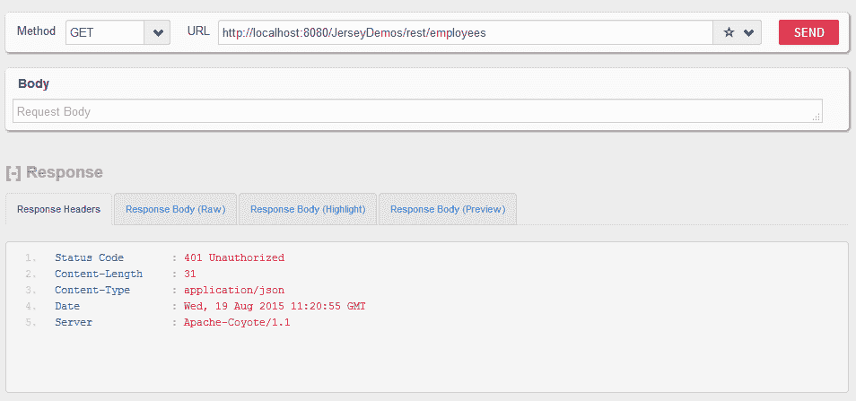
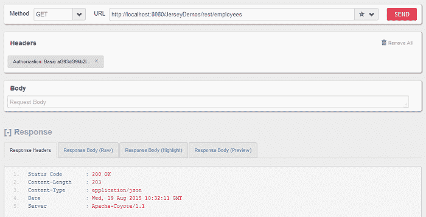

# Jersey REST API 安全示例

> 原文： [https://howtodoinjava.com/jersey/jersey-rest-security/](https://howtodoinjava.com/jersey/jersey-rest-security/)

在此 **Jersey rest 安全**示例中，我们将学习**通过基本认证**保护 Jersey REST API 的安全。 这将强制每个用户提供用户名/密码以认证到门户。 另外，用户还必须具有一定级别的角色。 我从为 [RESTEasy API 安全性](https://howtodoinjava.com/resteasy/jax-rs-2-0-resteasy-3-0-2-final-security-tutorial/)创建的另一个示例扩展了此示例，并使用[`ContainerRequestFilter`](https://jax-rs-spec.java.net/nonav/2.0-SNAPSHOT/apidocs/javax/ws/rs/container/ContainerRequestFilter.html)实现在用户登陆实际的 REST API 之前验证其访问权限。

```java
Table of Contents

1\. Create request authentication filter
2\. Register AuthenticationFilter with ResourceConfig
3\. Secure REST APIs
4\. Test Jersey AuthenticationFilter
```

## 1\. 创建请求认证过滤器

我们知道 *JAX-RS 2.0* 具有用于处理请求前和请求的过滤器，因此我们将使用`ContainerRequestFilter`接口。 在此过滤器中，我们将获取请求尝试访问的方法的详细信息。

我们将找出该方法上所有与安全性相关的配置，并在此过滤器中验证所有内容，例如，注解，例如`@PermitAll`，`@DenyAll`或`@RolesAllowed`。

根据方法上的注解，我们将决定是通过还是阻止请求。

```java
package com.howtodoinjava.jersey.provider;

import java.lang.reflect.Method;
import java.util.Arrays;
import java.util.HashSet;
import java.util.List;
import java.util.Set;
import java.util.StringTokenizer;

import javax.annotation.security.DenyAll;
import javax.annotation.security.PermitAll;
import javax.annotation.security.RolesAllowed;
import javax.ws.rs.container.ContainerRequestContext;
import javax.ws.rs.container.ResourceInfo;
import javax.ws.rs.core.Context;
import javax.ws.rs.core.MultivaluedMap;
import javax.ws.rs.core.Response;
import javax.ws.rs.ext.Provider;

import org.glassfish.jersey.internal.util.Base64;

/**
 * This filter verify the access permissions for a user
 * based on username and passowrd provided in request
 * */
@Provider
public class AuthenticationFilter implements javax.ws.rs.container.ContainerRequestFilter
{

	@Context
    private ResourceInfo resourceInfo;

    private static final String AUTHORIZATION_PROPERTY = "Authorization";
    private static final String AUTHENTICATION_SCHEME = "Basic";

    @Override
    public void filter(ContainerRequestContext requestContext)
    {
        Method method = resourceInfo.getResourceMethod();
        //Access allowed for all
        if( ! method.isAnnotationPresent(PermitAll.class))
        {
            //Access denied for all
            if(method.isAnnotationPresent(DenyAll.class))
            {
                requestContext.abortWith(Response.status(Response.Status.FORBIDDEN)
                         .entity("Access blocked for all users !!").build(););
                return;
            }

            //Get request headers
            final MultivaluedMap<String, String> headers = requestContext.getHeaders();

            //Fetch authorization header
            final List<String> authorization = headers.get(AUTHORIZATION_PROPERTY);

            //If no authorization information present; block access
            if(authorization == null || authorization.isEmpty())
            {
                requestContext.abortWith(Response.status(Response.Status.UNAUTHORIZED)
                    .entity("You cannot access this resource").build());
                return;
            }

            //Get encoded username and password
            final String encodedUserPassword = authorization.get(0).replaceFirst(AUTHENTICATION_SCHEME + " ", "");

            //Decode username and password
            String usernameAndPassword = new String(Base64.decode(encodedUserPassword.getBytes()));;

            //Split username and password tokens
            final StringTokenizer tokenizer = new StringTokenizer(usernameAndPassword, ":");
            final String username = tokenizer.nextToken();
            final String password = tokenizer.nextToken();

            //Verifying Username and password
            System.out.println(username);
            System.out.println(password);

            //Verify user access
            if(method.isAnnotationPresent(RolesAllowed.class))
            {
                RolesAllowed rolesAnnotation = method.getAnnotation(RolesAllowed.class);
                Set<String> rolesSet = new HashSet<String>(Arrays.asList(rolesAnnotation.value()));

                //Is user valid?
                if( ! isUserAllowed(username, password, rolesSet))
                {
                    requestContext.abortWith(Response.status(Response.Status.UNAUTHORIZED)
                        .entity("You cannot access this resource").build(););
                    return;
                }
            }
        }
    }
    private boolean isUserAllowed(final String username, final String password, final Set<String> rolesSet)
    {
        boolean isAllowed = false;

        //Step 1\. Fetch password from database and match with password in argument
        //If both match then get the defined role for user from database and continue; else return isAllowed [false]
        //Access the database and do this part yourself
        //String userRole = userMgr.getUserRole(username);

        if(username.equals("howtodoinjava") && password.equals("password"))
        {
        	String userRole = "ADMIN";

            //Step 2\. Verify user role
            if(rolesSet.contains(userRole))
            {
                isAllowed = true;
            }
        }
        return isAllowed;
    }
}

```

## 2\. 向`ResourceConfig`注册`AuthenticationFilter`

现在，您需要在`ResourceConfig`实例上方注册过滤器。 因此，创建一个如下所示的实例：

```java
package com.howtodoinjava.jersey;

import org.glassfish.jersey.filter.LoggingFilter;
import org.glassfish.jersey.server.ResourceConfig;
import com.howtodoinjava.jersey.provider.AuthenticationFilter;
import com.howtodoinjava.jersey.provider.GsonMessageBodyHandler;

public class CustomApplication extends ResourceConfig 
{
	public CustomApplication() 
	{
		packages("com.howtodoinjava.jersey");
		register(LoggingFilter.class);
		register(GsonMessageBodyHandler.class);

		//Register Auth Filter here
		register(AuthenticationFilter.class);
	}
}

```

并将此资源配置添加到`web.xml`文件中。

```java
<!DOCTYPE web-app PUBLIC
 "-//Sun Microsystems, Inc.//DTD Web Application 2.3//EN"
 "http://java.sun.com/dtd/web-app_2_3.dtd" >

<web-app>

	<display-name>Archetype Created Web Application</display-name>

	<servlet>
		<servlet-name>jersey-serlvet</servlet-name>
		<servlet-class>org.glassfish.jersey.servlet.ServletContainer</servlet-class>
		<init-param>
			<param-name>javax.ws.rs.Application</param-name>
			<param-value>com.howtodoinjava.jersey.CustomApplication</param-value>
		</init-param>
		<load-on-startup>1</load-on-startup>
	</servlet>

	<servlet-mapping>
		<servlet-name>jersey-serlvet</servlet-name>
		<url-pattern>/rest/*</url-pattern>
	</servlet-mapping>

</web-app>
```

## 3\. 安全的 REST API

现在是时候保护 REST API 了。 如下使用标准的 JAX-RS 注解。

```java
@Path("/employees")
public class JerseyService 
{
	@RolesAllowed("ADMIN")
	@GET
	@Produces(MediaType.APPLICATION_JSON)
	@Consumes(MediaType.APPLICATION_JSON)
	public Employees getAllEmployees() 
	{
		Employees list = new Employees();
		list.setEmployeeList(new ArrayList<Employee>());

		list.getEmployeeList().add(new Employee(1, "Lokesh Gupta"));
		list.getEmployeeList().add(new Employee(2, "Alex Kolenchiskey"));
		list.getEmployeeList().add(new Employee(3, "David Kameron"));

		return list;
	}
}	

```

## 4\. 测试 Jersey `AuthenticationFilter`

让我们测试认证设置是否有效。

#### 点击 URL：`http://localhost:8080/JerseyDemos/rest/employees`



Jersey 认证失败的请求


#### 在基本认证参数中传递用户名和密码：`howtodoinjava/password`



Jersey 认证成功的请求


单击下面的链接下载 **jersey rest api 认证示例**应用的源代码。

[JerseyDemos](//howtodoinjava.com/wp-content/uploads/2015/08/JerseyDemos1.zip)

学习愉快！