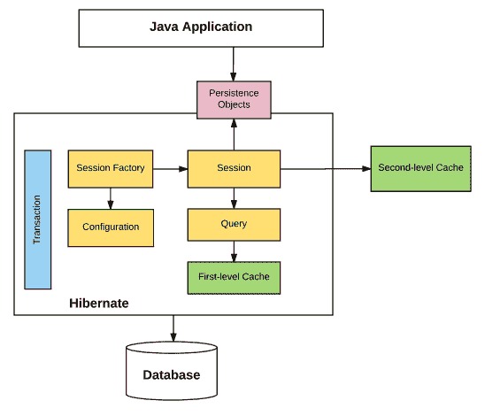

# Hiberate 教程

> 原文： [https://howtodoinjava.com/hibernate-tutorials/](https://howtodoinjava.com/hibernate-tutorials/)

Hibernate 是一个开源的 **Java 持久化**框架项目。 它使用 HQL 和 SQL 执行功能强大的对象关系映射和查询数据库。 Hibernate 是 Java 中 **ORM 映射**的出色工具。 它可以减少很多复杂性，从而减少应用中的缺陷，否则它们可能会找到存在的方法。 对于那些对 SQL 知识了解有限的开发人员来说，这特别有利。

Hibernate 最初是从 ORM 框架开始的，它已经分解为许多项目，例如 *Hibernate Search*，*Hibernate Validator*，*Hibernate OGM*（用于 NoSQL 数据库），以此类推。

## Hiberate 架构

下图总结了 Hiberate 架构中的主要构建块。

Hiberate 架构

让我们了解每个方块代表什么。

1.  **配置**：通常以`hibernate.properties`或`hibernate.cfg.xml`文件编写。 对于 Java 配置，您可能会发现带有`@Configuration`注解的类。 会话工厂使用它与 Java 应用和数据库一起使用。 它代表了应用 Java 类型到 SQL 数据库的完整映射集。
2.  **会话工厂**：任何用户应用都向会话工厂请求会话对象。 会话工厂使用上面列出的文件中的配置信息来适当地实例化会话对象。
3.  **会话**：这表示应用和数据库在任何时间点之间的交互。 这由`org.hibernate.Session`类表示。 可以从`SessionFactory` bean 中检索会话的实例。
4.  **查询**：它允许应用在数据库中查询一个或多个存储的对象。 Hibernate 提供了多种查询数据库的技术，包括`NamedQuery`和`Criteria API`。
5.  **一级缓存**：它表示 Hibernate 会话对象与数据库交互时使用的默认缓存。 它也称为会话缓存，它在当前会话中缓存对象。 从会话对象到数据库的所有请求都必须通过一级缓存或会话缓存。 必须注意，会话对象处于活动状态之前，会话对象可以使用第一级缓存。
6.  **事务**：使您能够实现数据一致性，并在出现意外情况时回滚。
7.  **持久化对象**：这些是普通的旧 Java 对象（PO​​JO），它们通过 Hiberate 被持久化为数据库相关表中的行之一。它们可以在配置文件中配置（`hibernate.cfg.xml`或`hibernate.properties`）或使用`@Entity`注解进行注解。
8.  **二级缓存**：用于跨会话存储对象。 需要明确启用此功能，并且需要为第二级缓存提供缓存供应器。 常见的二级缓存供应器之一是 *EhCache*。

## Hibernate 框架的主要功能

*   #### 对象/关系映射

    作为 ORM 框架，Hibernate 允许 Java 域对象与数据库表的映射，反之亦然。 结果，业务逻辑能够通过 Java 对象访问和操纵数据库实体。 它通过处理事务管理，自动主键生成，管理数据库连接和相关实现等方面，有助于加快整个开发过程。

*   #### JPA 供应器

    Hibernate 确实支持 [**Java 持久化 API**](https://docs.oracle.com/javaee/6/tutorial/doc/bnbpz.html)（JPA）规范。 JPA 是一组用于在 Java 对象和关系数据库实体之间访问，持久化和管理数据的规范。

*   #### 惯用的持久化

    遵循[面向对象原理](https://howtodoinjava.com/oops/object-oriented-principles/)的任何类（例如继承，多态等）都可以用作持久类。

*   #### 高性能和可扩展性

    Hibernate 支持各种技术，例如不同的获取策略，延迟初始化，乐观锁定等，以实现高性能，并且可以在任何环境中很好地扩展。

*   #### 易于维护

    Hibernate 不需要特殊的数据库表或字段，因此更易于维护。 它在系统初始化时生成 SQL。 与 JDBC 相比，它维护起来更快，更容易。

在此页面中，我已对该博客中所有可用的 **Hiberate 示例**进行了分类。 每次都会更新此页面，此博客中发布了一个新的 Hiberate 教程。 敬请关注 ！！

随意建议您想阅读的主题。

## Hello World 应用

#### [**Hibernate 3 简介和编写 hello world 应用**](//howtodoinjava.com/hibernate/hibernate-3-introduction-and-writing-hello-world-application/ "Hibernate 3 introduction and writing hello world application")

在本文中，我将尝试详细介绍有关 hibernate 的更多信息，然后将确定在我们第一个运行的 **java hibernate 示例**应用中使用 hibernate 的基本步骤。

## 基本概念

#### [如何在 Hiberate 4 中构建`SessionFactory`](//howtodoinjava.com/hibernate/hibarnate-4-how-to-build-sessionfactory/ "Hibarnate 4 : How to build SessionFactory")

如果您一直在观看以前的 Hiberate 版本，那么您一定已经注意到它们已经连续快速弃用了许多类。 不推荐使用的类是`AnnotationConfiguration`和`ServiceRegistryBuilder`，依此类推。

在这个 Hiberate 教程中，我给出了一个构建 Hiberate `SessionFactory`而不使用上面提到的不推荐使用的类的示例。 我正在使用**最新的 Hiberate 版本**，即`Hibernate 4.3.6.Final`，因此您可以确保使用最新的方法来构建会话工厂。

#### [实体等价和等同概念](//howtodoinjava.com/hibernate/hibernate-entities-equality-and-identity/ "Hibernate Entities Equality and Identity")

在我们的应用中，很多时候我们都面临着这样的情况，我们必须比较两个对象以检查它们的相等性以满足某些业务规则。 在核心 Java 中，我们已经掌握了检查对象是否相等的知识，但是在 Hiberate 下，我们还需要注意一些额外的事情。 让我们了解一下那些额外的概念。

#### [定义 Hiberate 实体之间的关联映射](//howtodoinjava.com/hibernate/how-to-define-association-mappings-between-hibernate-entities/ "How to Define Association Mappings between Hibernate Entities")

当我们使用 JPA 注解对 Java 类进行注解并使其成为持久化实体时，我们可能会遇到两个实体可以关联并且必须相互引用的情况，无论是单向还是双向。 在实际在 Hiberate 实体之间创建引用之前，让我们了解一些基本知识。

#### [实体/持久化生命周期状态概念](//howtodoinjava.com/hibernate/hibernate-entity-persistence-lifecycle-states/ "Hibernate Entity / Persistence LifeCycle States")

给定一个映射到 Hibernate 的对象的实例，它可以处于四种不同状态中的任何一种：瞬态，持久，分离或删除。 我们今天将在这个 Hiberate 教程中学习它们。

#### [将内存数据库与 Hiberate 一起使用](//howtodoinjava.com/hibernate/hibernate-4-using-in-memory-database-with-hibernate/ "Hibernate 4 : Using In-memory Database With Hibernate")

在此示例中，我使用 HSQLDB 数据库通过我们的 Hiberate 代码创建和访问内存数据库。

#### [Hiberate JPA 级联类型](//howtodoinjava.com/hibernate/hibernate-jpa-cascade-types/ "Hibernate JPA Cascade Types")

为了启用**级联和反向**效果，我们在实体中使用了“`CascadeType`”属性。 在本教程中，我们将学习通过`CascadeType`进行级联的各种可用选项。

#### [Hiberate 注解与映射的优缺点](//howtodoinjava.com/hibernate/pros-and-cons-of-hibernate-annotations-vs-mappings/ "Pros and Cons of Hibernate Annotations Vs Mappings")

您可能知道，在内联注解之前，创建 Hiberate 映射的唯一方法是通过 XML 文件。 尽管来自 Hibernate 和第三方项目的各种工具允许部分或全部映射从 Java 源代码自动生成。 今天，注解是定义映射的最新方法，但并不是自动的最佳方法。 让我们先讨论 Hiberate（或我应该说 JPA）注解的缺点和好处，然后再讨论何时应用它们。

#### [Hiberate 查询语言（HQL）](//howtodoinjava.com/hibernate/complete-hibernate-query-language-hql-tutorial/ "Complete Hibernate Query Language [HQL] Tutorial")

HQL 是一种类似于 SQL 的面向对象的查询语言，但是 HQL 不会对表和列进行操作，而是处理持久化对象及其属性。 它是 JPQL（Java 持久化查询语言）的超集； JPQL 查询是有效的 HQL 查询，但并非所有 HQL 查询都是有效的 JPQL 查询。 HQL 是一种具有自己的语法和语法的语言。

让我们使用以下示例学习 HQL：

1.  基本 HQL 语法
    *   更新操作
    *   删除操作
    *   插入操作
    *   选择操作
2.  `from`子句和别名
3.  `select`子句和投影
4.  使用命名参数
5.  分页结果集
6.  获得独特的结果
7.  使用`order by`子句对结果进行排序
8.  关联
9.  汇总方法
10.  命名查询
11.  使用本机 SQL
12.  启用日志记录和注解

#### [Hiberate 条件查询](//howtodoinjava.com/hibernate/hibernate-criteria-queries-tutorial-and-examples/ "Hibernate Criteria Queries Tutorial and Examples")

条件查询 API 使您可以用 Java 构建嵌套的结构化查询表达式，从而提供了编译时语法检查，而这是使用 HQL 或 SQL 这样的查询语言无法实现的。 条件查询 API 还包括示例查询（QBE）功能。 这样，您就可以提供示例对象，这些对象包含要检索的属性，而不必逐步说明查询的组件。 它还包括投影和聚合方法，包括`count()`。 让我们详细探讨它的不同功能。

1.  基本用法示例
2.  对条件使用限制
3.  分页结果集
4.  获得独特的结果
5.  获得不同的结果
6.  对查询结果进行排序
7.  执行关联（连接）
8.  添加投影
9.  示例查询（QBE）
10.  总结

#### [Hiberate 中的延迟加载](//howtodoinjava.com/hibernate/lazy-loading-in-hibernate/ "Lazy Loading in Hibernate")

在本教程中，我将讨论 Hiberate 中必须被称为延迟加载的功能。 如果您在大型应用中工作，这特别有用。

## CRUD 操作实例

#### [**Hello world 插入数据**](//howtodoinjava.com/hibernate/hibernate-insert-query-tutorial/ "Hibernate insert query tutorial")

在本教程中，我给出了在单个表中插入数据的示例。

#### [**Hiberate 命名查询教程**](//howtodoinjava.com/hibernate/hibernate-named-query-tutorial/ "Hibernate named query tutorial")

Hiberate 中的命名查询是一种将 HQL 语句分组在单个位置的技术，并在以后需要使用它们时以某种名称对其进行引用。 由于这些 HQL 语句不再分散在整个代码中，因此在很大程度上有助于代码清除。

#### [从数据库示例中加载实体](//howtodoinjava.com/hibernate/how-to-load-get-entity-in-hibernate/ "How to load / get entity in hibernate")

使用`load`或`get`方法加载 Hiberate 实体的示例。

#### [用于保存实体的`Save()`和`saveOrUpdate()`](//howtodoinjava.com/hibernate/save-and-saveorupdate-for-saving-hibernate-entities/ "Save() and saveOrUpdate() for Saving Hibernate Entities")

请不要创建使用 Hiberate 注解映射的类的实例不会自动将对象持久保存到数据库中。 将其附加到有效的 Hiberate 会话后，必须显式保存它。 让我们学习如何做。

#### [合并和刷新实体](//howtodoinjava.com/hibernate/merging-and-refreshing-hibernate-entities/ "Merging and Refreshing Hibernate Entities")

在本教程中，我将讨论有关 Hiberate 会话类中存在的`refresh()`和`merge()`方法的一些想法。

## Hiberate 实体映射

#### [**使用注解的 Hiberate 一对一映射**](//howtodoinjava.com/hibernate/hibernate-one-to-one-mapping-using-annotations/ "Hibernate one-to-one mapping using annotations")

让我们讨论一下 hibernate 支持的一对一映射的变体：

1.  使用外键关联
2.  使用通用连接表
3.  使用共享主键

#### [**使用注解的 Hiberate 一对多映射**](//howtodoinjava.com/hibernate/hibernate-one-to-many-mapping-using-annotations/ "hibernate one to many mapping using annotations")

讨论 Hiberate 中支持的一对多映射的变体：

1.  使用外键关联
2.  使用连接表

#### [**使用注解 Hiberate 多对多映射**](//howtodoinjava.com/hibernate/hibernate-many-to-many-mapping-using-annotations/ "Hibernate many-to-many mapping using annotations")

讨论 Hibernate 中支持的多对多映射的变体。

## Hiberate 连接池和缓存

#### [C3P0 连接池配置教程](//howtodoinjava.com/hibernate/hibernate-c3p0-connection-pool-configuration-tutorial/ "Hibernate C3P0 Connection Pool Configuration Tutorial")

默认情况下，Hibernate 使用 JDBC 连接以便与数据库进行交互。 创建这些连接非常昂贵 - Hibernate 在典型的使用情况下可能会执行最昂贵的单个操作。 由于 JDBC 连接管理非常昂贵，因此您可能会建议您使用连接池，它可以提前打开连接（并仅在需要时关闭它们，而不是“不再使用时”）。

C3P0 是外部连接池的示例。 在本教程中，我们将学习如何将其与 hibernate 一起使用。

#### [**Hiberate EhCache 配置**](//howtodoinjava.com/hibernate/hibernate-ehcache-configuration-tutorial/ "Hibernate EhCache configuration tutorial")

缓存是 ORM 框架提供的功能，可帮助用户获得快速运行的 Web 应用，同时帮助框架本身减少在单个事务中对数据库的查询数量。 Hibernate 还在第一级和第二级提供此缓存功能。

在本教程中，我将举一个使用 ehcache 配置作为 hibernate 中的二级缓存的示例。

#### [**Hiberate 一级缓存示例**](//howtodoinjava.com/hibernate/understanding-hibernate-first-level-cache-with-example/ "Understanding hibernate first level cache with example") 

默认情况下，Hiberate 下的第一级缓存已启用，您无需执行任何操作即可使此功能正常工作。 让我们进一步了解它。

#### [**Hiberate 二级缓存示例**](//howtodoinjava.com/hibernate/how-hibernate-second-level-cache-works/ "How hibernate second level cache works?") 

在本教程中，我将提供有关 Hiberate 二级缓存的概念，并提供使用代码段的示例。

## Hiberate 最佳实践

#### [**Hiberate `@NaturalId`用法和示例**](//howtodoinjava.com/hibernate/hibernate-naturalid-example-tutorial/ "Hibernate @NaturalId example tutorial")

Hibernate 4 带来了许多改进，而`@NaturalId`就是这样很好的改进之一。 如您所知，`@Id`注解用作指定实体主键的元数据。 但是有时，实体通常在 DAO 层代码中使用 ID，该 ID 不是主键，而是其逻辑或自然 ID。 在这种情况下，`@NaturalId`注解将证明是 Hiberate 下命名查询的良好替代。

#### [**获取延迟加载的实体引用**](//howtodoinjava.com/hibernate/hibernate-4-example-to-get-entity-reference-for-lazy-loading/ "Hibernate 4 example to get entity reference for lazy loading")

延迟加载是计算机编程中常用的一种设计模式，用于将对象的初始化推迟到需要它的时间点。 可以通过在 Hiberate 映射注解中指定“`fetch = FetchType.LAZY`”来完成 Hiberate 延迟加载。

## 与其他框架的整合

#### [**将 Hibernate 与 Spring 框架集成**](//howtodoinjava.com/spring/spring-orm/spring-3-and-hibernate-integration-tutorial-with-example/ "Spring 3 and hibernate integration tutorial with example")

本 Hiberate 教程侧重于将 Spring 3 框架与 Hibernate 结合使用。 我将展示这种集成的结果，一个基本的端到端应用流看起来如何。

## 您可能会遇到的异常

#### [[已解决]初始`SessionFactory`创建失败。`org.hibernate.HibernateException`：命名查询中的错误](https://howtodoinjava.com/hibernate/solved-initial-sessionfactory-creation-failed-org-hibernate-hibernateexception-errors-in-named-queries/)

## Hibernate 教程参考

#### [Hiberate 文档](http://hibernate.org/ "hibernate home")