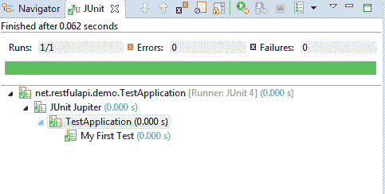

# JUnit5 – 在 Eclipse 中执行测试

> 原文： [https://howtodoinjava.com/junit5/execute-testcase-eclipse/](https://howtodoinjava.com/junit5/execute-testcase-eclipse/)

学习在 Eclipse IDE 中执行 [JUnit5](http://junit.org/junit5/) 测试。 在这个 JUnit5 示例中，已使用 Maven 导入依赖项。

## 1\. JUnit5 Maven 依赖项

为了能够在 Eclipse 中执行 JUnit5 测试，我们需要以下依赖项。

*   `test`范围中的`junit-platform-runner`：`JUnitPlatform`运行器的位置
*   `test`范围中的`junit-jupiter-api`：用于编写测试的 API，包括`@Test`等。当包含`junit-jupiter-engine`时，将其包括在内。
*   *测试运行时*范围中的`junit-jupiter-engine`：JUnit Jupiter 的引擎 API 的实现。

```java
<project xmlns="http://maven.apache.org/POM/4.0.0"
	xmlns:xsi="http://www.w3.org/2001/XMLSchema-instance"
	xsi:schemaLocation="http://maven.apache.org/POM/4.0.0 http://maven.apache.org/xsd/maven-4.0.0.xsd">
	<modelVersion>4.0.0</modelVersion>
	<groupId>com.howtodoinjava</groupId>
	<artifactId>JUnit5Examples</artifactId>
	<version>0.0.1-SNAPSHOT</version>
	<packaging>jar</packaging>
	<properties>
		<project.build.sourceEncoding>UTF-8</project.build.sourceEncoding>
		<maven.compiler.source>1.8</maven.compiler.source>
		<maven.compiler.target>${maven.compiler.source}</maven.compiler.target>
		<junit.jupiter.version>5.5.2</junit.jupiter.version>
		<junit.platform.version>1.5.2</junit.platform.version>
	</properties>
	<dependencies>
		<dependency>
			<groupId>org.junit.jupiter</groupId>
			<artifactId>junit-jupiter-engine</artifactId>
			<version>${junit.jupiter.version}</version>
			<scope>test</scope>
		</dependency>
		<dependency>
			<groupId>org.junit.platform</groupId>
			<artifactId>junit-platform-runner</artifactId>
			<version>${junit.platform.version}</version>
			<scope>test</scope>
		</dependency>
	</dependencies>
	<build>
		<plugins>
			<plugin>
				<artifactId>maven-compiler-plugin</artifactId>
				<version>3.8.1</version>
			</plugin>
			<plugin>
				<artifactId>maven-surefire-plugin</artifactId>
				<version>2.22.2</version>
			</plugin>
		</plugins>
	</build>
</project>

```

## 2\. `@RunWith(JUnitPlatform.class)`

`JUnitPlatform`允许测试与 IDE 一起运行并构建支持 JUnit4 但尚不直接支持 JUnit 平台的系统。

```java
package net.restfulapi.demo;

import org.junit.jupiter.api.Assertions;
import org.junit.jupiter.api.DisplayName;
import org.junit.jupiter.api.Test;
import org.junit.jupiter.api.TestInfo;
import org.junit.platform.runner.JUnitPlatform;
import org.junit.runner.RunWith;

@RunWith(JUnitPlatform.class)
public class TestApplication { 
	@Test
	@DisplayName("My First Test")
	void myFirstTest(TestInfo testInfo) {
		NumericCalculator calculator = new NumericCalculator();
		Assertions.assertEquals(2, calculator.add(1, 1), "1 + 1 = 2");
		Assertions.assertEquals("My First Test", testInfo.getDisplayName(), 
									() -> "TestInfo is injected correctly");
	}
}

```

其中`NumericCalculator`类是：

```java
package net.restfulapi.demo;

public class NumericCalculator {
	public int add(int a, int b) {
		return a + b;
	}
}

```

## 3\. 演示

现在，将其余部分作为 Eclipse 中的 junit 测试用例运行。

您将获得以下输出。



JUnit5 eclipse 示例


学习愉快！