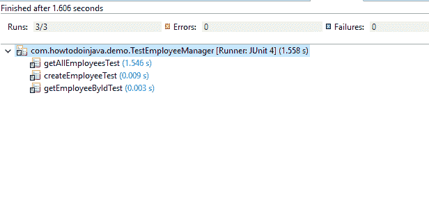

# Spring Boot，Mockito 和 Junit – 单元测试服务层

> 原文： [https://howtodoinjava.com/spring-boot2/testing/spring-boot-mockito-junit-example/](https://howtodoinjava.com/spring-boot2/testing/spring-boot-mockito-junit-example/)

学习使用 [**JUnit**](https://howtodoinjava.com/junit-4/) 和 **Mockito** 测试框架为 Spring 应用的服务层编写[**单元测试**](https://howtodoinjava.com/best-practices/unit-testing-best-practices-junit-reference-guide/)。 本教程演示 *[SpringBoot](https://howtodoinjava.com/spring-boot-tutorials/) 测试服务层示例*。

## 1\. Maven 依赖

`spring-boot-starter-test`依赖项包括创建和执行测试所需的所有依赖项。

```java
<dependency>
  <groupId>org.springframework.boot</groupId>
  <artifactId>spring-boot-starter-test</artifactId>
</dependency>

```

如果不使用 spring boot，则包括以下依赖项。

```java
<dependency>
    <groupId>junit</groupId>
    <artifactId>junit</artifactId>
    <version>4.12</version>
    <scope>test</scope>
</dependency>
<dependency>
    <groupId>org.mockito</groupId>
    <artifactId>mockito-core</artifactId>
    <version>2.15.0</version>
</dependency>
<dependency>
    <groupId>org.mockito</groupId>
    <artifactId>mockito-inline</artifactId>
    <version>2.15.0</version>
</dependency>

```

## 2\. 起步

在此示例中，我们主要对两个类`EmployeeManager`和`EmployeeDao`进行单元测试。 顾名思义，管理器类代表服务层，而 dao 类正在与数据库进行交互。

`EmployeeManager`类依赖于`EmployeeDao`和委托方法调用来获取 pis 最终返回到控制器类的数据。

为了测试`EmployeeManager`中的方法，我们可以通过以下两种方式创建 JUnit 测试类 `TestEmployeeManager`：

#### 2.1 `MockitoJUnitRunner`类

`MockitoJUnitRunner`类自动初始化所​​有带有`@Mock`和`@InjectMock`注解的对象。

```java
@RunWith(MockitoJUnitRunner.class)
public class TestEmployeeManager {

	@InjectMock
	EmployeeManager manager;

	@Mock
	EmployeeDao dao;

	//tests	
}

```

#### 2.2 `MockitoAnnotations.initMock()`方法

如果我们不使用`MockitoJUnitRunner`类方法，则可以使用静态方法`MockitoAnnotations.initMock()`。 在初始化 junit 测试时，该方法还会初始化模拟对象。

```java
public class TestEmployeeManager {

	@InjectMock
	EmployeeManager manager;

	@Mock
	EmployeeDao dao;

	@Before
	public void init() {
		MockitoAnnotations.initMock(this);
	}

	//tests	
}

```

#### 2.3 `@Mock` vs `@InjectMock`

*   **`@Mock`** 注解会为其注解的类创建一个模拟实现。
*   **`@InjectMock`** 还将创建模拟实现，另外将标有注解`@Mock`的从属模拟注入其中。

在上面的示例中，我们用`@InjectMock`注解了`EmployeeManager`类，因此模仿者将为`EmployeeManager`类创建模仿对象，并将`EmployeeDao`的模仿依赖项注入其中。

## 3\. 使用 Mockito 进行 JUnit 测试

让我们看几个例子，这些例子编写了 junit 测试，以使用通过嘲讽创建的模拟对象对服务层方法进行单元测试。

很少有示例方法是`getAllEmployees()`，该方法将返回`EmployeeVO`对象的列表，`getEmployeeById(int id)`以给定 id 返回雇员。 和`createEmployee()`将添加一个雇员对象并返回`void`。

#### 3.1 服务层测试

```java
package com.howtodoinjava.demo;

import static org.junit.Assert.assertEquals;
import static org.mockito.Mockito.times;
import static org.mockito.Mockito.verify;
import static org.mockito.Mockito.when;

import java.util.ArrayList;
import java.util.List;

import org.junit.Before;
import org.junit.Test;
import org.junit.runner.RunWith;
import org.mockito.InjectMock;
import org.mockito.Mock;
import org.mockito.MockitoAnnotations;
import org.mockito.junit.MockitoJUnitRunner;

import com.howtodoinjava.demo.dao.EmployeeDao;
import com.howtodoinjava.demo.model.EmployeeVO;
import com.howtodoinjava.demo.service.EmployeeManager;

public class TestEmployeeManager {

	@InjectMock
	EmployeeManager manager;

	@Mock
	EmployeeDao dao;

	@Before
	public void init() {
		MockitoAnnotations.initMock(this);
	}

	@Test
	public void getAllEmployeesTest()
	{
		List<EmployeeVO> list = new ArrayList<EmployeeVO>();
		EmployeeVO empOne = new EmployeeVO(1, "John", "John", "howtodoinjava@gmail.com");
		EmployeeVO empTwo = new EmployeeVO(2, "Alex", "kolenchiski", "alexk@yahoo.com");
		EmployeeVO empThree = new EmployeeVO(3, "Steve", "Waugh", "swaugh@gmail.com");

		list.add(empOne);
		list.add(empTwo);
		list.add(empThree);

		when(dao.getEmployeeList()).thenReturn(list);

		//test
		List<EmployeeVO> empList = manager.getEmployeeList();

		assertEquals(3, empList.size());
		verify(dao, times(1)).getEmployeeList();
	}

	@Test
	public void getEmployeeByIdTest()
	{
		when(dao.getEmployeeById(1)).thenReturn(new EmployeeVO(1,"Lokesh","Gupta","user@email.com"));

		EmployeeVO emp = manager.getEmployeeById(1);

		assertEquals("Lokesh", emp.getFirstName());
		assertEquals("Gupta", emp.getLastName());
		assertEquals("user@email.com", emp.getEmail());
	}

	@Test
	public void createEmployeeTest()
	{
		EmployeeVO emp = new EmployeeVO(1,"Lokesh","Gupta","user@email.com");

		manager.addEmployee(emp);

		verify(dao, times(1)).addEmployee(emp);
	}
}

```

单元测试结果将是这样。



Spring boot mockito junit 示例


#### 3.2 服务层类

```java
import java.util.List;

import org.springframework.beans.factory.annotation.Autowired;
import org.springframework.stereotype.Service;

import com.howtodoinjava.demo.dao.EmployeeDao;
import com.howtodoinjava.demo.model.EmployeeVO;

@Service
public class EmployeeManager 
{
	@Autowired
	EmployeeDao dao;

	public List<EmployeeVO> getEmployeeList() {
		return dao.getEmployeeList();
	}

	public EmployeeVO getEmployeeById(int id) {
		return dao.getEmployeeById(id);
	}

	public void addEmployee(EmployeeVO employee) {
		dao.addEmployee(employee);
	}
}

```

#### 3.3 DAO 层类

```java
package com.howtodoinjava.demo.dao;

import java.util.ArrayList;
import java.util.HashMap;
import java.util.List;
import java.util.Map;

import org.springframework.stereotype.Repository;

import com.howtodoinjava.demo.model.EmployeeVO;

@Repository
public class EmployeeDao {

	private Map<Integer, EmployeeVO> DB = new HashMap<>();

	public List<EmployeeVO> getEmployeeList() 
	{
		List<EmployeeVO> list = new ArrayList<>();
		if(list.isEmpty()) {
			list.addAll(DB.values());
		}
		return list;
	}

	public EmployeeVO getEmployeeById(int id) {
		return DB.get(id);
	}

	public void addEmployee(EmployeeVO employee) {
		employee.setEmployeeId(DB.keySet().size() + 1);
		DB.put(employee.getEmployeeId(), employee);
	}

	public void updateEmployee(EmployeeVO employee) {
		DB.put(employee.getEmployeeId(), employee);
	}

	public void deleteEmployee(int id) {
		DB.remove(id);
	}
}

```

## 4\. Spring Boot Mockito 示例 – 总结

在此 **mockito 教程**中，我们学习了使用 JUnit 和 Mockito 对 Spring Boot 应用中的服务层进行单元测试。 我们学习了如何设置测试类并编写 JUnit 测试。

我们还了解了`@Mock`和`@InjectMock`注解之间的**区别**。

学习愉快！