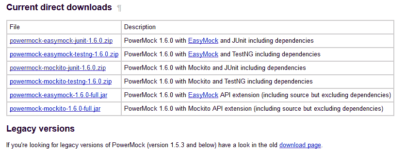

# 使用 PowerMock 进行模拟测试（带有 JUnit 和 Mockito）

> 原文： [https://howtodoinjava.com/library/mock-testing-using-powermock-with-junit-and-mockito/](https://howtodoinjava.com/library/mock-testing-using-powermock-with-junit-and-mockito/)

**PowerMock** 是 Java 世界的开源模拟库。 它扩展了现有的 Mockito 框架，例如 [**EasyMock**](http://www.easymock.org/ "easymock") 和 [**Mockito**](https://code.google.com/p/mockito/ "mockito")，为它们添加了更强大的功能。 PowerMock 使我们能够为最不可测试的代码编写良好的单元测试。 Java 中的大多数 Mockito 框架都不能模拟静态方法或最终类。 但是使用 PowerMock，我们可以模拟几乎任何类。

PowerMock 当前扩展了 EasyMock 和 Mockito 模拟框架。 根据首选的扩展名，编写任何单元测试的语法略有不同。 在本教程中，我将 PowerMock 与 Mockito 结合使用。

本教程将演示一个使用 PowerMock 的非常简单的模拟示例。 它将向我们展示创建模拟和验证方法调用的基本语法。

## PowerMock 和依赖项的安装

PowerMock 是一个正在积极开发的开源 Mockito 框架。 您可以按照以下步骤在计算机中进行设置。

1）首先下载 PowerMock 1.5。 通过 [http://code.google.com/p/powermock/](https://code.google.com/p/powermock/ "powermock home") 访问 PowerMock 主页。

2）点击页面上的下载选项卡，您应该看到如下内容：



3）由于我们将使用 Mockito 扩展和 JUnit 测试框架来开发所有示例，因此请下载`powermock-mockito-junit-1.6.zip`文件。

4）将 ZIP 文件解压缩到某个文件夹中。 该 ZIP 文件包含使用 PowerMock 编写单元测试所需的所有从属 JAR 文件。

5）将所有 jar 文件复制到项目的`lib`文件夹中，并将其添加为依赖项。

你完成了！

如果您还没有的话，您可能需要另外添加“[`hamcrest-core-1.3.jar`](https://code.google.com/p/hamcrest/downloads/detail?name=hamcrest-core-1.3.jar "hamcrest")”。

## 使用的类

为了完整起见，让我首先在下面的类中写下我们将在测试示例中使用的类。

**`Employee.java`**

```java
public class Employee {
	private String fName;

	public String getfName() {
		return fName;
	}

	public void setfName(String fName) {
		this.fName = fName;
	}
}

```

**`EmployeeService.java`**

```java
public class EmployeeService 
{
	public int getEmployeeCount() {
		throw new UnsupportedOperationException();
	}

	public void saveEmployee(Employee employee) {
        //return nothing
    }
}

```

**`EmployeeController.java`**

```java
public class EmployeeController 
{
	private EmployeeService employeeService;

    public EmployeeController(EmployeeService employeeService) {
        this.employeeService = employeeService;
    }

    public int getProjectedEmployeeCount()
    {
        final int actualEmployeeCount = employeeService.getEmployeeCount();
        return actualEmployeeCount * 2;
    }

    public void saveEmployee(Employee employee) {
        employeeService.saveEmployee(employee);
    }
}

```

## 不带 PowerMock 的首次测试

让我们编写一个简单的测试来获得不使用模拟的员工人数。 如您所见`EmployeeService.getEmployeeCount()`方法抛出`UnsupportedOperationException`，则测试应失败。

```java
@Test
public void shouldGetCountOfEmployees()
{
	EmployeeController employeeController =new EmployeeController(new EmployeeService());
	Assert.assertEquals(10,employeeController.getProjectedEmployeeCount());
}

```

在运行测试时，它肯定会失败，并带有以下异常。

```java
java.lang.UnsupportedOperationException
	at com.howtodoinjava.powermock.examples.service.EmployeeService.getEmployeeCount(EmployeeService.java:8)
	at com.howtodoinjava.powermock.examples.controller.EmployeeController.getProjectedEmployeeCount(EmployeeController.java:16)
	at com.howtodoinjava.powermock.examples.test.EmployeeControllerTestOne.shouldGetCountOfEmployees(EmployeeControllerTestOne.java:15)

```

在不允许您使用某种方法的任何应用中都可能出现这种情况，并且原因可以是无限的。 在这种情况下，您可能希望模拟上述方法，以便可以测试应用的其他部分。

## 使用 PowerMock 模拟一种简单的方法

在上面的示例中，不支持`getEmployeeCount()`方法，但我们想使用它。 在这种情况下，我们可以使用 powermock 模拟它。

```java
@Test
public void firstMockTest() 
{
	//Creating a mock using the PowerMockito.mock
	//method for the EmployeeService class.
	EmployeeService mock =PowerMockito.mock(EmployeeService.class);

	//Next statement essentially says that when getProjectedEmployeeCount method
	//is called on the mocked EmployeeService instance, return 8.
	PowerMockito.when(mock.getEmployeeCount()).thenReturn(8);

	EmployeeController employeeController = new EmployeeController(mock);

	Assert.assertEquals(16, employeeController.getProjectedEmployeeCount());
}

```

以上测试将成功执行。 在此，当调用`employeeController.getProjectedEmployeeCount()`时，它依次从模拟对象中调用方法`getEmployeeCount()`，该方法返回值 8。控​​制器将其乘以 2，返回值为 16。该返回值等于`assert`语句中的期望值， 因此测试通过了。

## 验证是否真的调用了模拟方法？

有时，单元测试只需要调用一个方法而忘记它。 主要是因为方法不返回任何值。 您肯定可以通过再次从数据源获取值来测试 DB 中是否存在值。 但是，如果您的测试仅需要验证方法是否已被调用，就可以使用 powermock 进行。

```java
@Test
public void verifyMethodInvokationTest() 
{
	EmployeeService mock =PowerMockito.mock(EmployeeService.class);
	EmployeeController employeeController = new EmployeeController(mock);

	Employee employee = new Employee();
	employeeController.saveEmployee(employee);

	//Verifying that controller did call the
	//saveEmployee() method on the mocked service instance.
	Mockito.verify(mock).saveEmployee(employee);
}

```

在上面的测试示例中，我们使用`verify(mock)`方法验证了`saveEmployee(employee)`是否确实已被调用。 如果您通过测试，则将通过。

要验证上述代码是否正常运行，请在`EmployeeController.java`的下面一行中注解掉。

```java
public void saveEmployee(Employee employee) {
	//employeeService.saveEmployee(employee); //Comment this line
}

```

现在，如果您再次运行测试，它将失败并显示此错误。

```java
Wanted but not invoked:
employeeService.saveEmployee(
    com.howtodoinjava.powermock.examples.model.Employee@7808b9
);
-> at com.howtodoinjava.powermock.examples.test.EmployeeControllerTestOne.verifyMethodInvokationTest(EmployeeControllerTestOne.java:47)
Actually, there were zero interactions with this mock.

```

您可以在单元测试中拥有非常好的功能。

## 使用模拟设置获取有关测试运行的更多信息

这些模拟设置很少使用，但在某些情况下很有用。 如果您想为模拟命名，以供将来调试之用，请使用它们。 或者您想启用详细日志记录以获取更多信息。 当您要注册一个监听器来通知该模拟方法的调用时，可以使用它。 甚至在尚未实现实际对象的模拟对象上实现一些额外的接口。

```java
@Test
public void MockettingsTest() {
	EmployeeService mock =PowerMockito.mock(EmployeeService.class, Mockito
		.withSettings()
		.name("EmployeeServiceMock")
		.verboseLogging());
	EmployeeController employeeController = new EmployeeController(mock);

	Employee employee = new Employee();
	employeeController.saveEmployee(employee);

	//Verifying that controller did call the
	//saveEmployee method on the mocked service
	//instance.
	Mockito.verify(mock).saveEmployee(employee);
}

```

运行以上测试以在控制台中获得以下结果：

```java
############ Logging method invocation #1 on mock/spy ########
employeeService.saveEmployee(
    com.howtodoinjava.powermock.examples.model.Employee@c9131c
);
   invoked: -> at com.howtodoinjava.powermock.examples.controller.EmployeeController.saveEmployee(EmployeeController.java:21)
   has returned: "null"

############ Logging method invocation #2 on mock/spy ########
employeeService.saveEmployee(
    com.howtodoinjava.powermock.examples.model.Employee@c9131c
);
   invoked: -> at com.howtodoinjava.powermock.examples.test.EmployeeControllerTestOne.MockettingsTest(EmployeeControllerTestOne.java:64)
   has returned: "null"

```

这就是有关 powermock 的初学者教程的全部内容，可帮助您入门。 我将在下一组教程中介绍一些复杂的主题。

**祝您学习愉快！**