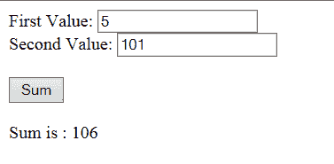

# AngularJS 教程 – HelloWorld 示例

> 原文： [https://howtodoinjava.com/angularjs/angularjs-tutorial-helloworld-example/](https://howtodoinjava.com/angularjs/angularjs-tutorial-helloworld-example/)

本 **[AngularJS](https://angularjs.org/) 教程**涵盖以下主题，这些主题将帮助您详细学习 AngularJS。

```java
Table Of Contents

Why AngularJS?
Advantages of using AngularJS?
Understanding AngularJS Components
Building AngularJS HelloWorld application
```

## 为什么选择 AngularJS？

最初建立网站时，它们纯粹是在完整的请求 - 响应模型上工作。 流程就像–首先在浏览器中呈现了一个网页–然后用户在网页中进行了任何互动，例如，表单提交或单击按钮–将向服务器发送新请求，然后从服务器返回整个新页面以在浏览器中呈现响应。

在 Microsoft 引入[`XMLHttpRequest`](//howtodoinjava.com/2013/06/21/complete-ajax-tutorial/)之前，一直使用该模型，这使开发人员无需实际刷新页面即可对服务器进行**异步**调用，并使用服务器响应来部分刷新页面。 这使用户体验更加连贯，因为用户可以执行需要远程调用的任务，并且在进行和处理呼叫时仍可以与应用进行交互。

仅在此时间段内，大多数 JS 框架（如 jQuery，原型等）才出现。jQuery 是该列表中最引人注目的框架–可能仍然是 UI 开发的最佳和最简单的选择。

如果您从事过在 UI 组件中使用 jQuery 的相当大的项目，那么您可以在一段时间内轻松地将其关联起来 - 代码维护变得有些麻烦。 一段时间后，您的项目中将有 100 多个 JS 文件，甚至更多–所有这些文件都是相互引用的，而无需执行设计。 jQuery 确实是使编码变得容易的绝佳框架，但是它缺乏任何可以在代码库增长时为我们提供帮助的结构性指导。 因此，我们最终得到了难以维护和测试的意大利面条代码。

这是诸如[模型视图控制器（MVC）](//howtodoinjava.com/scripting/implement-mvc-and-pubsub-in-javascript/)之类的架构模式和诸如 AngularJS 之类的框架出现的地方。 Google 的 AngularJS 是一个全面的 JavaScript 模型 - 视图 - 控制器（MVC）框架，可让您轻松轻松地快速构建可在任何台式机或移动平台上正常运行的应用。 AngularJS 完全支持单元测试，以帮助减少质量保证（QA）时间。

AngularJS 中的模型和视图比大多数 JavaScript 客户端框架中的模型和视图简单得多。 在其他 JavaScript 客户端框架中经常缺少的控制器是 AngularJS 中的关键功能组件。

## 使用 AngularJS 的优势？

让我们记下 Angular 与其他框架相比提供的其他好处：

*   Angular 直接修改页面 DOM，而不添加内部 HTML 代码。 它更快。
*   Angular 基于页面中特定于 Angular 的元素属性构建绑定。 这有助于减少编写工作，使代码更简洁，更易于理解并且不易出错。
*   Angular 具有一些扩展功能，例如依赖项注入，路由，动画，视图编排等。 它们有助于编写更健壮和可维护的代码，并鼓励良好的设计实践。
*   AngularJS 完全支持单元测试。
*   Angular 中的 Pub-sub 系统支持上下文感知通信。 `broadcast()`将向所有子控制器发送一条消息，而`emit()`将向所有祖先发送一条消息。
*   它得到了 Google 和一个强大的开发社区的支持。

## 了解 AngularJS 组件

我们已经知道 AngularJS 是基于 MVC 的结构化框架，因此我们将需要编写许多组件和工具以使您的应用代码结构化并得到良好维护。 让我们简短地学习这些组件。 我们将在下一个教程中详细讨论。

*   #### 模块

    模块是控制器，指令，过滤器，服务和其他配置信息的集合。 所有这一切的主要参与者是`angular.module()`，因为它是进入模块 API（用于配置 Angular 模块的机制）的网关。 它用于注册，创建和检索以前创建的 AngularJS 模块。

    例如，将以下代码添加到新的 JavaScript 文件中，您可以将其命名为`myAppModule.js`。

    ```java
    // Create a new module
    var myAppModule = angular.module('myAppModule', []);
    ```

    您刚刚创建了一个模块。 很简单，不是吗？

    在`module()`中传递的数组参数可用于传递依赖项列表。 即该模块所依赖的其他模块。 我们没有任何依赖项，因此我们只需传递一个空数组即可。

    现在，您可以使用`myAppModule`变量来定义模块特定的其他组件，例如控制器或过滤器。 例如：

    ```java
    // configure the module with a controller
    myAppModule.controller('MyFilterDemoCtrl', function ($scope) {
             // controller code would go here
          }
    );
    ```

*   #### 作用域

    在 AngularJS 中，`$scope`是具有可用属性和要使用方法的对象。 请注意，作用域可用于视图和控制器。
    在 AngularJS 中创建控制器时，会将`$scope`对象作为参数传递。

    ```java
    var myAppModule = angular.module('MyFilterDemoCtrl', []);

    myAppModule.controller('myController', function($scope) {
        $scope.firstName = "Lokesh";
    });
    ```

    将属性添加到控制器中的`$scope`时，视图（HTML）可以访问这些属性。

    ```java
    <div ng-app="myAppModule" ng-controller="myController">

    <h1>{{firstName}}</h1>

    </div>
    ```

*   #### 指令

    AngularJS 指令是**扩展 HTML 属性**，其前缀为`"ng-"`。 有一些预定义的指令，例如`ng-app`，`ng-init`和`ng-controller`。 此外，您也可以定义自己的指令。

    例如，使用`ng-init`指令，您可以将应用数据初始化为某个默认值。

    ```java
    <div ng-app="myAppModule" ng-init="firstName='Lokesh'">

    <h1>{{firstName}}</h1>

    </div>
    ```

*   #### 表达式

    视图中使用的范围变量实际上是表达式。 这些表达式用大括号括起来：`{{ expression }}`。 您可以编写简单表达式以及复杂表达式，例如`{{ firstName + " " + lastName }}`或`{{ "id = " + 0 }}`。

*   #### 控制器

    在 Angular 中，控制器通过在范围内设置初始状态或值以及向范围添加行为来扩展范围。 例如，您可以添加一个对范围内的值求和的函数，以提供总计，以便如果范围后的模型数据发生更改，则总值始终会更改。

    您必须使用“`ng-controller`”将控制器添加到 HTML 元素，然后在后台将其实现为 JavaScript 代码。

    ```java
    <div ng-app="myApp" ng-controller="sumController">

    First Value: <input type="text" ng-model="firstValue"><br>
    Second Value: <input type="text" ng-model="secondValue"><br>

    <br />
    Sum is = {{sum()}}

    </div>

    <script>
    var app = angular.module('myApp', []);
    app.controller('sumController', function($scope) {
        $scope.firstValue = 5;
        $scope.secondValue = 10;
        $scope.sum = function() {
            return $scope.firstValue + $scope.secondValue;
        };
    });
    </script>
    ```

*   #### 数据绑定或模型

    这是 AngularJS 的最佳功能。 数据绑定是将来自模型的数据与网页中显示的内容链接起来的过程。 AngularJS 提供了一个非常干净的界面，可以将模型数据链接到网页中的元素。

    在 AngularJS 中，数据绑定是一个双向过程：在网页上更改数据时，将更新模型，而在模型中更改数据时，将自动更新网页。 这样，**模型始终是表示用户**的唯一数据源，**视图只是模型**的投影。

    上面“控制器”部分中的示例也是数据绑定的示例。 因此，当您在文本框中更改“第一个值”或“第二个值”时，求和字段将自动更新，而无需付出额外的努力。 太棒了。

*   #### 服务

    服务是 AngularJS 环境中的主要工作。 服务是为 Web 应用提供功能的单例对象。 例如，Web 应用的常见任务是执行对 Web 服务器的 AJAX 请求。 AngularJS 提供了一个 HTTP 服务，其中包含访问 Web 服务器的所有功能。

    服务功能完全独立于上下文或状态，因此可以轻松地从应用的组件中使用它。 AngularJS 提供了许多用于基本用途的内置服务组件，例如 HTTP 请求，日志记录，解析和动画。 您还可以创建自己的服务，并在整个代码中重复使用它们。

    例如，`$http`是用于从 Web 服务器读取数据的核心服务。 我们可以按以下方式使用此服务。

    ```java
    var app = angular.module('myApp', []);
    app.controller('customersCtrl', function($scope, $http) {
        $http.get("some HTTP URL")
        .then(function(response) {
        	//process the response here
        });
    });
    ```

*   #### 编译器

    AngularJS 提供了一个 HTML 编译器，它将在 AngularJS 模板中发现指令，并使用 JavaScript 指令代码构建扩展的 HTML 元素。

    引导 AngularJS 库时，会将 AngularJS 编译器加载到浏览器中。 加载后，编译器将在浏览器中搜索 HTML DOM，并将任何后端 JavaScript 代码链接到 HTML 元素，然后最终的应用视图将呈现给用户。

## 构建 AngularJS HelloWorld 应用

到目前为止，我们已经了解了 AngularJS 中涉及的一些重要概念。 让我们利用所有这些知识来构建我们的第一个 hello world 应用。

在此示例中，我们将尝试使用所有组件而不增加复杂性，以便于理解。 以后，如果需要，您可以尝试添加功能，从而在此应用中增加更多的复杂性。

该应用显示两个文本框，您可以在其中输入任何数字，然后单击求和按钮以添加值并更新显示在它们下面的消息。 看起来像这样的图像：



AngularJS Hello World 应用界面


让我们看一下 HTML 视图和 Angular 控制器 JS 文件的代码，以了解其工作原理。

#### `helloWorld.html`

```java
<!doctype html>
<html ng-app="helloWorldApp">
<head>
	<title>Hello World - AngularJS</title>
</head>
<body>
	<div ng-controller="MyController">
		<span>First Value:</span> <input type="text" ng-model="first"> <br />
		<span>Second Value:</span> <input type="text" ng-model="second"> <br /><br />
		<button ng-click='updateSum()'>Sum</button> <br /><br />
		{{heading}}  {{total}}
	</div>
	<script src="angular.min.js"></script>
	<script src="app.js"></script>
</body>
</html>
```

#### `app.js`

```java
var firstApp = angular.module('helloWorldApp', []);
firstApp.controller('MyController', function($scope) {
	$scope.first = 5;
	$scope.second = 10;
	$scope.heading = 'Sum is : ';
	$scope.total = 15;
	$scope.updateSum = function() {
		$scope.total = parseInt($scope.first) + parseInt($scope.second);
	};
});
```

当您执行上面的 Angular 示例时，您将看到输出作为附加图像作为工作应用。

学习愉快！