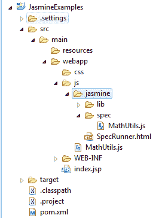
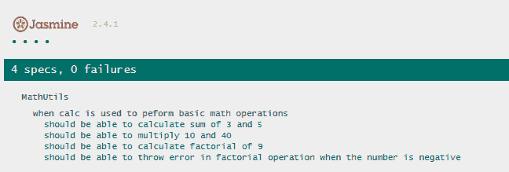

# Jasmine 单元测试教程及示例

> 原文： [https://howtodoinjava.com/javascript/jasmine-unit-testing-tutorial/](https://howtodoinjava.com/javascript/jasmine-unit-testing-tutorial/)

**Jasmine** 是流行的 JavaScript 单元测试框架之一，能够测试同步和异步 JavaScript 代码。 它用于 BDD（行为驱动的开发）编程中，该编程更多地侧重于业务价值而不是技术细节。 在此 **Jasmine 教程**中，我们将从设置说明到了解测试用例的输出来详细学习 Jasmine 框架。

```java
Table of Contents

1\. Jasmine Setup Configuration
2\. Writing Suite and Specs
3\. Setup and Teardown
4\. Jasmine Describe Blocks
5\. Jasmine Matchers 
6\. Disable Suites and Specs
7\. Working with Jasmine Spy
8\. Final Thoughts

```

## 1\. Jasmine 起步配置

首先[下载 Jasmine 框架](https://github.com/jasmine/jasmine/releases)并将其解压缩到您的项目文件夹中。 我建议在应用中可能已经存在的`/js`或`/javascript`文件夹下创建一个单独的文件夹`/jasmine`。

您将在分发捆绑包中获得以下四个文件夹/文件：

1.  `/src`：包含您要测试的 JavaScript 源文件
2.  `/lib`：包含框架文件
3.  `/spec`：包含 JavaScript 测试文件
4.  `SpecRunner.html`：是测试用例运行器 HTML 文件

您可以删除`/src`文件夹； 并从`SpecRunner.html`文件中的当前位置引用源文件。 默认文件如下所示，您将需要更改`/src`和`/spec`文件夹中包含的文件。

```java
<!DOCTYPE html>
<html>
<head>
	<meta charset="utf-8">
	<title>Jasmine Spec Runner v2.4.1</title>

	<link rel="shortcut icon" type="image/png" href="lib/jasmine-2.4.1/jasmine_favicon.png">
	<link rel="stylesheet" href="lib/jasmine-2.4.1/jasmine.css">

	<script src="lib/jasmine-2.4.1/jasmine.js"></script>
	<script src="lib/jasmine-2.4.1/jasmine-html.js"></script>
	<script src="lib/jasmine-2.4.1/boot.js"></script>

	<!-- include source files here... -->
	<script src="src/Player.js"></script>
	<script src="src/Song.js"></script>

	<!-- include spec files here... -->
	<script src="spec/SpecHelper.js"></script>
	<script src="spec/PlayerSpec.js"></script>
</head>

<body></body>
</html>

```

在此演示中，我删除了`/src`文件夹，并将引用其当前位置的文件。 当前的文件夹结构如下：



Jasmine 文件夹结构


为了专注于 Jasmine 的功能，我将创建一个具有一些基本操作的简单 JS 文件`MathUtils.js`，我们将对这些功能进行单元测试。

```java
MathUtils = function() {};

MathUtils.prototype.sum = function(number1, number2) {
		return number1 + number2;
}

MathUtils.prototype.substract = function(number1, number2) {
	return number1 - number2;
}

MathUtils.prototype.multiply = function(number1, number2) {
	return number1 * number2;
}

MathUtils.prototype.divide = function(number1, number2) {
	return number1 / number2;
}

MathUtils.prototype.average = function(number1, number2) {
	return (number1 + number2) / 2;
}

MathUtils.prototype.factorial = function(number) {
	if (number < 0) {
		throw new Error("There is no factorial for negative numbers");
	} else if (number == 1 || number == 0) {
		return 1;
	} else {
		return number * this.factorial(number - 1);
	}
}

```

在`SpecRunner.html`中添加文件引用后，文件内容将为：

```java
<!DOCTYPE html>
<html>
<head>
	<meta charset="utf-8">
	<title>Jasmine Spec Runner v2.4.1</title>

	<link rel="shortcut icon" type="image/png"
		href="lib/jasmine-2.4.1/jasmine_favicon.png">
	<link rel="stylesheet" href="lib/jasmine-2.4.1/jasmine.css">

	<script src="lib/jasmine-2.4.1/jasmine.js"></script>
	<script src="lib/jasmine-2.4.1/jasmine-html.js"></script>
	<script src="lib/jasmine-2.4.1/boot.js"></script>

	<!-- include source files here... -->
	<script src="../MathUtils.js"></script>

	<!-- include spec files here... -->
	<script src="spec/MathUtils.js"></script>
</head>

<body></body>
</html>

```

## 2\. Jasmine 套件和规范

在 Jasmine 中，有两个重要术语 – **套件**和**规范**。

#### 2.1 套件

Jasmine 套件是一组测试用例，可用于测试 JavaScript 代码（JavaScript 对象或函数）的特定行为。 首先使用两个参数调用 Jasmine 全局函数`describe` - 第一个参数代表测试套件的标题，第二个参数代表实现测试套件的功能。

```java
//This is test suite
describe("Test Suite", function() {
  	//.....
});

```

#### 2.2 规范

Jasmine 规范表示测试套件中的一个测试用例。 首先使用两个参数调用 Jasmine 全局函数`it` - 第一个参数代表规范的标题，第二个参数代表实现测试用例的函数。

实际上，规范包含一个或多个期望。 每个期望代表一个可以为`true`或`false`的断言。 为了通过规范，规范内的所有期望都必须为`true`。 如果规范中的一个或多个期望是`false`，则规范失败。

```java
//This is test suite
describe("Test Suite", function() {
  	it("test spec", function() {
   		expect( expression ).toEqual(true);
  	});	
});

```

让我们开始为`MathUtils.js`编写单元测试，以更好地了解套件和规范。 我们将在`spec/MathUtils.js`中编写这些规范。

```java
describe("MathUtils", function() {
	var calc;

	//This will be called before running each spec
	beforeEach(function() {
		calc = new MathUtils();
	});

	describe("when calc is used to peform basic math operations", function(){

		//Spec for sum operation
		it("should be able to calculate sum of 3 and 5", function() {
			expect(calc.sum(3,5)).toEqual(8);
		});

		//Spec for multiply operation
		it("should be able to multiply 10 and 40", function() {
			expect(calc.multiply(10, 40)).toEqual(400);
		});

		//Spec for factorial operation for positive number
		it("should be able to calculate factorial of 9", function() {
			expect(calc.factorial(9)).toEqual(362880);
		});

		//Spec for factorial operation for negative number
		it("should be able to throw error in factorial operation when the number is negative", function() {
			expect(function() { 
				calc.factorial(-7)
	        }).toThrowError(Error);
		});

	});
});

```

在浏览器中打开`SpecRunner.html`文件时，将运行规范并在浏览器中呈现结果，如下所示：



Jasmine 输出


## 3\. 安装和拆卸

为了进行安装和拆卸，Jasmine 在套件级别提供了两个全局功能，即`beforeEach()`和`afterEach()`。

#### 3.1 `beforeEach()`

在调用`describe()`的每个规范之前，会先调用`beforeEach`函数。

#### 3.2 `afterEach()`

每个规范后都会调用一次`afterEach`函数。

实际上，规范变量（任何变量）在顶级范围`describe`块中定义，并且初始化代码被移到`beforeEach`函数中。 `afterEach`功能在继续之前重置变量。 这有助于开发人员不要为每个规范重复设置和完成代码。

## 4\. Jasmine 描述块

在 Jasmine 中，`describe`功能用于对相关规范进行分组。 字符串参数用于命名规范集合，并将其与规范连接在一起以形成规范的全名。 这有助于在大型套件中查找规范。

好消息是，您也可以嵌套`describe`块。 在嵌套`describe`的情况下，Jasmine 在执行规范之前先按顺序执行每个`beforeEach`函数，然后执行规范，最后逐步执行每个`afterEach`函数。

让我们通过一个例子来理解它。 将`MathUtilSpecs.js`中的内容替换为以下代码：

```java
describe("Nested Describe Demo", function() {
	beforeEach(function() {
		console.log("beforeEach level 1");
	});
	describe("MyTest level2", function() {
		beforeEach(function() {
			console.log("beforeEach level 2");
		});
		describe("MyTest level3", function() {
			beforeEach(function() {
				console.log("beforeEach level 3");
			});
			it("is a simple spec in level3", function() {
				console.log("A simple spec in level 3");
				expect(true).toBe(true);
			});
			afterEach(function() {
				console.log("afterEach level 3");
			});
		});
		afterEach(function() {
			console.log("afterEach level 2");
		});
	});
	afterEach(function() {
		console.log("afterEach level 1");
	});
});

```

现在，通过在浏览器中打开`SpecRunner.html`执行此文件。 观察控制台输出，它写为：

```java
beforeEach level 1 
beforeEach level 2 
beforeEach level 3 
A simple spec in level 3 
afterEach level 3 
afterEach level 2 
afterEach level 1
```

我建议您在上面的代码中放置更多规范，并查看执行流程以更好地理解。

## 5\. Jasmine 匹配器

在第一个示例中，我们看到了`toEqual`和`toThrow`函数的用法。 它们是匹配器，用于比较任何 Jasmine 测试的实际输出和预期输出。 您就像 Java 断言一样，如果有帮助的话。

让我们列出所有这些 Jasmine 匹配器，它们可以帮助您制定更强大，更有意义的测试规范。

| 匹配器 | 目的 |
| --- | --- |
| `toBe()` | 如果实际值与期望值的类型和值相同，则通过。 它与`===`运算符进行比较 |
| `toEqual()` | 适用于简单的文字和变量；也应适用于对象 |
| `toMatch()` | 检查值是否匹配字符串或正则表达式 |
| `toBeDefined()` | 确保定义了属性或值 |
| `toBeUndefined()` | 确保未定义属性或值 |
| `toBeNull()` | 确保属性或值为空。 |
| `toBeTruthy()` | 确保属性或值是`true` |
| `toBeFalsy()` | 确保属性或值是`false` |
| `toContain()` | 检查字符串或数组是否包含子字符串或项目。 |
| `toBeLessThan()` | 用于小于的数学比较 |
| `toBeGreaterThan()` | 用于大于的数学比较 |
| `toBeCloseTo()` | 用于精确数学比较 |
| `toThrow()` | 用于测试函数是否引发异常 |
| `toThrowError()` | 用于测试引发的特定异常 |

Jasmine `not`关键字可以与每个匹配器的条件一起使用，以求将结果取反。 例如：

```java
expect(actual).not.toBe(expected);
expect(actual).not.toBeDefined(expected);

```

## 6\. 禁用套件和规范

很多时候，出于各种原因，您可能需要禁用套件 - 一段时间。 在这种情况下，您无需删除代码 - 只需在`describe`的开头添加`char x`以使`if`为`xdescribe`。

这些套件及其内部的任何规范在运行时都会被跳过，因此其结果将不会出现在结果中。

```java
xdescribe("MathUtils", function() {
	//code
});

```

如果您不想禁用整个套件，而是只想禁用某个规范测试，然后将`x`放在该规范本身之前，这一次将仅跳过该规范。

```java
describe("MathUtils", function() {
	//Spec for sum operation
	xit("should be able to calculate the sum of two numbers", function() {
		expect(10).toBeSumOf(7, 3);
	});
});

```

## 7\. 与 Jasmine 间谍一起工作

Jasmine 具有双重测试功能，称为间谍。间谍可以对任何函数进行存根，并跟踪对该函数和所有参数的调用。 间谍仅存在于定义它的`describe`或`it`块中，并且在每个规范后都会被删除。 要使用任何方法创建间谍，请使用`spyOn(object, 'methodName')`调用。

有两个匹配器`toHaveBeenCalled`和`toHaveBeenCalledWith`应该与间谍一起使用。 如果调用了间谍，则`toHaveBeenCalled`匹配器将返回`true`；否则，将返回`true`。 如果参数列表与对间谍的任何记录调用匹配，则`toHaveBeenCalledWith`匹配器将返回`true`。

```java
describe("MathUtils", function() {
	var calc;

	beforeEach(function() {
		calc = new MathUtils();
		spyOn(calc, 'sum');
	});

	describe("when calc is used to peform basic math operations", function(){

		//Test for sum operation
		it("should be able to calculate sum of 3 and 5", function() {
			//call any method
			calc.sum(3,5);

			//verify it got executed
			expect(calc.sum).toHaveBeenCalled();
			expect(calc.sum).toHaveBeenCalledWith(3,5);
		});

	});
});

```

上面的示例本质上是最基本的，您也可以使用间谍来验证对内部方法的调用。 例如。 如果在任何对象上调用方法`calculateInterest()`，则可能需要检查是否必须在该对象内调用`getPrincipal()`，`getROI()`和`getTime()`。 间谍将帮助您验证这些假设。

当没有要监视的功能时，`jasmine.createSpy`可以创建裸露的间谍。 该间谍的行为与其他任何间谍一样 - 跟踪调用，参数等。但是它背后没有实现。 间谍是 JavaScript 对象，可以这样使用。 通常，这些间谍在需要时用作其他函数的回调函数。

```java
var callback = jasmine.createSpy('callback');

//Use it for testing
expect(object.callback).toHaveBeenCalled();

```

如果需要定义多个此类方法，则可以使用快捷方式`jasmine.createSpyObj`。 例如：

```java
tape = jasmine.createSpyObj('tape', ['play', 'pause', 'stop', 'rewind']);
tape.play();

//Use it for testing
 expect(tape.play.calls.any()).toEqual(true);

```

在`calls`属性上跟踪并公开了对间谍的每次调用。 让我们看看如何使用这些属性来跟踪间谍。

| 追踪属性 | 目的 |
| --- | --- |
| `.calls.any()` | 如果根本没有调用过该间谍，则返回`false`；如果至少发生一次调用，则返回`true`。 |
| `.calls.count()` | 返回间谍被调用的次数 |
| `.calls.argsFor(index)` | 返回传递给电话号码索引的参数 |
| `.calls.allArgs()` | 返回所有调用的参数 |
| `.calls.all()` | 返回上下文（`this`），并且参数传递了所有调用 |
| `.calls.mostRecent()` | 返回上下文（`this`）和最近一次调用的参数 |
| `.calls.first()` | 返回第一次调用的上下文（`this`）和参数 |
| `.calls.reset()` | 清除所有跟踪以发现间谍 |

## 8\. Jasmine 教程 – 最终想法

Jasmine 是用于测试 javascript 函数的非常强大的框架，但是学习曲线有点困难。 在使用 Jasmine 进行有效测试之前，需要编写大量实际的 javascript 代码。

请记住，Jasmine 旨在用于以 [BDD](https://en.wikipedia.org/wiki/Behavior-driven_development)（行为驱动的开发）样式编写测试。 不要通过测试无关的东西来滥用它。

让我知道您对本**初学者 Jasmine 教程**的想法。

学习愉快！

参考文献：

[Jasmine Github 仓库](https://github.com/jasmine/jasmine)