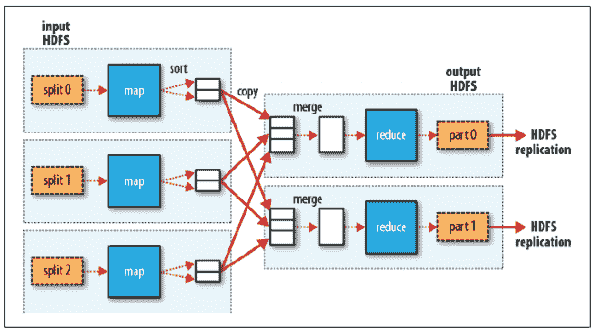
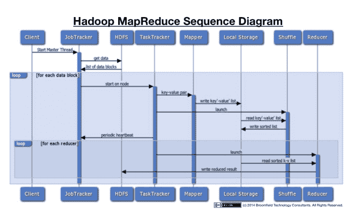
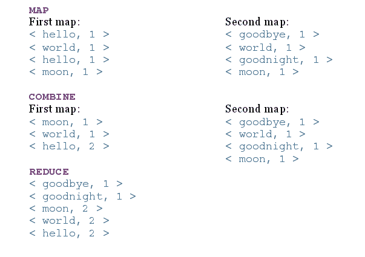

# Hadoop MapReduce 初学者教程

> 原文： [https://howtodoinjava.com/hadoop/hadoop-mapreduce-tutorial-for-beginners/](https://howtodoinjava.com/hadoop/hadoop-mapreduce-tutorial-for-beginners/)

[**Hadoop**](//howtodoinjava.com/big-data/hadoop/hadoop-big-data-tutorial/) **MapReduce** 是一种软件框架，可轻松以可靠，容错的方式，编写可在商用硬件的大型集群（数千个节点）上并行处理大量数据（多 TB 数据集）的应用。 与 [**HDFS**](//howtodoinjava.com/big-data/hadoop/hdfs-hadoop-distributed-file-system-architecture-tutorial/) 相似，Hadoop MapReduce 甚至可以在商用硬件中执行，并且假定节点可以随时发生故障并且仍在处理作业。 通过将一个任务划分为多个独立的子任务，MapReduce 可以并行处理大量数据。 与 HDFS 相似，MapReduce 也具有主从结构。

MapReduce 作业通常将输入数据集分成独立的块，这些块由**映射**任务以完全并行的方式处理。 框架对映射的输出进行排序，然后将其输入到**简化**任务中。 通常，作业的输入和输出都存储在文件系统中。

输入和输出，甚至是 MapReduce 作业中的中间输出，都是`<key, value>`对的形式。 键和值必须是可序列化的，并且不使用 Java 序列化程序包，而是具有一个接口，该接口必须实现并且可以有效地序列化，因为数据处理必须从一个节点移动到另一个节点。

## MapReduce 应用中的步骤

在大数据中，您希望将大数据集分解为许多较小的部分，并使用相同的算法并行处理它们。 使用 HDFS，文件已经被分割成一口大小的片段。 MapReduce 可帮助您处理所有这些数据。

MapReduce 作业很复杂，涉及多个步骤。 某些步骤是由 Hadoop 以默认行为执行的，可以在需要时将其覆盖。 以下是在 MapReduce 中依次执行的必需步骤：

1.  #### 映射器

    在 MapReduce 中，映射器代码应具有逻辑，该逻辑可以独立于其他块数据。 映射器逻辑应利用算法中所有可能的并行步骤。 在特定的`InputFormat`类型和必须在其上运行映射器进程的文件的驱动中设置对映射器的输入。 映射器的输出将是一个映射`<key, value>`，在映射器输出中设置的键和值不会保存在 HDFS 中，而是会在 OS 空间路径中创建一个中间文件，并且该文件会被读取，随机播放和排序。

2.  #### 随机排序（合并）

    随机排序和排序是映射器和归约器之间 MapReduce 中的中间步骤，由 Hadoop 处理，可以根据需要覆盖。 随机播放过程通过对映射器输出的键值进行分组来聚合所有映射器输出，并且该值将附加在值列表中。 因此，随机播放输出格式将为映射`<key, List<list of values>>`。

3.  #### 归约器

    归约器是聚合器过程，将经过随机排序和排序后的数据发送到具有`<key, List<list of values>>`的归约器，然后归约器将在值列表上进行处理。 每个密钥可以发送到不同的归约器。 归约器可以设置该值，并将其合并到 MapReduce 作业的最终输出中，并且该值将作为最终输出保存在 HDFS 中。

MapReduce 流程

让我们来看看序列图的所有动作信息。 这将有助于更好地可视化整个过程。

MapReduce 序列图

让我们来看一个上述步骤的示例。 考虑一下，我们将一个文件分为两个节点，文件内容为：

1.  **`file1`内容**：“`hello world hello moon`”
2.  **`file2`内容**：“`goodbye world goodnight moon`”

现在，在每个步骤之后，MapReduce 的结果如下：

MapReduce 步骤输出

没有归约器的应用称为“只有映射的作业”，当不需要合并映射任务的结果集时，它会很有用。

## 用 Java 编写 MapReduce 应用

要对 HDFS 中存储的大数据使用 MapReduce，必须提供以下输入：

*   指定输入/输出位置
*   通过实现适当的接口和/或抽象类来提供映射并简化功能

映射和归约函数必须与`Serializable`键和值一起使用，因为它们将在不同的节点之间移动。

对于序列化，Hadoop 使用以下两个接口：

1.  #### `Writable`接口（用于值）

    `Writable`接口用于序列化和反序列化的值。 一些实现`Writable`接口的类是`ArrayWritable`，`BooleanWritable`和`ByteWritable`等。我们可以创建自己的自定义`Writable`类，该类可在 MapReduce 中使用。 为了创建自定义类，我们必须实现`Writable`类并实现以下两种方法：

    **`void write (DataOutput out):`**：序列化对象。

    **`void readFields (DataInput in)`**：这将读取输入流并将其转换为对象。

2.  #### `WritableComparable`接口（用于密钥）

    `WritableComparable`用于键，键是从`Writable`接口继承的，并实现可比较的接口以提供值对象的比较。 其中的一些实现是`BooleanWritable`，`BytesWritable`和`ByteWritable`等。为了创建自定义`WritableComparable`类，我们必须实现`WritableComparable`类并实现以下三种方法：

    **`void write (DataPutput out)`**：序列化对象

    **`void readFields (DataInput in)`**：读取输入流并将其转换为对象
    
    **`Int compareTo (Object obj)`**：比较排序键所需的值

将以上输入合并到 MapReduce 作业中后，可以将其提交到`JobTracker`。

## `JobTracker`和`TaskTracker`流程

为了执行上面讨论的所有事情，MapReduce 具有以下两个守护进程：

1.  #### `JobTracker`（主流程）

    `JobTracker`的主要功能是资源管理，跟踪资源可用性和任务处理周期。 `JobTracker`识别`TaskTracker`来执行某些任务，并监视任务的进度和状态。 `JobTracker`是 MapReduce 流程的单点故障。

2.  #### `TaskTracker`（从属进程）

    `TaskTracker`是从属守护程序进程，它执行`JobTracker`分配的任务。 `TaskTracker`定期将心跳消息发送到`JobTracker`，以通知有关可用插槽的信息，并将有关任务的状态发送给`JobTracker`，并检查是否必须执行任何任务。

## 择时执行

MapReduce 作业分为多个映射器和归约器流程以及一些中间任务，因此一个作业可以产生数百或数千个任务，并且某些任务或节点可能需要很长时间才能完成任务。 Hadoop 监视和检测任务何时运行得比预期的慢，并且如果该节点的执行历史较慢，则它将在另一个节点中启动相同的任务作为备份，这称为推测性执行任务。 Hadoop 不会尝试修复或诊断节点或进程，因为该进程不会出错，但是速度很慢，并且由于硬件降级，软件配置错误，网络拥塞等原因会导致速度变慢。

一旦标记了执行缓慢的任务，`JobTracker`就会在另一个节点上启动该任务，并获取该任务的结果，该结果首先完成并杀死其他任务并记录情况。 如果某个节点始终落后，则`JobTracker`对该节点的优先级会降低。

可以启用或禁用推测性执行，并且默认情况下将其启用，因为它是一个有用的过程。 推测执行必须监视每个任务，在某些情况下会影响性能和资源。 不建议在执行某些任务的情况下执行推测执行，在这些任务中，特别是归约任务由于特定归约器上的数据偏斜而可能获得数百万个值，这比其他任务需要更长的时间，而启动另一个任务也无济于事。

## MapReduce 的局限性？

1.  您无法控制映射或缩小的运行顺序。
2.  为了获得最大的并行度，您需要映射和归约不依赖于同一 MapReduce 作业中生成的数据（即两者都应该是无状态的）。
3.  在所有映射都完成之前，不会进行归约操作。
4.  一般的假设，归约的输出小于映射的输入。
5.  由于带有索引的数据库将始终比未索引数据上的 MapReduce 作业快，因此性能可能下降。

**祝您学习愉快！**