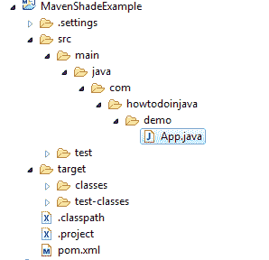

# Maven Shade 插件 – UberJar/胖 Jar 示例

> 原文： [https://howtodoinjava.com/maven/maven-shade-plugin-create-uberfat-jar-example/](https://howtodoinjava.com/maven/maven-shade-plugin-create-uberfat-jar-example/)

在此示例中，我们将学习使用 [Maven Shade 插件](https://maven.apache.org/plugins/maven-shade-plugin/)将 Java 项目及其依赖项打包到**胖 JAR** 或**超级 JAR** 中。

## Maven Shade 插件语法

让我们先了解一下 Maven Shade 插件的基本语法，然后再学习如何在项目中使用它。

```java
<plugin>
	<groupId>org.apache.maven.plugins</groupId>
	<artifactId>maven-shade-plugin</artifactId>
	<version>2.4.3</version>
	<executions>
	  <execution>
	    <phase>package</phase>
	    <goals>
	      	<goal>shade</goal>
	    </goals>
	    <configuration>
	      	<transformers>
		        <transformer implementation="org.apache.maven.plugins.shade.resource.ManifestResourceTransformer">
		          	<manifestEntries>
		            	<Main-Class>com.howtodoinjava.demo.App</Main-Class>
		            	<Build-Number>1.0</Build-Number>
		          	</manifestEntries>
		        </transformer>
	      	</transformers>
	    </configuration>
	  </execution>
	</executions>
</plugin>

```

1.  `<goal>shade</goal>`告知应在**程序包**阶段中运行。
2.  `ManifestResourceTransformer`在`MANIFEST.MF`文件中创建条目，作为`<manifestEntries>`中的键值对。
3.  您可以根据需要使用更多可用的[传输](https://maven.apache.org/plugins/maven-shade-plugin/usage.html)。

## 示例 Maven 项目

让我们创建一个示例 maven 项目，并向其中添加一些依赖项。 这是它的`pom.xml`文件。

```java
<project xmlns="http://maven.apache.org/POM/4.0.0" xmlns:xsi="http://www.w3.org/2001/XMLSchema-instance"
	xsi:schemaLocation="http://maven.apache.org/POM/4.0.0 http://maven.apache.org/xsd/maven-4.0.0.xsd;
	<modelVersion>4.0.0</modelVersion>

	<groupId>com.howtodoinjava.demo</groupId>
	<artifactId>MavenShadeExample</artifactId>
	<version>0.0.1-SNAPSHOT</version>
	<packaging>jar</packaging>

	<name>MavenShadeExample</name>
	<url>http://maven.apache.org</url>

	<properties>
		<project.build.sourceEncoding>UTF-8</project.build.sourceEncoding>
	</properties>

	<dependencies>
		<dependency>
			<groupId>log4j</groupId>
			<artifactId>log4j</artifactId>
			<version>1.2.17</version>
		</dependency>
		<dependency>
			<groupId>org.apache.commons</groupId>
			<artifactId>commons-lang3</artifactId>
			<version>3.4</version>
		</dependency>
	</dependencies>

	<build>
		<finalName>MavenShadeExample-uber</finalName>
		<plugins>
			<plugin>
				<groupId>org.apache.maven.plugins</groupId>
				<artifactId>maven-shade-plugin</artifactId>
				<version>2.4.3</version>
				<executions>
					<execution>
						<phase>package</phase>
						<goals>
							<goal>shade</goal>
						</goals>
						<configuration>
							<transformers>
								<transformer
									implementation="org.apache.maven.plugins.shade.resource.ManifestResourceTransformer">
									<manifestEntries>
										<Main-Class>com.howtodoinjava.demo.App</Main-Class>
										<Build-Number>1.0</Build-Number>
									</manifestEntries>
								</transformer>
							</transformers>
						</configuration>
					</execution>
				</executions>
			</plugin>
		</plugins>
	</build>
</project>

```

项目结构如下所示。



Maven Shade 插件结构


## 运行 Maven 包目标

```java
> mvn package
```

在项目的根目录中运行`package`目标时，您将获得**两个生成的 jar 文件**，即一个名为`dependency-reduced-pom.xml`的额外`pom.xml`文件。

1.  **`MavenShadeExample-uber.jar`**：这是胖/超级 jar，其中包含所有依赖项。
2.  **依赖项减少的`pom.xml`**：此生成的 Maven 文件是您的`pom.xml`文件减去所有依赖项。
3.  **`original-MavenShadeExample-uber.jar`**：该 jar 是通过执行`dependency-reduced-pom.xml`生成的。

通过运行以下命令验证生成的所有类。

```java
jar -tvf MavenShadeExample-uber.jar
```

输出将在命令提示符中列出，其中包含所有类。

清单文件的内容也可以被验证。

```java
Manifest-Version: 1.0
Build-Number: 1.0
Build-Jdk: 1.6.0_33
Created-By: Apache Maven
Main-Class: com.howtodoinjava.demo.App

```

将我的问题放在评论部分。

学习愉快！