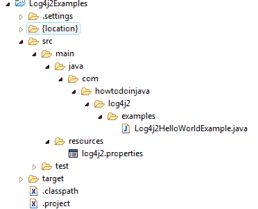

# Log4j2 属性文件示例

> 原文： [https://howtodoinjava.com/log4j2/log4j2-properties-example/](https://howtodoinjava.com/log4j2/log4j2-properties-example/)

学习配置`log4j2.properties`文件，以将日志语句输出到控制台，滚动文件等。学习配置 **log4j2** 附加器，级别和模式。

Apache [Log4j2](https://logging.apache.org/log4j/2.x/) 是 Log4j 1.x 的升级版，对它的前身进行了重大改进，例如性能提高，自动重新加载已修改的配置文件， [Java 8 lambda](https://howtodoinjava.com/java8/complete-lambda-expressions-tutorial-in-java/) 支持和自定义 [日志级别](https://howtodoinjava.com/log4j/logging-levels-in-log4j/)。

## 1\. Log4j2 Maven 依赖项

要包含 **Log4j2** ，请在项目中包含以下 maven 依赖项。

```java
<dependency>
	<groupId>org.apache.logging.log4j</groupId>
	<artifactId>log4j-api</artifactId>
	<version>2.6.1</version>
</dependency>
<dependency>
	<groupId>org.apache.logging.log4j</groupId>
	<artifactId>log4j-core</artifactId>
	<version>2.6.1</version>
</dependency>

```

## 2\. `log4j2.properties` – 控制台日志记录

我们可以使用下面的`log4j2.properties`文件将日志输出到控制台。 请注意，如果找不到配置文件，则将使用`DefaultConfiguration`。 **Log4j2 默认日志记录**还将日志输出到控制台。

```java
status = error
name = PropertiesConfig

filters = threshold

filter.threshold.type = ThresholdFilter
filter.threshold.level = debug

appenders = console

appender.console.type = Console
appender.console.name = STDOUT
appender.console.layout.type = PatternLayout
appender.console.layout.pattern = %d{yyyy-MM-dd HH:mm:ss} %-5p %c{1}:%L - %m%n

rootLogger.level = debug
rootLogger.appenderRefs = stdout
rootLogger.appenderRef.stdout.ref = STDOUT

```

## 3\. `log4j2.properties` – 滚动文件附加器

我们可以使用下面的`log4j2.properties`文件将日志输出到**基于日期的滚动文件**。

```java
status = error
name = PropertiesConfig

#Make sure to change log file path as per your need
property.filename = C:\\logs\\debug.log

filters = threshold

filter.threshold.type = ThresholdFilter
filter.threshold.level = debug

appenders = rolling

appender.rolling.type = RollingFile
appender.rolling.name = RollingFile
appender.rolling.fileName = ${filename}
appender.rolling.filePattern = debug-backup-%d{MM-dd-yy-HH-mm-ss}-%i.log.gz
appender.rolling.layout.type = PatternLayout
appender.rolling.layout.pattern = %d{yyyy-MM-dd HH:mm:ss} %-5p %c{1}:%L - %m%n
appender.rolling.policies.type = Policies
appender.rolling.policies.time.type = TimeBasedTriggeringPolicy
appender.rolling.policies.time.interval = 1
appender.rolling.policies.time.modulate = true
appender.rolling.policies.size.type = SizeBasedTriggeringPolicy
appender.rolling.policies.size.size=10MB
appender.rolling.strategy.type = DefaultRolloverStrategy
appender.rolling.strategy.max = 20

loggers = rolling

#Make sure to change the package structure as per your application

logger.rolling.name = com.howtodoinjava
logger.rolling.level = debug
logger.rolling.additivity = false
logger.rolling.appenderRef.rolling.ref = RollingFile

```

## 4\. `log4j2.properties`文件路径

我们应该将`log4j2.properties`放在应用的类路径中的任何位置。 **Log4j2** 将扫描所有类路径位置以查找此文件，然后将其加载。



`Log4j2.properties`文件位置


## 5\. log4j2 属性文件示例

让我们写一个 Java 类并写一些日志语句来验证日志是否也出现在控制台和日志文件中。

```java
package com.howtodoinjava.log4j2.examples;

import org.apache.logging.log4j.LogManager;
import org.apache.logging.log4j.Logger;

public class Log4j2HelloWorldExample 
{
	private static final Logger LOGGER = LogManager.getLogger(Log4j2HelloWorldExample.class.getName());

	public static void main(String[] args) 
	{
		LOGGER.debug("Debug Message Logged !!!");
		LOGGER.info("Info Message Logged !!!");
		LOGGER.error("Error Message Logged !!!", new NullPointerException("NullError"));
	}
}

```

现在，当您运行上述程序时，您将在控制台中获得以下日志。

```java
2016-06-16 13:41:27 DEBUG Log4j2HelloWorldExample:12 - Debug Message Logged !!!
2016-06-16 13:41:27 INFO  Log4j2HelloWorldExample:13 - Info Message Logged !!!
2016-06-16 13:41:27 ERROR Log4j2HelloWorldExample:14 - Error Message Logged !!!
java.lang.NullPointerException: NullError
	at com.howtodoinjava.log4j2.examples.Log4j2HelloWorldExample.main(Log4j2HelloWorldExample.java:14) 
	[classes/:?]

```

学习愉快！