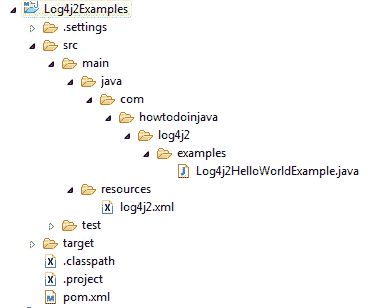

# Log4j2 xml 配置示例

> 原文： [https://howtodoinjava.com/log4j2/log4j-2-xml-configuration-example/](https://howtodoinjava.com/log4j2/log4j-2-xml-configuration-example/)

[Apache Log4j2](https://logging.apache.org/log4j/2.x/) 是对 Log4j 1.x 的升级，与以前的版本相比有了显着改进，例如性能提高，自动重新加载已修改的配置文件， [Java8 lambda](https://howtodoinjava.com/java-8-tutorial/) 支持和自定义日志级别。

Log4j2.4 及更高版本需要 Java 7。 版本 2.0-alpha1 至 2.3 需要 Java 6。

## 1\. log4j2 maven 依赖

要将 **Log4j2** 包含在您的项目中，请在项目中包含以下 maven 依赖项。

```java
<dependency>
	<groupId>org.apache.logging.log4j</groupId>
	<artifactId>log4j-api</artifactId>
	<version>2.6.1</version>
</dependency>
<dependency>
	<groupId>org.apache.logging.log4j</groupId>
	<artifactId>log4j-core</artifactId>
	<version>2.6.1</version>
</dependency>

```

## 2\. 用于控制台日志`log4j2.xml`

您可以使用下面的`log4j2.xml`将日志输出到控制台。 请注意，如果找不到配置文件，则将使用`DefaultConfiguration`。 这也将日志输出到控制台。

```java
<?xml version="1.0" encoding="UTF-8"?>
<Configuration status="INFO">
	<Appenders>
		<Console name="console" target="SYSTEM_OUT">
			<PatternLayout
				pattern="[%-5level] %d{yyyy-MM-dd HH:mm:ss.SSS} [%t] %c{1} - %msg%n" />
		</Console>
	</Appenders>
	<Loggers>
		<Root level="debug" additivity="false">
			<AppenderRef ref="console" />
		</Root>
	</Loggers>
</Configuration>

```

## 3\. 用于滚动文件日志的`log4j2.xml`

您可以使用下面的`log4j2.xml`文件将日志输出到基于日期的滚动文件 – 以及控制台。

```java
<?xml version="1.0" encoding="UTF-8"?>
<Configuration status="warn">
	<Properties>
		<Property name="basePath">C:\\logs</Property>
	</Properties>

	<Appenders>
		<RollingFile name="fileLogger" fileName="${basePath}/app-info.log" filePattern="${basePath}/app-info-%d{yyyy-MM-dd}.log">
			<PatternLayout>
				<pattern>[%-5level] %d{yyyy-MM-dd HH:mm:ss.SSS} [%t] %c{1} - %msg%n</pattern>
			</PatternLayout>
			<Policies>
				<TimeBasedTriggeringPolicy interval="1" modulate="true" />
			</Policies>
		</RollingFile>

		<Console name="console" target="SYSTEM_OUT">
			<PatternLayout	pattern="[%-5level] %d{yyyy-MM-dd HH:mm:ss.SSS} [%t] %c{1} - %msg%n" />
		</Console>
	</Appenders>
	<Loggers>
		<Logger name="com.howtodoinjava" level="debug" additivity="true">
			<appender-ref ref="fileLogger" level="debug" />
		</Logger>
		<Root level="debug" additivity="false">
			<appender-ref ref="console" />
		</Root>
	</Loggers>
</Configuration>

```

## 4\. `log4j2.xml`文件位置

您应该将`log4j2.xml`放在应用的类路径中的任何位置。 Log4j 将扫描所有类路径位置以查找此文件，然后加载它。



`Log4j2.xml`文件位置


## 5\. `log4j2.xml`示例

让我们编写一个 Java 类，并写一些日志语句，以验证控制台和日志文件中的日志是否也在增加。 它将不同的日志级别记录到不同的日志中

```java
package com.howtodoinjava.log4j2.examples;

import org.apache.logging.log4j.LogManager;
import org.apache.logging.log4j.Logger;

public class Log4j2HelloWorldExample 
{
	private static final Logger LOGGER = LogManager.getLogger(Log4j2HelloWorldExample.class.getName());

	public static void main(String[] args) 
	{
		LOGGER.debug("Debug Message Logged !!!");
		LOGGER.info("Info Message Logged !!!");
		LOGGER.error("Error Message Logged !!!", new NullPointerException("NullError"));
	}
}

```

现在，当您运行上述程序时，您将在控制台中获得以下日志。

```java
[DEBUG] 2016-06-16 12:17:42.972 [main] Log4j2HelloWorldExample - Debug Message Logged !!!
[INFO ] 2016-06-16 12:17:42.996 [main] Log4j2HelloWorldExample - Info Message Logged !!!
[ERROR] 2016-06-16 12:17:42.997 [main] Log4j2HelloWorldExample - Error Message Logged !!!
java.lang.NullPointerException: NullError
	at com.howtodoinjava.log4j2.examples.Log4j2HelloWorldExample.main(Log4j2HelloWorldExample.java:14) [classes/:?]

```

如果您更改系统日期并再次运行该应用，则会在配置的位置找到两个日志文件，即`app-info.log`和`app-info-2016-06-15.log` –第二个文件将在该文件上滚动。

## 6\. 带有多文件附加器的`log4j2.xml`

使用此**简单`log4j2.xml`**作为**多个日志文件**中的日志语句的快速参考。 它使用`LevelRangeFilter`将不同级别的日志（`debug`，`info`等）记录到不同的文件中，以便您的日志干净且分开，以便于分析。

```java
<?xml version="1.0" encoding="UTF-8"?>
<Configuration status="WARN" monitorInterval="30">

	<!-- Logging Properties -->
    <Properties>
        <Property name="LOG_PATTERN">%d{yyyy-MM-dd'T'HH:mm:ss.SSSZ} %p %m%n</Property>
        <Property name="APP_LOG_ROOT">c:/temp</Property>
    </Properties>

    <Appenders>

    	<!-- Console Appender -->
        <Console name="Console" target="SYSTEM_OUT" follow="true">
            <PatternLayout pattern="${LOG_PATTERN}"/>
        </Console>

        <!-- File Appenders on need basis -->
        <RollingFile name="frameworkLog" fileName="${APP_LOG_ROOT}/app-framework.log" 
			filePattern="${APP_LOG_ROOT}/app-framework-%d{yyyy-MM-dd}-%i.log">
			<LevelRangeFilter minLevel="ERROR" maxLevel="ERROR" onMatch="ACCEPT" onMismatch="DENY"/>
			<PatternLayout pattern="${LOG_PATTERN}"/>
			<Policies>
				<SizeBasedTriggeringPolicy size="19500KB" />
			</Policies>
			<DefaultRolloverStrategy max="10"/>
		</RollingFile>

		<RollingFile name="debugLog" fileName="${APP_LOG_ROOT}/app-debug.log" 
			filePattern="${APP_LOG_ROOT}/app-debug-%d{yyyy-MM-dd}-%i.log">
			<LevelRangeFilter minLevel="DEBUG" maxLevel="DEBUG" onMatch="ACCEPT" onMismatch="DENY"/>
			<PatternLayout pattern="${LOG_PATTERN}"/>
			<Policies>
				<SizeBasedTriggeringPolicy size="19500KB" />
			</Policies>
			<DefaultRolloverStrategy max="10"/>
		</RollingFile>

		<RollingFile name="infoLog" fileName="${APP_LOG_ROOT}/app-info.log" 
			filePattern="${APP_LOG_ROOT}/app-info-%d{yyyy-MM-dd}-%i.log" >
			<LevelRangeFilter minLevel="INFO" maxLevel="INFO" onMatch="ACCEPT" onMismatch="DENY"/>
			<PatternLayout pattern="${LOG_PATTERN}"/>
			<Policies>
				<SizeBasedTriggeringPolicy size="19500KB" />
			</Policies>
			<DefaultRolloverStrategy max="10"/>
		</RollingFile>

		<RollingFile name="errorLog" fileName="${APP_LOG_ROOT}/app-error.log" 
			filePattern="${APP_LOG_ROOT}/app-error-%d{yyyy-MM-dd}-%i.log" >
			<LevelRangeFilter minLevel="ERROR" maxLevel="ERROR" onMatch="ACCEPT" onMismatch="DENY"/>
			<PatternLayout pattern="${LOG_PATTERN}"/>
			<Policies>
				<SizeBasedTriggeringPolicy size="19500KB" />
			</Policies>
			<DefaultRolloverStrategy max="10"/>
		</RollingFile>

		<RollingFile name="perfLog" fileName="${APP_LOG_ROOT}/app-perf.log" 
			filePattern="${APP_LOG_ROOT}/app-perf-%d{yyyy-MM-dd}-%i.log" >
			<PatternLayout pattern="${LOG_PATTERN}"/>
			<Policies>
				<SizeBasedTriggeringPolicy size="19500KB" />
			</Policies>
			<DefaultRolloverStrategy max="1"/>
		</RollingFile>

		<RollingFile name="traceLog" fileName="${APP_LOG_ROOT}/app-trace.log" 
			filePattern="${APP_LOG_ROOT}/app-trace-%d{yyyy-MM-dd}-%i.log" >
			<PatternLayout pattern="${LOG_PATTERN}"/>
			<Policies>
				<SizeBasedTriggeringPolicy size="19500KB" />
			</Policies>
			<DefaultRolloverStrategy max="1"/>
		</RollingFile>

    </Appenders>

    <Loggers>

    	<Logger name="com.howtodoinjava.app.somePackage" additivity="false" level="trace">
    		<AppenderRef ref="traceLog" />
            <AppenderRef ref="Console" />
        </Logger>

        <Logger name="com.howtodoinjava.app" additivity="false" level="debug">
	        <AppenderRef ref="debugLog" />
	        <AppenderRef ref="infoLog"  />
            <AppenderRef ref="errorLog" />
            <AppenderRef ref="Console"  />
        </Logger>

        <Logger name="org.framework.package" additivity="false" level="info">
            <AppenderRef ref="perfLog" />
            <AppenderRef ref="Console"/>
        </Logger>

        <Root level="warn">
            <AppenderRef ref="Console"/>
        </Root>

    </Loggers>

</Configuration>

```

学习愉快！