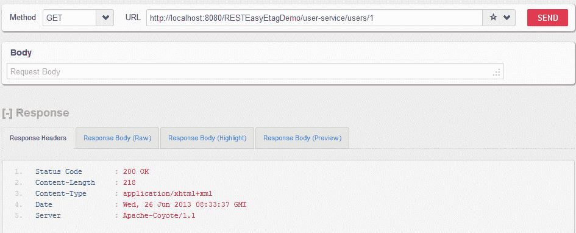
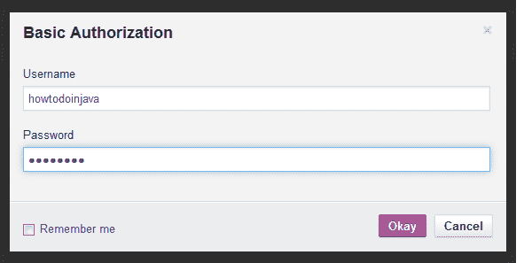
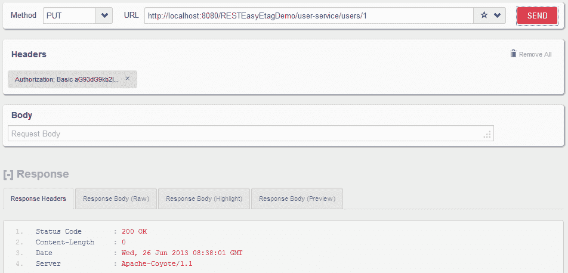

# RESTEasy 基本认证和授权教程

> 原文： [https://howtodoinjava.com/resteasy/jax-rs-resteasy-basic-authentication-and-authorization-tutorial/](https://howtodoinjava.com/resteasy/jax-rs-resteasy-basic-authentication-and-authorization-tutorial/)

安全性是任何企业应用不可或缺的一部分。 安全涉及两个阶段，即认证和授权。 **认证可验证您的身份。 授权会验证您有权执行的操作。** 在本文中，我们将学习为 REST API 构建基于角色的基本认证/授权安全性。

```java
Sections in this post:

Background information
Important classes/annotations used
Building the security interceptor
Testing authorization and authentication on REST APIs

```

## 背景信息

在本文中，我将尝试**解决以下安全问题**：

*   从 http 请求获取用户名和密码
*   获取适用的方法安全性详细信息
*   验证用户是否有权访问 API
*   如果访问无效，则返回有效的错误代码

另外，请注意，我正在**为您实现以下部分**：

*   访问数据库以获取密码，以验证请求中提供的密码
*   从数据库中为有效用户获取允许的角色

我正在重用为 [**ETag 使用演示**](//howtodoinjava.com/2013/06/05/jax-rs-resteasy-cache-control-with-etag-example/ "JAX-RS RESTEasy Cache control with ETag example")编写的代码。 该项目有 2 个主要类：

**`User.java`**：代表系统中用户资源的模型类

```java
@XmlAccessorType(XmlAccessType.NONE)
@XmlRootElement(name = "user")
public class User implements Serializable 
{
	@XmlAttribute(name = "id")
	private int id;

	@XmlAttribute(name="uri")
	private String uri;

	@XmlElement(name = "firstName")
	private String firstName;

	@XmlElement(name = "lastName")
	private String lastName;

	@XmlElement(name="last-modified")
	private Date lastModified;

	//Getters and setters
}

```

**`UserService.java`**：此类具有 GET 和 PUT API，用于获取/修改用户资源。

```java
@Path("/user-service")
public class UserService
{
    @GET
    @Path("/users/{id}")
    public Response getUserById(@PathParam("id") int id, @Context Request req)
    {
        Response.ResponseBuilder rb = Response.ok(UserDatabase.getUserById(id));
        return rb.build();
    }

    @PUT
    @Path("/users/{id}")
    public Response updateUserById(@PathParam("id") int id)
    {
        //Update the User resource
        UserDatabase.updateUser(id);
        return Response.status(200).build();
    }
}

```

在本教程中，我将使用上述 2 个 API 并确保它们的安全。

## 使用的重要类/注解

JAX-RS 提供必要的注解，以在基于 RESTEasy 的应用中实现安全性。 重要的注解是：

*   [`javax.annotation.security.PermitAll`](https://docs.oracle.com/javaee/6/api/javax/annotation/security/PermitAll.html "PermitAll")：此注解应用于 API 时，用于声明任何用户都可以自由访问该 API。 此 API 没有访问限制。
*   [`javax.annotation.security.DenyAll`](https://docs.oracle.com/javaee/6/api/javax/annotation/security/DenyAll.html "DenyAll")：此注解用于声明无论分配给任何用户的角色，都不允许任何人访问此 API。
*   [`javax.annotation.security.RolesAllowed`](https://docs.oracle.com/javaee/6/api/javax/annotation/security/RolesAllowed.html "RolesAllowed")：此注解有助于标识访问该 API 的任何用户都需要哪些角色。 如果通过用户/名称和密码验证了用户，但没有此注解指定的角色，则将不允许该用户访问。
*   [`javax.ws.rs.core.HttpHeaders`](https://docs.oracle.com/javaee/6/api/javax/ws/rs/core/HttpHeaders.html "HttpHeaders")：一个接口，提供对与 http 请求一起附加的 HTTP 标头信息的访问。
*   [`org.jboss.resteasy.util.Base64`](http://docs.jboss.org/resteasy/docs/2.3.0.GA/javadocs/org/jboss/resteasy/util/Base64.html "Base64")：此类有助于在 Base64 表示法之间进行编码和解码。

除上述类外，[`org.jboss.resteasy.spi.interception.PreProcessInterceptor`](http://docs.jboss.org/resteasy/docs/1.2.GA/javadocs/org/jboss/resteasy/spi/interception/PreProcessInterceptor.html "PreProcessInterceptor")将用于创建安全拦截器。 [`javax.ws.rs.ext.Provider`](http://docs.jboss.org/resteasy/docs/1.0.2.GA/javadocs/javax/ws/rs/ext/class-use/Provider.html "Provider")注解将用于在 resteasy 上下文中注册拦截器。

## 构建安全拦截器

在构建拦截器之前，请确保 API 的安全。 我在 GET/PUT API 中添加了`@PermitAll`和`@RolesAllowed`注解。 GET API 向所有人开放，即没有访问限制。 PUT API 需要具有`ADMIN`功能的有效用户。

```java
@Path("/user-service")
public class UserService
{
	@PermitAll
    @GET
    @Path("/users/{id}")
    public Response getUserById(@PathParam("id") int id, @Context Request req)
    {
        Response.ResponseBuilder rb = Response.ok(UserDatabase.getUserById(id));
        return rb.build();
    }

	@RolesAllowed("ADMIN")
    @PUT
    @Path("/users/{id}")
    public Response updateUserById(@PathParam("id") int id)
    {
        //Update the User resource
        UserDatabase.updateUser(id);
        return Response.status(200).build();
    }
}

```

通过实现`org.jboss.resteasy.spi.interception`.`PreProcessInterceptor`接口来构建安全拦截器。 该接口有一个实现类的类需要实现的方法。

```java
	public ServerResponse preProcess(HttpRequest request, ResourceMethod methodInvoked) 
															throws Failure, WebApplicationException;

```

`methodInvoked`参数提供对方法的访问，该方法将由于调用 REST API 而被调用。
请求参数提供对客户端传递的请求标头和参数的访问。

拦截器类的定义如下：

```java
@Provider
@ServerInterceptor
public class SecurityInterceptor implements PreProcessInterceptor
{
	//more code
}

```

`@Provider`进行 resteasy 上下文扫描，以将该类添加为上下文类。
`@ServerInterceptor`注解将此类添加到可用的拦截器列表中。

现在，第一步是检查 API 是否对所有人都打开或对所有人都关闭。 这可以通过检查`@PermitAll`和`@DenyAll`注解来完成。

```java
	Method method = methodInvoked.getMethod();

	//Access allowed for all 
	if(method.isAnnotationPresent(PermitAll.class))
	{
		return null; //Return null to continue request processing
	}
	//Access denied for all 
	if(method.isAnnotationPresent(DenyAll.class))
	{
		return ACCESS_FORBIDDEN; //Return access denied to user
	}

```

下一步是从请求中获取授权标头。 从授权标头中，我们将检索用户发送的用户名和密码。

```java
	//Get request headers
	final HttpHeaders headers = request.getHttpHeaders();

	//Fetch authorization header
	final List<String> authorization = headers.getRequestHeader(AUTHORIZATION_PROPERTY);

	//If no authorization information present; block access
	if(authorization == null || authorization.isEmpty())
	{
		return ACCESS_DENIED;
	}

	//Get encoded username and password
	final String encodedUserPassword = authorization.get(0).replaceFirst(AUTHENTICATION_SCHEME + " ", "");

	//Decode username and password
	String usernameAndPassword;
	try {
		usernameAndPassword = new String(Base64.decode(encodedUserPassword));
	} catch (IOException e) {
		return SERVER_ERROR;
	}

	//Split username and password tokens
	final StringTokenizer tokenizer = new StringTokenizer(usernameAndPassword, ":");
	final String username = tokenizer.nextToken();
	final String password = tokenizer.nextToken();

```

现在，我们将从`@RolesAllowed`注解中获取访问 API 所需的角色。

```java
	RolesAllowed rolesAnnotation = method.getAnnotation(RolesAllowed.class);
	Set<String> rolesSet = new HashSet<String>(Arrays.asList(rolesAnnotation.value()));

```

`RolesSet`包含所有可以允许 API 访问的角色。

现在，在最后一步中，我们必须做两件事。 首先，从任何数据库服务验证用户名和密码，如果用户有效，则获取分配给他的角色。 该角色将用于检查用户的认证成功。

```java
	if(rolesSet.contains(userRole))
	{
		isAllowed = true;
	}

```

`SecurityInterceptor.java`的完整源代码如下所示：

```java
/**
 * This interceptor verify the access permissions for a user 
 * based on username and passowrd provided in request
 * */
@Provider
@ServerInterceptor
public class SecurityInterceptor implements PreProcessInterceptor
{
	private static final String AUTHORIZATION_PROPERTY = "Authorization";
	private static final String AUTHENTICATION_SCHEME = "Basic";
	private static final ServerResponse ACCESS_DENIED = new ServerResponse("Access denied for this resource", 401, new Headers<Object>());;
	private static final ServerResponse ACCESS_FORBIDDEN = new ServerResponse("Nobody can access this resource", 403, new Headers<Object>());;
	private static final ServerResponse SERVER_ERROR = new ServerResponse("INTERNAL SERVER ERROR", 500, new Headers<Object>());;

	@Override
	public ServerResponse preProcess(HttpRequest request, ResourceMethod methodInvoked) throws Failure, WebApplicationException
	{
		Method method = methodInvoked.getMethod();

		//Access allowed for all 
		if(method.isAnnotationPresent(PermitAll.class))
		{
			return null;
		}
		//Access denied for all 
		if(method.isAnnotationPresent(DenyAll.class))
		{
			return ACCESS_FORBIDDEN;
		}

		//Get request headers
		final HttpHeaders headers = request.getHttpHeaders();

		//Fetch authorization header
	    final List<String> authorization = headers.getRequestHeader(AUTHORIZATION_PROPERTY);

	    //If no authorization information present; block access
	    if(authorization == null || authorization.isEmpty())
	    {
	    	return ACCESS_DENIED;
	    }

	    //Get encoded username and password
	    final String encodedUserPassword = authorization.get(0).replaceFirst(AUTHENTICATION_SCHEME + " ", "");

	    //Decode username and password
	    String usernameAndPassword;
		try {
			usernameAndPassword = new String(Base64.decode(encodedUserPassword));
		} catch (IOException e) {
			return SERVER_ERROR;
		}

		//Split username and password tokens
	    final StringTokenizer tokenizer = new StringTokenizer(usernameAndPassword, ":");
	    final String username = tokenizer.nextToken();
	    final String password = tokenizer.nextToken();

	    //Verifying Username and password
	    System.out.println(username);
	    System.out.println(password);

	    //Verify user access
		if(method.isAnnotationPresent(RolesAllowed.class))
		{
			RolesAllowed rolesAnnotation = method.getAnnotation(RolesAllowed.class);
			Set<String> rolesSet = new HashSet<String>(Arrays.asList(rolesAnnotation.value()));

			//Is user valid?
			if( ! isUserAllowed(username, password, rolesSet))
			{
				return ACCESS_DENIED;
			}
		}

		//Return null to continue request processing
		return null;
	}

	private boolean isUserAllowed(final String username, final String password,	final Set<String> rolesSet) 
	{
		boolean isAllowed = false;

		//Step 1\. Fetch password from database and match with password in argument
		//If both match then get the defined role for user from database and continue; else return isAllowed [false]
		//Access the database and do this part yourself
		//String userRole = userMgr.getUserRole(username);
		String userRole = "ADMIN";

		//Step 2\. Verify user role
		if(rolesSet.contains(userRole))
		{
			isAllowed = true;
		}
		return isAllowed;
	}
}

```

## 在 REST API 上测试授权和认证

要测试安全代码，请将 Web 应用部署在任何应用服务器（例如 Tomcat）中。 现在，发送以下请求：

**HTTP GET `http://localhost:8080/RESTEasyEtagDemo/user-service/users/1`，没有用户名和密码**

用户能够成功访问 API。



**HTTP PUT `http://localhost:8080/RESTEasyEtagDemo/user-service/users/1`，没有用户名和密码**

用户无法访问 API。


**添加基本授权凭证**



**HTTP PUT `http://localhost:8080/RESTEasyEtagDemo/user-service/users/1`，其中添加了用户名和密码**

用户能够访问受保护的 API



这就是本教程中的全部内容。 如果您有任何疑问或建议，请给我评论。

[**下载源代码**](https://docs.google.com/file/d/0B7yo2HclmjI4U1BkQzZTV3VjVVk/edit?usp=sharing "JAX-RS RESTEasy basic authentication tutorial sourcecode")

**祝您学习愉快！**