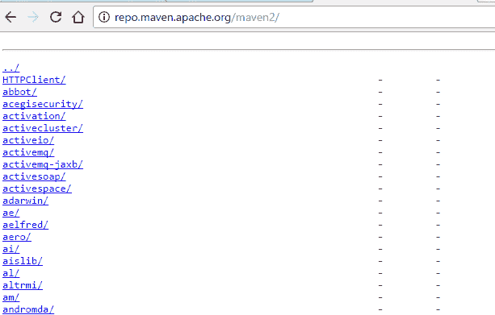

# Maven – 本地，远程和中央仓库

> 原文： [https://howtodoinjava.com/maven/local-remote-central-repositories/](https://howtodoinjava.com/maven/local-remote-central-repositories/)

Maven 仓库是物理目录，其中包含打包的 JAR 文件以及有关这些 jar 文件的额外元数据。 此元数据采用 POM 文件的形式，这些文件具有 jar 文件项目信息，包括此 JAR 文件还具有哪些其他外部依赖项。 这些其他外部依赖项会暂时下载到您的项目中，并成为该项目的**有效 pom** 的一部分。

```java
Table of Contents

Local repository
Central repository
Remote repository
```

## 本地仓库

**Maven 本地仓库**位于开发人员的计算机中。 每当您运行需要这些依赖项的 maven 目标时，maven 都会从远程服务器下载依赖项并将它们存储在开发人员的计算机中。

默认情况下，Maven 在用户主目录（即`C:/Users/superdev/.m2`目录）内创建本地仓库。 您可以使用`localRepository`标签在[`setting.xml`](//howtodoinjava.com/maven/maven-settings-file/)文件中更改本地仓库的位置。

```java
<settings>
    <localRepository>
        C:\M2
    </localRepository>
</settings>

```

将依赖项存储到本地计算机有两个主要好处。 首先，多个项目可以访问相同的工件，从而减少了存储需求。 其次，由于依赖项仅下载一次，因此也减少了网络使用率。

## 中央仓库

**Maven 中央仓库**位于 [http://repo.maven.apache.org/maven2/](https://repo.maven.apache.org/maven2/)。 每当您运行构建作业时，Maven 都会首先尝试从本地仓库中找到依赖项。 如果不存在，默认情况下，maven 将触发从该中央仓库位置进行下载。



Maven 中央仓库


要覆盖此默认位置，可以更改`settings.xml`文件以使用一个或多个镜像。

如果您在任何防火墙后面，则无需进行任何特殊配置即可访问中央仓库，但[网络代理设置](//howtodoinjava.com/maven/configure-network-proxy-settings-for-maven/)除外。

## 远程仓库

除了中央仓库之外，您可能还需要将工件部署在其他远程位置。 例如，在您的公司办公室中，可能仅存在特定于组织的项目或模块。 在这种情况下，组织可以创建远程仓库并部署这些**私有工件**。 仅在组织内部可以访问此远程仓库。

这些 **maven 远程仓库**的工作方式与 maven 的中央仓库完全相同。 每当需要这些仓库中的工件时，都会先将其下载到开发人员的本地仓库中，然后再使用。

您可以在 POM 文件中配置远程仓库，也可以在远程仓库本身中配置超级 POM 文件。

```java
<repositories>
   <repository>
       <id>org.source.repo</id>
       <url>http://maven.orgName.com/maven2/</url>
   </repository>
</repositories>

```

将我的问题放在评论部分。

学习愉快！

参考：[仓库简介](https://maven.apache.org/guides/introduction/introduction-to-repositories.html)