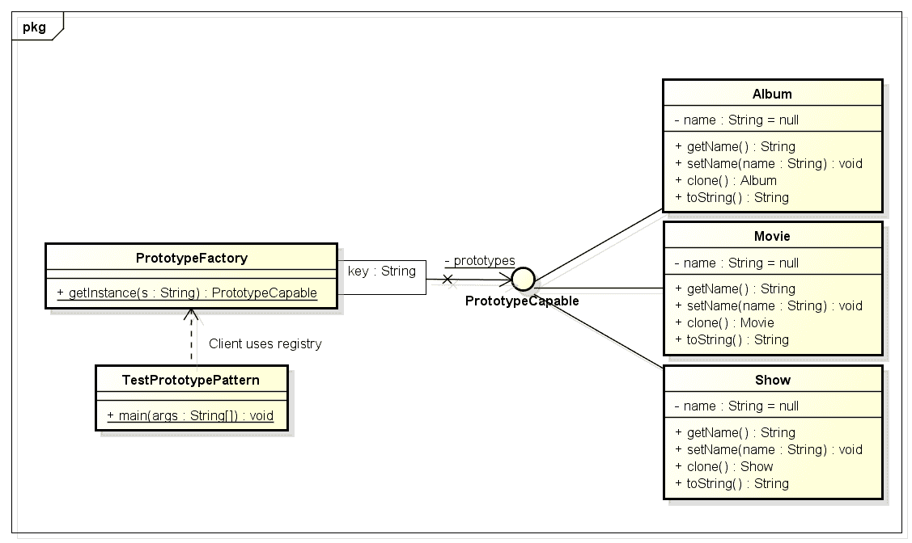

# Java 中的原型设计模式

> 原文： [https://howtodoinjava.com/design-patterns/creational/prototype-design-pattern-in-java/](https://howtodoinjava.com/design-patterns/creational/prototype-design-pattern-in-java/)

在构建实际对象之前， [**原型**](https://en.wikipedia.org/wiki/Prototype "Prototype")是任何对象的模板。 同样在 Java 中，它具有相同的含义。 原型设计模式用于应用需要创建多个类实例的情况，这些实例的状态几乎相同或相差很小。

在这种设计模式中，在启动时会创建一个实际对象的实例（即原型），此后每当需要一个新实例时，都会将该原型克隆为另一个实例。 此模式的主要**优势**是具有最少的实例创建过程，该过程比克隆过程要昂贵得多。

```java
Table of Contents

Design participants
Problem statement
Implementation
```

> 请确保您要对原型进行[深克隆或浅克隆](https://howtodoinjava.com/java/cloning/a-guide-to-object-cloning-in-java/ "A guide to object cloning in java")，因为两者在运行时的行为不同。 如果需要深度复制，则可以使用在内存序列化中使用[此处](https://howtodoinjava.com/java/serialization/how-to-do-deep-cloning-using-in-memory-serialization-in-java/ "How to do deep cloning using in memory serialization in java")给出的良好技术。

## 原型模式 – 参与者

*   **原型**：这是如上所述的实际对象的原型。
*   **原型注册表**：用作注册表服务，使所有原型都可以使用简单的字符串参数进行访问。
*   **客户端**：客户端将负责使用注册表服务访问原型实例。

## 问题陈述

让我们通过一个例子来了解这种模式。 我正在创建一个娱乐应用，该应用将非常频繁地需要`Movie`，`Album`和`Show`类的实例。 我不想每次都创建它们的实例，因为这很昂贵。 因此，我将创建他们的原型实例，每当我需要一个新实例时，我都将克隆该原型。

## 原型模式示例 – 实现

让我们从创建类图开始。



上面的类图说明了必要的类及其之间的关系。

解决方案中仅增加了一个接口“`PrototypeCapable`”。 使用此接口的原因是[`Cloneable`接口](//howtodoinjava.com/java/cloning/cloneable-interface-is-broken-in-java/ "Cloneable interface is broken in java")的损坏行为。 该接口有助于实现以下目标：

*   能够克隆原型而不知道它们的实际类型
*   提供要在注册表中使用的类型引用

他们的工作流程将如下所示：


让我们敲键盘并编写这些类。

**`PrototypeCapable.java`**

```java
package com.howtodoinjava.prototypeDemo.contract;

public interface PrototypeCapable extends Cloneable
{
	public PrototypeCapable clone() throws CloneNotSupportedException;
}

```

**`Movie.java`，`Album.java`和`Show.java`**

```java
package com.howtodoinjava.prototypeDemo.model;

import com.howtodoinjava.prototypeDemo.contract.PrototypeCapable;

public class Movie implements PrototypeCapable
{
	private String name = null;
	public String getName() {
		return name;
	}
	public void setName(String name) {
		this.name = name;
	}
	@Override
	public Movie clone() throws CloneNotSupportedException {
		System.out.println("Cloning Movie object..");
		return (Movie) super.clone();
	}
	@Override
	public String toString() {
		return "Movie";
	}
}

public class Album implements PrototypeCapable
{
	private String name = null;
	public String getName() {
		return name;
	}
	public void setName(String name) {
		this.name = name;
	}
	@Override
	public Album clone() throws CloneNotSupportedException {
		System.out.println("Cloning Album object..");
		return (Album) super.clone();
	}
	@Override
	public String toString() {
		return "Album";
	}
}

public class Show implements PrototypeCapable
{
	private String name = null;
	public String getName() {
		return name;
	}
	public void setName(String name) {
		this.name = name;
	}
	@Override
	public Show clone() throws CloneNotSupportedException {
		System.out.println("Cloning Show object..");
		return (Show) super.clone();
	}
	@Override
	public String toString() {
		return "Show";
	}
}

```

**`PrototypeFactory.java`**

```java
package com.howtodoinjava.prototypeDemo.factory;

import com.howtodoinjava.prototypeDemo.contract.PrototypeCapable;
import com.howtodoinjava.prototypeDemo.model.Album;
import com.howtodoinjava.prototypeDemo.model.Movie;
import com.howtodoinjava.prototypeDemo.model.Show;

public class PrototypeFactory
{
	public static class ModelType
	{
		public static final String MOVIE = "movie";
		public static final String ALBUM = "album";
		public static final String SHOW = "show";
	}
	private static java.util.Map<String , PrototypeCapable> prototypes = new java.util.HashMap<String , PrototypeCapable>();

	static
	{
		prototypes.put(ModelType.MOVIE, new Movie());
		prototypes.put(ModelType.ALBUM, new Album());
		prototypes.put(ModelType.SHOW, new Show());
	}

	public static PrototypeCapable getInstance(final String s) throws CloneNotSupportedException {
		return ((PrototypeCapable) prototypes.get(s)).clone();
	}
}

```

**`TestPrototypePattern`**

```java
package com.howtodoinjava.prototypeDemo.client;

import com.howtodoinjava.prototypeDemo.factory.PrototypeFactory;
import com.howtodoinjava.prototypeDemo.factory.PrototypeFactory.ModelType;

public class TestPrototypePattern
{
	public static void main(String[] args)
	{
		try
		{
			String moviePrototype  = PrototypeFactory.getInstance(ModelType.MOVIE).toString();
			System.out.println(moviePrototype);

			String albumPrototype  = PrototypeFactory.getInstance(ModelType.ALBUM).toString();
			System.out.println(albumPrototype);

			String showPrototype  = PrototypeFactory.getInstance(ModelType.SHOW).toString();
			System.out.println(showPrototype);

		}
		catch (CloneNotSupportedException e)
		{
			e.printStackTrace();
		}
	}
}

```

运行客户端代码时，输​​出如下。

```java
Cloning Movie object..
Movie
Cloning Album object..
Album
Cloning Show object..
Show
```

希望您喜欢 **Java 原型模式示例**上的这篇文章。 如有任何疑问，请发表评论。

[**下载源码**](//howtodoinjava.com/wp-content/downloads/PrototypePatternDemo.zip "下载源码 for prototype design pattern in java")

学习愉快！