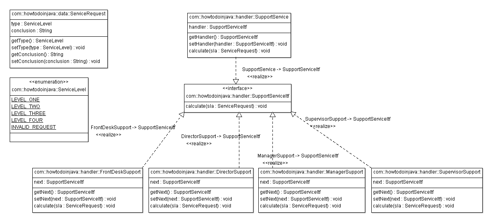

# 责任链设计模式

> 原文： [https://howtodoinjava.com/design-patterns/behavioral/chain-of-responsibility-design-pattern/](https://howtodoinjava.com/design-patterns/behavioral/chain-of-responsibility-design-pattern/)

[责任链](https://en.wikipedia.org/wiki/Chain-of-responsibility_pattern "Chain-of-responsibility_pattern")被称为行为模式。 这种模式的主要目的是避免将请求的发送方耦合到接收方，从而为多个对象提供了处理请求的机会。 GoF 定义的核心逻辑是：

```java
"Gives more than one object an opportunity to handle a request by linking receiving objects together."
```

责任链允许许多类尝试处理请求，而与链上的任何其他对象无关。 处理完请求后，它就完成了整个流程。

可以在链中添加或删除额外的处理程序，而无需修改任何具体处理程序内部的逻辑。

```java
Sections in this post:

Suggested usage
Participants in the solution
Sample problem to be solved
Proposed solution
Class diagram of participants
Sourcecode of participants
Test the application
Download sourecode link
Reference implementations in JDK
```

## **建议用法**

当多个对象可以处理一个请求并且处理程序不必是特定的对象时，建议使用此模式。 另外，处理程序是在运行时确定的。 请注意，任何处理程序都不处理的请求是有效的用例。

例如，Windows OS 中的事件处理机制，可以从鼠标，键盘或某些自动生成的事件生成事件。 所有这些事件都可以由多个处理程序处理，并且在运行时可以找到正确的处理程序。

更一般的例子可以是对呼叫中心的服务请求。 可以在前台，主管或任何更高级别处理此请求。 仅当在各个级别上遍历请求时，才在运行时知道正确的请求处理程序。 我们将在这篇文章中解决这种情况。

## **解决方案**中的参与者

**1）处理程序**：这可以是一个主要接收请求并将请求分派到处理程序链的接口。 它仅引用链中的第一个处理程序，而对其余处理程序一无所知。

**2）具体处理程序**：这些是按某些顺序链接的请求的实际处理程序。

**3）客户端**：请求的始发者，它将访问处理程序来处理它。

[](https://howtodoinjava.files.wordpress.com/2013/04/participants_of_chain_of_responsibility.gif)

Participants in chain of responsibility


## **要解决的示例问题**

问题陈述是为**支持服务系统**设计一个系统，该系统由前台，主管，经理和主管组成。 任何客户都可以致电前台，并寻求解决方案。 如果前台能够解决问题，它将解决； 否则将转交给主管。 同样，主管将尝试解决该问题，如果他能够解决，则将解决； 否则传给经理。 同样，经理将解决问题或转给董事。 导演将解决该问题或拒绝它。

## **建议的解决方案**

以上问题是使用责任链模式的良好人选。 我们可以在每个级别上定义处理程序，即支持台，主管，经理和主管。 然后，我们可以定义一条链来处理支持请求。 该链必须遵循以下顺序：

```java
Support desk > supervisor > manager > director
```

上面的链也可以使用 Java 中的编程解决方案进行管理，但是在本教程中，我将使用 spring 注入依赖项，从而形成该链。 同样，系统将首先将请求仅分配给前台。

## **参与者的课程图**

我已经绘制了解决方案中涉及的所有实体的结构，如下所示。

[](https://howtodoinjava.files.wordpress.com/2013/04/chainofresponsibility_classdiagram.png)

Support service system : class diagram


## **参与者**的源代码

以下是使用责任链设计模式实施支持服务的所有参与者的源代码：

**ServiceLevel.java**

```java
package com.howtodoinjava;

public enum ServiceLevel
{
	LEVEL_ONE, LEVEL_TWO, LEVEL_THREE, LEVEL_FOUR, INVALID_REQUEST
}

```

**ServiceRequest.java**

```java
package com.howtodoinjava.data;

import com.howtodoinjava.ServiceLevel;

public class ServiceRequest {

	private ServiceLevel type;
	private String conclusion = null;

	public ServiceLevel getType() {
		return type;
	}
	public void setType(ServiceLevel type) {
		this.type = type;
	}
	public String getConclusion() {
		return conclusion;
	}
	public void setConclusion(String conclusion) {
		this.conclusion = conclusion;
	}
}

```

**SupportServiceItf.java**

```java
package com.howtodoinjava.handler;

import com.howtodoinjava.data.ServiceRequest;

public interface SupportServiceItf
{
	public void handleRequest(ServiceRequest request);
}

```

**SupportService.java**

```java
package com.howtodoinjava.handler;

import com.howtodoinjava.data.ServiceRequest;

public class SupportService implements SupportServiceItf {

	private SupportServiceItf handler = null;

	public SupportServiceItf getHandler() {
		return handler;
	}

	public void setHandler(SupportServiceItf handler) {
		this.handler = handler;
	}

	@Override
	public void handleRequest(ServiceRequest request) {
		handler.handleRequest(request);
	}
}

```

**FrontDeskSupport.java**

```java
package com.howtodoinjava.handler;

import com.howtodoinjava.ServiceLevel;
import com.howtodoinjava.data.ServiceRequest;

public class FrontDeskSupport implements SupportServiceItf {

	private SupportServiceItf next = null;
	public SupportServiceItf getNext() {
		return next;
	}
	public void setNext(SupportServiceItf next) {
		this.next = next;
	}

	@Override
	public void handleRequest(ServiceRequest service) {
		if(service.getType() == ServiceLevel.LEVEL_ONE)
		{
			service.setConclusion("Front desk solved level one reuqest !!");
		}
		else
		{
			if(next != null){
				next.handleRequest(service);
			}
			else
			{
				throw new IllegalArgumentException("No handler found for :: " + service.getType());
			}
		}
	}
}

```

**SupervisorSupport.java**

```java
package com.howtodoinjava.handler;

import com.howtodoinjava.ServiceLevel;
import com.howtodoinjava.data.ServiceRequest;

public class SupervisorSupport implements SupportServiceItf {

	private SupportServiceItf next = null;
	public SupportServiceItf getNext() {
		return next;
	}
	public void setNext(SupportServiceItf next) {
		this.next = next;
	}

	@Override
	public void handleRequest(ServiceRequest request) {
		if(request.getType() == ServiceLevel.LEVEL_TWO)
		{
			request.setConclusion("Supervisor solved level two reuqest !!");
		}
		else
		{
			if(next != null){
				next.handleRequest(request);
			}
			else
			{
				throw new IllegalArgumentException("No handler found for :: " + request.getType());
			}
		}
	}
}

```

**ManagerSupport.java**

```java
package com.howtodoinjava.handler;

import com.howtodoinjava.ServiceLevel;
import com.howtodoinjava.data.ServiceRequest;

public class ManagerSupport implements SupportServiceItf {

	private SupportServiceItf next = null;
	public SupportServiceItf getNext() {
		return next;
	}
	public void setNext(SupportServiceItf next) {
		this.next = next;
	}

	@Override
	public void handleRequest(ServiceRequest request) {
		if(request.getType() == ServiceLevel.LEVEL_THREE)
		{
			request.setConclusion("Manager solved level three reuqest !!");
		}
		else
		{
			if(next != null){
				next.handleRequest(request);
			}
			else
			{
				throw new IllegalArgumentException("No handler found for :: " + request.getType());
			}
		}
	}
}

```

**DirectorSupport.java**

```java
package com.howtodoinjava.handler;

import com.howtodoinjava.ServiceLevel;
import com.howtodoinjava.data.ServiceRequest;

public class DirectorSupport implements SupportServiceItf {

	private SupportServiceItf next = null;
	public SupportServiceItf getNext() {
		return next;
	}
	public void setNext(SupportServiceItf next) {
		this.next = next;
	}

	@Override
	public void handleRequest(ServiceRequest request) {
		if(request.getType() == ServiceLevel.LEVEL_FOUR)
		{
			request.setConclusion("Director solved level four reuqest !!");
		}
		else
		{
			if(next != null){
				next.handleRequest(request);
			}
			else
			{
				request.setConclusion("You problem is none of our business");
				throw new IllegalArgumentException("You problem is none of our business :: " + request.getType());
			}
		}
	}
}

```

**applicationConfig.xml**

```java
<?xml  version="1.0" encoding="UTF-8"?>
<beans xmlns="http://www.springframework.org/schema/beans"
    xmlns:xsi="http://www.w3.org/2001/XMLSchema-instance"
    xmlns:aop="http://www.springframework.org/schema/aop"
    xmlns:context="http://www.springframework.org/schema/context"
    xmlns:jee="http://www.springframework.org/schema/jee"
    xmlns:lang="http://www.springframework.org/schema/lang"
    xmlns:p="http://www.springframework.org/schema/p"
    xmlns:tx="http://www.springframework.org/schema/tx"
    xmlns:util="http://www.springframework.org/schema/util"
    xsi:schemaLocation="http://www.springframework.org/schema/beans http://www.springframework.org/schema/beans/spring-beans.xsd
        http://www.springframework.org/schema/aop http://www.springframework.org/schema/aop/spring-aop.xsd
        http://www.springframework.org/schema/context http://www.springframework.org/schema/context/spring-context.xsd
        http://www.springframework.org/schema/jee http://www.springframework.org/schema/jee/spring-jee.xsd
        http://www.springframework.org/schema/lang http://www.springframework.org/schema/lang/spring-lang.xsd
        http://www.springframework.org/schema/tx http://www.springframework.org/schema/tx/spring-tx.xsd
        http://www.springframework.org/schema/util http://www.springframework.org/schema/util/spring-util.xsd">

    <bean id="supportService" class="com.howtodoinjava.handler.SupportService">
        <property name="handler" ref="frontDeskSupport"></property>
    </bean>

    <bean id="frontDeskSupport" class="com.howtodoinjava.handler.FrontDeskSupport">
        <property name="next" ref="supervisorSupport"></property>
    </bean>
    <bean id="supervisorSupport" class="com.howtodoinjava.handler.SupervisorSupport">
        <property name="next" ref="managerSupport"></property>
    </bean>
    <bean id="managerSupport" class="com.howtodoinjava.handler.ManagerSupport">
        <property name="next" ref="directorSupport"></property>
    </bean>
    <bean id="directorSupport" class="com.howtodoinjava.handler.DirectorSupport"></bean>

</beans>

```

## **测试应用程序**

我将在链下传递各种级别的支持请求，这些请求将由正确的级别处理。 任何无效的请求将按计划被拒绝。

```java
package com.howtodoinjava;

import org.springframework.context.ApplicationContext;
import org.springframework.context.support.ClassPathXmlApplicationContext;

import com.howtodoinjava.data.ServiceRequest;
import com.howtodoinjava.handler.SupportService;

public class TestChainOfResponsibility {
	public static void main(String[] args)
	{
		ApplicationContext context = new ClassPathXmlApplicationContext("application-config.xml");
		SupportService supportService = (SupportService) context.getBean("supportService");

		ServiceRequest request = new ServiceRequest();
		request.setType(ServiceLevel.LEVEL_ONE);
		supportService.handleRequest(request);
		System.out.println(request.getConclusion());

		request = new ServiceRequest();
		request.setType(ServiceLevel.LEVEL_THREE);
		supportService.handleRequest(request);
		System.out.println(request.getConclusion());

		request = new ServiceRequest();
		request.setType(ServiceLevel.INVALID_REQUEST);
		supportService.handleRequest(request);
		System.out.println(request.getConclusion());
	}
}

<strong>Output:</strong>

Front desk solved level one reuqest !!
Manager solved level three reuqest !!
Exception in thread "main" java.lang.IllegalArgumentException: You problem is none of our business :: INVALID_REQUEST

```

要下载上述示例应用程序的源代码，请单击以下链接。

```java
**Sourcecode download**
```

## **JDK 中的参考实现**

*   [javax.servlet.Filter＃doFilter（）](https://docs.oracle.com/javaee/6/api/javax/servlet/Filter.html#doFilter%28javax.servlet.ServletRequest,%20javax.servlet.ServletResponse,%20javax.servlet.FilterChain%29 "dofilter chain")

每当客户端对链末端的资源提出请求时，每次通过链传递请求/响应对时，容器都会调用 Filter 的`doFilter`方法。 传入此方法的 FilterChain 允许 Filter 将请求和响应传递给链中的下一个实体。

*   [java.util.logging.Logger＃日志](https://docs.oracle.com/javase/6/docs/api/java/util/logging/Logger.html#log%28java.util.logging.Level,%20java.lang.String%29 "logger.log")

如果当前为给定消息级别启用了记录器，则将给定消息转发到所有已注册的输出 Handler 对象。

我希望这篇文章能为您对责任链模式的理解增加一些知识。 如有任何疑问，请发表评论。

**祝您学习愉快！**