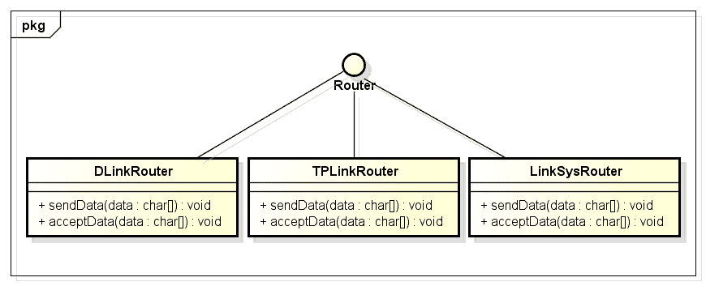
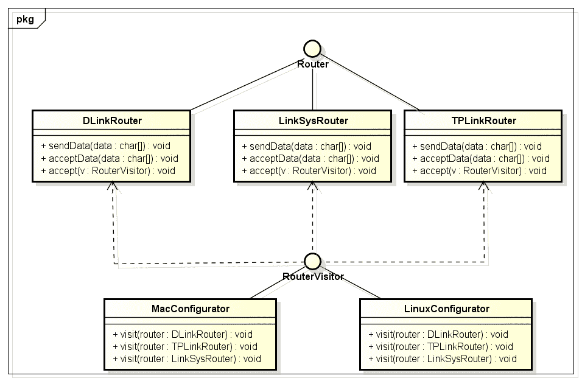

# 访客设计模式示例

> 原文： [https://howtodoinjava.com/design-patterns/behavioral/visitor-design-pattern-example-tutorial/](https://howtodoinjava.com/design-patterns/behavioral/visitor-design-pattern-example-tutorial/)

[**设计模式**](//howtodoinjava.com/category/design-patterns/ "design patterns") 用于解决模式中出现的问题，我们都知道，对吧？ 我们也知道 [**行为设计模式**](//howtodoinjava.com/category/design-patterns/behavioral/ "behavioral patterns") 是识别对象之间常见通信模式的设计模式。 这种行为模式之一是访客模式，我们将在本文中学习。

如果您一直在处理管理大量产品的应用程序，那么您可以轻松地解决此问题：

“You need to add a new method to a hierarchy of classes, but the act of adding it might be painful or damaging to the design.”

显然，您**希望对象的层次结构可以修改其行为，而不需要修改其源代码**。 怎么做？ 为了解决这个问题，访客模式成为现实。

```java
Sections in this post:

Visitor pattern introduction
Design participants/components
Sample problem to solve
Proposed solution using Visitor pattern
Implementation code
How to use visitors in application code
Sourcecode download
```

## 访客模式介绍

根据 Wikipedia 所述， [**访问者设计模式**](https://en.wikipedia.org/wiki/Visitor_pattern "visitor pattern") 是一种将算法与操作对象的结构分离的方法。 这种分离的实际结果是能够在不修改那些对象结构的情况下向现有对象结构添加新操作。 这是遵循**打开/关闭原则**（ [**SOLID 设计原则**](//howtodoinjava.com/best-practices/5-class-design-principles-solid-in-java/ "5 class design principles [S.O.L.I.D.] in java") 之一）的一种方法。

上面的设计灵活性允许将方法添加到任何对象层次结构，而无需修改为层次结构编写的代码。 而是使用 [**双调度**](https://en.wikipedia.org/wiki/Double_dispatch "double dispatch") 机制来实现此功能。 双调度是一种特殊的机制，可以根据调用中涉及的两个对象的运行时类型，将函数调用分派给不同的具体函数。

## 设计参与者/组件

此模式中的参与者类是：

**访问者** – 这是用于声明所有可访问类类型的访问操作的接口或抽象类。

**ConcreteVisitor** – 对于每种类型的访问者，必须实现在抽象访问者中声明的所有访问方法。 每个访客将负责不同的操作。

**可访问** – 是一个声明接受操作的接口。 这是使访问者对象可以“访问”对象的入口点。

**ConcreteVisitable** – 这些类实现了 Visitable 接口或类并定义了接受操作。 使用 accept 操作将访问者对象传递给该对象。

## 样品问题要解决

一个例子总是比冗长的理论更好。 因此，让我们在这里也有一个访客设计模式。

假设我们有一个在不同环境中管理路由器的应用程序。 路由器应该能够从其他节点发送和接收字符数据，应用程序应该能够在不同的环境中配置路由器。

本质上，设计应该足够灵活，以支持**路由器将来可以在其他环境中进行配置的方式，而无需对源代码**进行大量修改。



Existing routers in application


我们有以上 3 种类型的路由器，我们需要为它们编写代码。 **解决此问题的一种方法**是在 Router.java 接口中定义诸如 configureForWinodws（）和 configureForLinux（）之类的方法，并在不同的产品中实现它们，因为每种方法都有自己的配置设置和过程。

但是上述方法的问题在于，每次引入新环境时，都必须重新编译整个路由器的层次结构。 不可接受的解决方案。 那么什么可以预防这种情况呢？

## 使用访客模式的建议解决方案

访客模式非常适合这些类型的问题，在这些类型的问题中，您希望对对象的层次结构引入新的操作，而无需更改其结构或对其进行修改。 在此解决方案中，我们将通过引入两种方法（即 accept（）和 visit（）方法）来实现**双调度技术。 方法 accept（），将在路由器的层次结构中定义，访问方法将在访问者级别。**

每当需要添加新环境时，都会将新的访问者添加到访问者层次结构中，这需要为所有可用的路由器实现 visit（）方法，仅此而已。



Solution using visitor pattern


在上面的类图中，我们为 Mac 和 Linux 操作系统配置了路由器。 如果我们还需要添加 Windows 功能，那么我不需要更改任何类，只需定义一个新的访问者 WindowsConfigurator 并实现 RouterVisitor 接口中定义的 visit（）方法。 它将提供所需的功能，而无需任何进一步的修改。

## 实施代码

让我们看一下上面讨论的问题和解决方案所涉及的不同文件的源代码。

**Router.java**

```java
public interface Router 
{
	public void sendData(char[] data);
	public void acceptData(char[] data);

	public void accept(RouterVisitor v);
}

```

**DLinkRouter.java**

```java
public class DLinkRouter implements Router{

	@Override
	public void sendData(char[] data) {
	}

	@Override
	public void acceptData(char[] data) {
	}

	@Override
	public void accept(RouterVisitor v) {
		v.visit(this);
	}
}

```

**LinkSysRouter.java**

```java
public class LinkSysRouter implements Router{

	@Override
	public void sendData(char[] data) {
	}

	@Override
	public void acceptData(char[] data) {
	}

	@Override
	public void accept(RouterVisitor v) {
		v.visit(this);
	}
}

```

**TPLinkRouter.java**

```java
public class TPLinkRouter implements Router{

	@Override
	public void sendData(char[] data) {
	}

	@Override
	public void acceptData(char[] data) {
	}

	@Override
	public void accept(RouterVisitor v) {
		v.visit(this);
	}
}

```

**RouterVisitor.java**

```java
public interface RouterVisitor {
	public void visit(DLinkRouter router);
	public void visit(TPLinkRouter router);
	public void visit(LinkSysRouter router);
}

```

**LinuxConfigurator.java**

```java
public class LinuxConfigurator implements RouterVisitor{

	@Override
	public void visit(DLinkRouter router) {
		System.out.println("DLinkRouter Configuration for Linux complete !!");
	}

	@Override
	public void visit(TPLinkRouter router) {
		System.out.println("TPLinkRouter Configuration for Linux complete !!");
	}

	@Override
	public void visit(LinkSysRouter router) {
		System.out.println("LinkSysRouter Configuration for Linux complete !!");
	}
}

```

**MacConfigurator.java**

```java
public class MacConfigurator implements RouterVisitor{

	@Override
	public void visit(DLinkRouter router) {
		System.out.println("DLinkRouter Configuration for Mac complete !!");
	}

	@Override
	public void visit(TPLinkRouter router) {
		System.out.println("TPLinkRouter Configuration for Mac complete !!");
	}

	@Override
	public void visit(LinkSysRouter router) {
		System.out.println("LinkSysRouter Configuration for Mac complete !!");
	}
}

```

## 如何在应用程序代码中使用访问者

要使用上述设计，请按以下给定方式使用访问者。 我已经以 JUNIT 测试用例的形式使用了代码，您可以以适合您的情况的方式更改代码。

**TestVisitorPattern.java**

```java
public class TestVisitorPattern extends TestCase
{
	private MacConfigurator macConfigurator;
	private LinuxConfigurator linuxConfigurator;
	private DLinkRouter dlink;
	private TPLinkRouter tplink;
	private LinkSysRouter linksys;

	public void setUp()
	{
		macConfigurator = new MacConfigurator();
		linuxConfigurator = new LinuxConfigurator();

		dlink = new DLinkRouter();
		tplink = new TPLinkRouter();
		linksys = new LinkSysRouter();
	}

	public void testDlink()
	{
		dlink.accept(macConfigurator);
		dlink.accept(linuxConfigurator);
	}

	public void testTPLink()
	{
		tplink.accept(macConfigurator);
		tplink.accept(linuxConfigurator);
	}

	public void testLinkSys()
	{
		linksys.accept(macConfigurator);
		linksys.accept(linuxConfigurator);
	}
}

Output:

DLinkRouter Configuration for Mac complete !!
DLinkRouter Configuration for Linux complete !!
LinkSysRouter Configuration for Mac complete !!
LinkSysRouter Configuration for Linux complete !!
TPLinkRouter Configuration for Mac complete !!
TPLinkRouter Configuration for Linux complete !!

```

#### 源代码下载

要下载上述应用程序的源代码，请遵循给定的链接。

[**Souececode download**](https://docs.google.com/file/d/0B7yo2HclmjI4YlJ2RkYxU3hNWDQ/edit?usp=sharing "visitor design pattern source code")

**祝您学习愉快！**