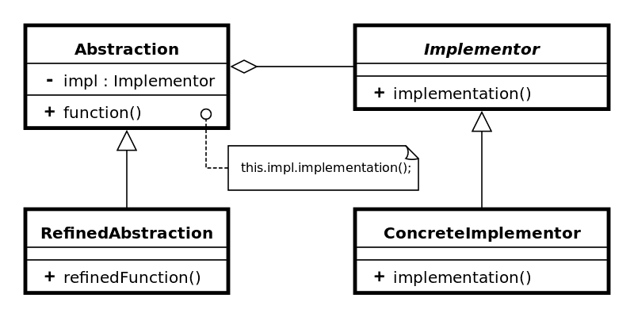

# 桥梁设计模式

> 原文： [https://howtodoinjava.com/design-patterns/structural/bridge-design-pattern/](https://howtodoinjava.com/design-patterns/structural/bridge-design-pattern/)

**桥梁设计模式**用于将类分解为两个部分（抽象及其实现），以便将来可以相互进化而不会相互影响。 它增加了类抽象与其实现之间的松散耦合。

```java
Table of Contents

Design participants of bridge design pattern
When we need bridge design pattern
Sample problem statement
Solution using bridge design pattern
Final notes
```

> 将抽象与其实现分离，以便二者可以独立变化。

Bridge 是“ **handle / body** ”成语的同义词。 这是一种将实现类封装在接口类内部的设计机制。 前者是身体，后者是手柄。 用户将手柄视为实际类，但工作是在体内完成的。

**通过在从抽象到实现的方法调用之间添加一个重定向，可以实现这种分离。**

## 桥梁设计模式的设计参与者



Bridge pattern participants


以下参与者构成桥梁设计模式。

1.  #### 抽象（抽象类）

    它定义了抽象接口，即行为部分。 它还维护实现者参考。

2.  #### RefinedAbstraction（普通类）

    它扩展了 Abstraction 定义的接口。

3.  #### 实现者（接口）

    它定义了实现类的接口。 该接口不需要直接对应于抽象接口，并且可以有很大的不同。 抽象 imp 提供了一个由 Implementer 接口提供的操作的实现。

4.  #### ConcreteImplementor（普通类）

    它实现了 Implementer 接口。

## 当我们需要桥梁设计模式时

桥接模式是旧建议的应用，“ **比继承**更喜欢合成”。 当您必须以 ***与*** 相互正交的方式来划分不同的时间时，它变得很方便。

例如，假设您要创建具有不同颜色的各种 GUI 形状。 一种解决方案可能是：


Without bridge pattern


但是上述解决方案存在问题。 如果要更改`Rectange`类别，则可能最终也会更改`BlueRectangle`和`RedRectangle` – 即使更改是特定于颜色的，也可能需要更改`Circle`类别。

您可以通过以下方式去耦`Shape`和`Color`接口来解决上述问题。


With bridge pattern


现在，当您更改任何形状时，颜色将保持不变。 同样，反之亦然。

## 问题陈述样本

> 网桥设计模式最适用于需要提供**平台独立性**的应用。

假设我们正在设计**的应用，该应用可以在任何操作系统**上下载和存储文件。 我想以这种方式设计系统，将来我应该能够以最小的变化添加更多的平台支持。 此外，如果我想在下载程序类中添加更多支持（例如，仅在 Windows 中删除下载内容），那么它应该不会影响客户端代码以及 linux 下载程序。

## 使用桥梁设计模式的解决方案

由于此问题是与经典平台独立性相关的问题，因此我将使用桥接模式来解决此问题。 我将把下载器组件分为抽象部分和实现部分。

我在这里创建两个接口，`FileDownloaderAbstraction`表示客户端将与之交互的抽象； `FileDownloadImplementor`代表实现。 这样，两个层次结构可以独立发展而不会互相影响。

**FileDownloaderAbstraction.java**

```java
public interface FileDownloaderAbstraction 
{
    public Object download(String path);

    public boolean store(Object object);
}

```

**FileDownloaderAbstractionImpl.java**

```java
public class FileDownloaderAbstractionImpl implements FileDownloaderAbstraction {

    private FileDownloadImplementor provider = null;

    public FileDownloaderAbstractionImpl(FileDownloadImplementor provider) {
        super();
        this.provider = provider;
    }

    @Override
    public Object download(String path) 
    {
        return provider.downloadFile(path);
    }

    @Override
    public boolean store(Object object) 
    {
        return provider.storeFile(object);
    }
}

```

**FileDownloadImplementor.java**

```java
public interface FileDownloadImplementor
{
    public Object downloadFile(String path);

    public boolean storeFile(Object object);
}

```

**LinuxFileDownloadImplementor.java**

```java
public class LinuxFileDownloadImplementor implements FileDownloadImplementor 
{
    @Override
    public Object downloadFile(String path) {
        return new Object();
    }

    @Override
    public boolean storeFile(Object object) {
        System.out.println("File downloaded successfully in LINUX !!");
        return true;
    }
}

```

**WindowsFileDownloadImplementor.java**

```java
public class WindowsFileDownloadImplementor implements FileDownloadImplementor 
{
    @Override
    public Object downloadFile(String path) {
        return new Object();
    }

    @Override
    public boolean storeFile(Object object) {
        System.out.println("File downloaded successfully in WINDOWS !!");
        return true;
    }
}

```

**Client.java**

```java
public class Client 
{
    public static void main(String[] args) 
    {
        String os = "linux";
        FileDownloaderAbstraction downloader = null;

        switch (os) 
        {
            case "windows":
                downloader = new FileDownloaderAbstractionImpl( new WindowsFileDownloadImplementor() );
                break;

            case "linux":
                downloader = new FileDownloaderAbstractionImpl( new LinuxFileDownloadImplementor() );
                break;

            default:
                System.out.println("OS not supported !!");
        }

        Object fileContent = downloader.download("some path");
        downloader.store(fileContent);
    }
}

Output:

File downloaded successfully in LINUX !!

```

#### 抽象的更改不会影响实现

现在，假设您要在抽象层添加另一项功能（即删除）。 它也不能强迫现有的实现者和客户进行改变。

**FileDownloaderAbstraction.java**

```java
public interface FileDownloaderAbstraction 
{
    public Object download(String path);

    public boolean store(Object object);

    public boolean delete(String object);
}

```

**FileDownloaderAbstractionImpl.java**

```java
public class FileDownloaderAbstractionImpl implements FileDownloaderAbstraction {

    private FileDownloadImplementor provider = null;

    public FileDownloaderAbstractionImpl(FileDownloadImplementor provider) {
        super();
        this.provider = provider;
    }

    @Override
    public Object download(String path) 
    {
        return provider.downloadFile(path);
    }

    @Override
    public boolean store(Object object) 
    {
        return provider.storeFile(object);
    }

    @Override
    public boolean delete(String object) {
        return false;
    }
}

```

上述更改并不强迫您对实现器类/接口进行任何更改。

#### 实现中的更改不会影响抽象

假设您要在实现层为客户端不知道的所有下载程序添加删除功能（内部功能）。

**FileDownloadImplementor.java**

```java
public interface FileDownloadImplementor
{
    public Object downloadFile(String path);

    public boolean storeFile(Object object);

    public boolean delete(String object);
}

```

**LinuxFileDownloadImplementor.java**

```java
public class LinuxFileDownloadImplementor implements FileDownloadImplementor 
{
    @Override
    public Object downloadFile(String path) {
        return new Object();
    }

    @Override
    public boolean storeFile(Object object) {
        System.out.println("File downloaded successfully in LINUX !!");
        return true;
    }

    @Override
    public boolean delete(String object) {
        return false;
    }
}

```

**WindowsFileDownloadImplementor.java**

```java
public class WindowsFileDownloadImplementor implements FileDownloadImplementor 
{
    @Override
    public Object downloadFile(String path) {
        return new Object();
    }

    @Override
    public boolean storeFile(Object object) {
        System.out.println("File downloaded successfully in LINUX !!");
        return true;
    }

    @Override
    public boolean delete(String object) {
        return false;
    }
}

```

上面的更改不会影响抽象层，因此客户端完全不会受到影响。

## 最后的笔记

1.  桥接模式将抽象与其实现分离，以便两者可以独立变化。
2.  它主要用于实现平台独立性功能。
3.  它添加了另一种方法级别重定向以实现该目标。
4.  将抽象接口发布在单独的继承层次结构中，并将实现放入其自己的继承层次结构中。
5.  使用桥接模式来实现执行时的绑定。
6.  使用桥模式来映射正交类层次结构
7.  Bridge 是预先设计的，以使抽象和实现独立变化。

**祝您学习愉快！**