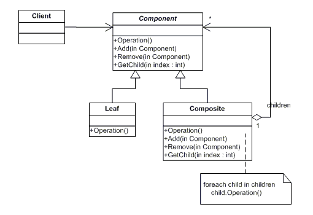

# 组合设计模式

> 原文： [https://howtodoinjava.com/design-patterns/structural/composite-design-pattern/](https://howtodoinjava.com/design-patterns/structural/composite-design-pattern/)

**组合设计模式**是修改对象结构的**结构型模式**。 此模式最适合需要使用**对象的情况，这些对象形成树状结构**。 在该树中，每个节点/对象（根节点除外）都是复合节点或叶节点。 实现组合模式可使客户统一对待单个对象和构图。

```java
Table of Contents

When to use composite design pattern
Participants in composite design pattern
Sample problem to solve
Solution using composite design pattern
Final notes
```

## 何时使用组合设计模式

> 组合设计模式将对象组合成树状结构，以表示整个部分的层次结构。 复合可以使客户统一对待单个对象和对象组成。

*   当应用具有分层结构并且需要跨结构的通用功能时。
*   当应用需要跨层次结构聚合数据时。
*   当应用要统一对待复合对象和单个对象时。

**组合设计模式**的真实示例用法可能是：

1.  建立银行中客户帐户的综合视图（即客户的投资组合）
2.  建立总账
3.  计算机/网络监控应用
4.  零售和库存申请
5.  文件系统实现中的目录结构
6.  GUI 屏幕中的菜单项

## 组合设计模式的参与者

以下是任何基于组合模式的解决方案的参与者。



组合设计模式


参与此模式的类和对象：

1.  #### `component`

    *   声明组合中对象的接口。
    *   根据需要为所有类通用的接口实现默认行为。
    *   声明用于访问和管理其子组件的接口。
2.  #### `Leaf`

    *   表示组合中的叶对象。 叶子没有孩子。
    *   定义组合中原始对象的行为。
3.  #### `composite`

    *   定义具有子级的组件的行为。
    *   存储子组件。
    *   在`Component`界面中实现与子相关的操作。
4.  #### `Client`

    *   通过`Component`接口操作组合中的对象。

在上图中，客户端使用`Component`接口与复合层次结构中的对象进行交互。 在层次结构内部，如果对象是复合对象，则它将请求传递给叶节点。 如果对象是叶节点，则立即处理请求。

复合叶子还可以选择在叶子节点处理请求之前或之后修改请求/响应。

## 要解决的示例问题

假设我们正在构建财务应用。 我们的客户拥有多个银行帐户。 我们被要求准备一个设计，该设计可用于生成客户的合并帐户视图，该视图能够在合并所有帐户对帐单后显示**客户的总帐户余额以及合并对帐单**。 因此，应用应该能够生成：

1）客户来自所有帐户的总帐户余额
2）合并帐户对帐单

## 使用组合设计模式的解决方案

在这里，我们正在处理形成树状结构的帐户对象，在该结构中，我们将遍历帐户对象并仅对帐户对象执​​行一些操作，因此可以应用组合设计模式。

让我们来看看参与的类：

**`Component.java`**

```java
import java.util.ArrayList;
import java.util.List;

public abstract class Component 
{
    AccountStatement accStatement;

    protected List<Component> list = new ArrayList<>();

    public abstract float getBalance();

    public abstract AccountStatement getStatement();

    public void add(Component g) {
        list.add(g);
    }

    public void remove(Component g) {
        list.remove(g);
    }

    public Component getChild(int i) {
        return (Component) list.get(i);
    }
}
```

**`CompositeAccount.java`**

```java
public class CompositeAccount extends Component 
{
    private float totalBalance;
    private AccountStatement compositeStmt, individualStmt;

    public float getBalance() {
        totalBalance = 0;
        for (Component f : list) {
            totalBalance = totalBalance + f.getBalance();
        }
        return totalBalance;
    }

    public AccountStatement getStatement() {
        for (Component f : list) {
            individualStmt = f.getStatement();
            compositeStmt.merge(individualStmt);
        }
        return compositeStmt;
    }
}
```

**`AccountStatement.java`**

```java
public class AccountStatement 
{
    public void merge(AccountStatement g) 
    {
        //Use this function to merge all account statements
    }
}
```

**`DepositAccount.java`**

```java
public class DepositAccount extends Component 
{
    private String accountNo;
    private float accountBalance;

    private AccountStatement currentStmt;

    public DepositAccount(String accountNo, float accountBalance) {
        super();
        this.accountNo = accountNo;
        this.accountBalance = accountBalance;
    }

    public String getAccountNo() {
        return accountNo;
    }

    public float getBalance() {
        return accountBalance;
    }

    public AccountStatement getStatement() {
        return currentStmt;
    }
}

```

**`SavingsAccount.java`**

```java
public class SavingsAccount extends Component 
{
    private String accountNo;
    private float accountBalance;

    private AccountStatement currentStmt;

    public SavingsAccount(String accountNo, float accountBalance) {
        super();
        this.accountNo = accountNo;
        this.accountBalance = accountBalance;
    }

    public String getAccountNo() {
        return accountNo;
    }

    public float getBalance() {
        return accountBalance;
    }

    public AccountStatement getStatement() {
        return currentStmt;
    }
}
```

`Client.java`

```java
public class Client 
{
    public static void main(String[] args) 
    {
        // Creating a component tree
        Component component = new CompositeAccount();

        // Adding all accounts of a customer to component
        component.add(new DepositAccount("DA001", 100));
        component.add(new DepositAccount("DA002", 150));
        component.add(new SavingsAccount("SA001", 200));

        // getting composite balance for the customer
        float totalBalance = component.getBalance();
        System.out.println("Total Balance : " + totalBalance);

        AccountStatement mergedStatement = component.getStatement();
        //System.out.println("Merged Statement : " + mergedStatement);
    }
}

Output:

Total Balance : 450.0
```

## 最后的笔记

1.  组合模式定义了由各个对象和复合对象组成的类层次结构。
2.  客户端通过组件接口统一对待原始对象和组合对象，这使客户端代码变得简单。
3.  添加新组件很容易，并且由于客户端通过组件接口处理新组件，因此不需要更改客户端代码。
4.  可以使用迭代器设计模式遍历复合层次结构。
5.  访问者设计模式可以对组合应用操作。
6.  享元设计模式通常与组合结合以实现共享的叶节点。

**祝您学习愉快！**