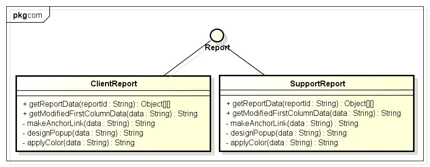

# Java 中的装饰器设计模式

> 原文： [https://howtodoinjava.com/design-patterns/structural/decorator-design-pattern/](https://howtodoinjava.com/design-patterns/structural/decorator-design-pattern/)

在软件工程中，**装饰器设计模式**用于向类的特定实例添加其他功能或行为，而不会修改同一类的其他实例。 装饰器提供了子类别的灵活替代方案，以扩展功能。 请注意，以上描述暗示装饰对象会更改其行为，但不会更改其界面。

理解这种模式非常重要，因为一旦您了解了装饰技术，就可以赋予您（或其他人）对象新的职责，而无需对基础类进行任何代码更改。 有趣，不是吗？ 这种模式也非常有用，并且经常会遇到 [**Java 面试问题**](//howtodoinjava.com/java/interviews-questions/core-java-interview-questions-series-part-1/ "Core java interview questions series : Part 1") 关于 [**设计模式**](//howtodoinjava.com/category/design-patterns/ "design patterns") 的问题。

In this post we will discuss on following points:

*   设计参加者
*   问题陈述样本
*   使用 Decorator 设计模式的建议解决方案
*   常见面试问题
*   一些实际用法

## **设计参与者**

装饰器模式的典型示意图如下所示。


Decorator design pattern participants


以下是“装饰器设计”模式的参与者：

*   **组件** – 这是包装程序，在运行时可以具有与其相关的其他职责。
*   **具体组件** – 是在程序中添加了其他职责的原始对象。
*   **装饰器**- 这是一个抽象类，其中包含对组件对象的引用，并且还实现了组件接口。
*   **混凝土装饰器**- 它们扩展了装饰器，并在 Component 类的顶部构建了附加功能。

如果您仔细阅读这两行内容，那么您将了解它的工作方式如下：

You have an instance, and you put another instance inside of it. They both support the same (or similar) interfaces. The one on the outside is a “decorator.” You use the one on the outside. It either masks, changes, or pass-troughs the methods of the instance inside of it.

我总是喜欢以身作则。 因此，让我们解决一个问题。

## **问题陈述**

让我们有一个常见的用例，我们必须将所有用户创建的报告显示给管理员。 现在，这些报告可以属于这些类别。

*   客户报告
*   支持报告

这两个报告**都必须具有第一列作为到原始报告的链接**，并且它们应具有**不同的颜色**。 可能应在**不同弹出窗口大小**中打开它们。 这些只是很少的事情，现实中可以实现很多。

一种**可能的方法是扩展 Report 对象**，然后具有两个单独的类 ClientReport 和 SupportReport。 在这两种方法中，定义私有方法，例如 *makeAnchorLink()，designPopup()，applyColor()*等。 现在，在第一列数据单元格的某些获取器方法中调用这些方法。



如果您在此处停止并且不再修改系统，则它将起作用。 但是，假设几天后**，您被告知为两种报告应用不同的背景色**。 现在，您只有一种方法可以在两个类中定义方法 *colorBackground* ()，并进行适当的调用。 将来系统中有更多报告时，问题将变得更加严重。

上面的解决方案明显违反了 [**SMART 类别设计**](//howtodoinjava.com/best-practices/5-class-design-principles-solid-in-java/ "SMART principles for class design") 中提到的**打开/关闭原则**。

## **使用装饰器设计模式的建议解决方案**

上面的问题是装饰图案的理想选择。 请记住，当我们有一个需要扩展但设计不当的对象时，请进行装饰。

通过下面的类图可以轻松解决以上问题。 在这里，我仅用于支持报告。 也可以为客户报告构建类似的类层次结构。


Decorator Pattern Solution


如果我们已经实现了这样的解决方案，那么将来任何时候我们都可以添加其他修饰，而无需修改现有的类层次结构。 那是我们开始这篇文章的最终目标，对吧？

## **源代码列表**

让我们看一看上课的源代码，以了解其实际外观。

**Report.java**

```java
public interface Report {
	public Object[][] getReportData(final String reportId);
	public String getFirstColumnData();
}

```

**SupportReport.java**

```java
public class SupportReport implements Report {

	@Override
	public Object[][] getReportData(String reportId) {
		return null;
	}

	@Override
	public String getFirstColumnData() {
		return "Support data";
	}

}

```

**ColumDecorator.java**

```java
public abstract class ColumDecorator implements Report 
{
	private Report decoratedReport;

	public ColumDecorator(Report report){
		this.decoratedReport = report;
	}

	public String getFirstColumnData() {
        return decoratedReport.getFirstColumnData(); 
    }

	@Override
	public Object[][] getReportData(String reportId) {
		return decoratedReport.getReportData(reportId);
	}
}

```

**SupportLinkDecorator.java**

```java
public class SupportLinkDecorator extends ColumDecorator{

	public SupportLinkDecorator(Report report) {
		super(report);
	}

	public String getFirstColumnData() {
		return addMoreInfo (super.getFirstColumnData()) ;
	}

	private String addMoreInfo(String data){
		return data  + " - support link - ";
	}
}

```

**SupportPopupDecorator.java**

```java
public class SupportPopupDecorator extends ColumDecorator{

	public SupportPopupDecorator(Report report) {
		super(report);
	}

	public String getFirstColumnData() {
		return addPopup (super.getFirstColumnData()) ;
	}

	private String addPopup(String data){
		return data  + " - support popup - ";
	}
}

```

**DecoratorPatternTest.java**

```java
public class DecoratorPatternTest {
	public static void main(String[] args) {

		//ClientPopupDecorator popupDecoratored = new ClientPopupDecorator(new ClientLinkDecorator(new ClientReport()));
		//System.out.println(popupDecoratored.getFirstColumnData());

		SupportPopupDecorator supportPopupDecoratored = new SupportPopupDecorator(new SupportLinkDecorator(new SupportReport()));
		System.out.println(supportPopupDecoratored.getFirstColumnData());
	}
}

Output:

Support data - support link -  - support popup - 

```

要下载完整的源代码和 UML 图，请遵循文章结尾处的下载链接。

## **关于装饰图案**的访谈问题

**A）如何确定何时使用装饰器模式？**

如果我们深入了解该概念，则会发现 Decorator Design Pattern 具有多个需求指标以表明这是潜在的解决方案，例如

*   我们有一个需要扩展名 e 的对象。 一个需要其他“可选”功能（例如滚动条，标题栏和状态栏）的窗口控件。
*   几个通过“装饰”支持扩展的对象。 通常，这些对象共享一个公共接口，特征或超类，有时还具有其他中间超类。
*   装饰的对象（类或原型实例化）和装饰器对象具有一个或几个共同的特征。 为了确保该功能，装饰器&的装饰器具有公共接口，特征或类继承。

**B）装饰器模式和适配器模式**之间的区别

不可以。AdapterPattern 用于将对象的界面转换为其他内容。 DecoratorPattern 用于扩展对象的功能，同时保持其接口。 由于它们都“包裹”了一个对象，因此两者有时有时也被称为“包装模式”。

**C）DecoratorPattern 与子类别**之间的差异

DecoratorPattern 和子类之间的区别在于，在子类中，您可以“使用单个类”修饰实现接口的任何类。 假设我想给自己一个 java.util.Map，每当我添加或删除键时，它都会打印一条消息。 如果我只实际使用过 java.util.HashMap，那么我可以创建 PrintingMap 吗？ 作为 HashMap 的子类并重写&删除。 但是，如果要创建 TreeMap 的打印版本，则可以创建 PrintingTreeMap？ （哪些代码与 PrintingMap 具有几乎相同的代码？

## **装饰器模式的常用用法：**

1）Java iO 库类，例如 BufferedInputStream bs = new BufferedInputStream（new FileInputStream（new File（“ File1.txt”））））;

2）在显示标签 jsp 库中的装饰器列中，例如

```java
<display:table name="reportsViewResultTable" class="demoClass" id="reportsQueryViewResultTable">
	<display:column title="Report Id" sortable="true" property="reportDisplayId" decorator="com.comp.FirstColumnDataDecorator"></display:column>
</display:table>

```

3）在 **sitemesh** 中使用装饰器，以提供一致的 UI 体验。

[**Sourcecode Download**](https://docs.google.com/file/d/0B7yo2HclmjI4RTREbG9ReDc5V2M/edit?usp=sharing)

**祝您学习愉快！**