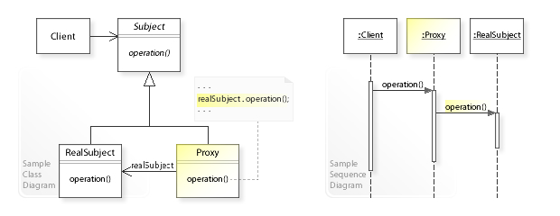

# 代理设计模式

> 原文： [https://howtodoinjava.com/design-patterns/structural/proxy-design-pattern/](https://howtodoinjava.com/design-patterns/structural/proxy-design-pattern/)

根据**代理设计模式**的 GoF 定义，代理对象为另一对象提供**代理或占位符**来控制对其的访问。 代理基本上可以替代我们由于许多原因而创建的预期对象，例如 与创建完全初始化的原始对象相关的安全性原因或成本。

## 1.何时使用代理设计模式

代理对象隐藏原始对象并控制对其的访问。 当我们可能想要使用可以充当其他接口的类时，可以使用代理。

代理大量用于实现与延迟加载相关的用例，在这种情况下，我们直到真正需要时才创建完整的对象。

代理也可以用于在原始对象周围添加额外的安全层。

## 2.代理模式的真实示例

*   In [hibernate](https://howtodoinjava.com/hibernate-tutorials/), we write the code to fetch entities from the database. Hibernate returns an object which a proxy (by dynamically constructed by Hibernate by extending the domain class) to the underlying entity class. The client code is able to read the data whatever it needs to read with the proxy.

    这些代理实体类有助于实现延迟加载方案，在这种方案中，只有在明确请求关联实体时，才提取它们。 它有助于提高 DAO 操作的性能。

*   在公司网络中，Internet 访问位于网络代理后面。 所有网络请求都通过代理，该代理首先检查对允许的网站和发布到网络的数据的请求。 如果请求看起来可疑，则代理将阻止该请求，否则请求将通过。
*   在面向方面的编程（AOP）中，由 AOP 框架创建的一个对象，用于实现方面协定（建议方法执行等）。 例如，在 [Spring AOP](https://howtodoinjava.com/spring-aop/spring-aop-aspectj-example-tutorial-using-annotation-config/) 中，AOP 代理将是 JDK 动态代理或 CGLIB 代理。

## 3.代理设计模式

#### 3.1。 建筑



Proxy design pattern


#### 3.2。 设计参加者

*   **主题** –是一个接口，它公开了可供客户端使用的功能。
*   **实际主题** –是实现`Subject`的类，并且是具体的实现，需要隐藏在代理后面。
*   **代理** –通过扩展它来隐藏真实对象，并且客户端通过此代理对象与真实对象进行通信。 通常，当客户端请求真实对象时，框架会创建此代理对象。

## 4.代理设计模式示例

在给定的示例中，我们有一个`RealObject`，客户端需要访问它才能执行某项操作。 它将要求框架提供`RealObject`的实例。 但是由于需要保护对该对象的访问，因此框架将对`RealObjectProxy`的引用返回。

对代理对象的任何调用都用于其他要求，并且该调用将传递给实际对象。

```java
public interface RealObject 
{
	public void doSomething();
}

```

```java
public class RealObjectImpl implements RealObject {

	@Override
	public void doSomething() {
		System.out.println("Performing work in real object");
	}

}

```

```java
public class RealObjectProxy extends RealObjectImpl 
{
	@Override
	public void doSomething() 
	{
		//Perform additional logic and security
		//Even we can block the operation execution
		System.out.println("Delegating work on real object");
		super.doSomething();
	}
}

```

```java
public class Client 
{
	public static void main(String[] args) 
	{
		RealObject proxy = new RealObjectProxy();
		proxy.doSomething();
	}
}

```

程序输出。

```java
Delegating work on real object
Performing work in real object

```

## 5.常见问题

#### 5.1。 有哪些不同类型的代理

代理通常分为四种类型–

1.  **远程代理** –表示远程授乳的对象。 要与远程对象对话，客户端需要在网络通信方面做其他工作。 代理对象代表原始对象进行此通信，而客户端则专注于实际交谈。
2.  **虚拟代理** –延迟昂贵对象的创建和初始化，直到需要时才按需创建对象。 Hibernate 创建的代理实体是虚拟代理的示例。
3.  **保护代理** –帮助实现对原始对象的安全性。 他们可以在方法调用之前检查访问权限，然后根据结论允许或拒绝访问。
4.  **智能代理** –当客户端访问对象时，执行其他内部管理工作。 一个示例可以是在访问真实对象之前检查它是否已锁定，以确保没有其他对象可以更改它。

#### 5.2。 代理模式与装饰器模式

两种模式之间的主要区别是它们承担的责任。 [装饰器](https://howtodoinjava.com/design-patterns/structural/decorator-design-pattern/)专注于添加职责，但是代理专注于控制对对象的访问。

在评论中向我发送有关**代理模式**的问题。

学习愉快！

参考文献：

图片来源– [Wikipedia](https://en.wikipedia.org/wiki/Proxy_pattern)