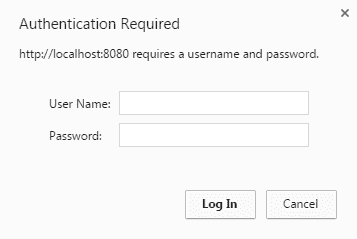

# Vaadin Spring Security BasicAuth 示例

> 原文： [https://howtodoinjava.com/vaadin/vaadin-spring-security-basicauth-example/](https://howtodoinjava.com/vaadin/vaadin-spring-security-basicauth-example/)

在本教程中，我们将学习在 [spring security](//howtodoinjava.com/spring-security-tutorial/) 模块提供的[基本身份验证](//howtodoinjava.com/spring/spring-security/http-basic-authentication-example-using-spring-3/)安全性之后保护 vaadin 应用程序的安全。

I am updating the [vaadin hello world application](//howtodoinjava.com/vaadin/hello-world-web-application-maven/) sourcecode with spring security configuration, so if you already have any vaadin application, you can directly look into [spring security section](#basicauth-config).

```java
Table of Contents

Development environment
Spring Security BasicAuth Configuration
Vaadin UI Configuration
Maven Dependencies
Run the application
```

## 开发环境

本示例使用以下工具和框架来构建演示 vaadin 应用程序，该应用程序在 spring 的基本身份验证安全性的保护下得到保护。

1.  [JDK 1.8](http://www.oracle.com/technetwork/java/javase/downloads/jdk8-downloads-2133151.html)
2.  [我需要 7.7.0](https://vaadin.com/download/release/7.7/7.7.0/release-notes.html)
3.  [Spring Security 4.1.3。发布](https://mvnrepository.com/artifact/org.springframework.security)
4.  [Eclipse Luna](https://eclipse.org/luna/)
5.  [](https://eclipse.org/luna/)[Tomcat 7](https://tomcat.apache.org/download-70.cgi)

## Spring Security BasicAuth 配置

要配置 spring basicauth 安全性，您需要在类路径中添加`applicationContext.xml`文件（如果尚不存在），然后需要配置安全性设置，例如 安全的 URL 模式，哪些角色可以访问哪些 URL 等。

#### applicationContext.xml

```java
<?xml version="1.0" encoding="UTF-8"?>
<beans:beans xmlns="http://www.springframework.org/schema/security"
    xmlns:beans="http://www.springframework.org/schema/beans"
    xmlns:xsi="http://www.w3.org/2001/XMLSchema-instance"
    xsi:schemaLocation="http://www.springframework.org/schema/beans
    http://www.springframework.org/schema/beans/spring-beans-4.1.xsd
    http://www.springframework.org/schema/security
    http://www.springframework.org/schema/security/spring-security-4.1.xsd">

	<http auto-config="true">
		<intercept-url pattern="/vaadinServlet/**" access="hasRole('ROLE_EDITOR')" />
		<intercept-url pattern="/vaadinServlet/*.*" access="hasRole('ROLE_EDITOR')" />
		<intercept-url pattern="/**" access="hasRole('ROLE_EDITOR')" />
		<http-basic />
		<csrf disabled="true"/>
	</http>

	<authentication-manager>
		<authentication-provider>
			<user-service>
				<user name="howtodoinjava" password="password" authorities="ROLE_EDITOR" />
			</user-service>
		</authentication-provider>
	</authentication-manager>

</beans:beans>

```

现在，您需要在`web.xml`文件中配置`springSecurityFilterChain`，以便将安全性添加到应用程序中。 另外，如果您添加了新的`applicationContext.xml`文件，则还需要注册`ContextLoaderListener`。

#### web.xml

```java
<?xml version="1.0" encoding="UTF-8"?>
<web-app id="WebApp_ID" version="2.4"
	xmlns="http://java.sun.com/xml/ns/j2ee" xmlns:xsi="http://www.w3.org/2001/XMLSchema-instance"
	xsi:schemaLocation="http://java.sun.com/xml/ns/j2ee
     http://java.sun.com/xml/ns/j2ee/web-app_2_4.xsd">

<filter>
	<filter-name>springSecurityFilterChain</filter-name>
	<filter-class>org.springframework.web.filter.DelegatingFilterProxy</filter-class>
</filter>

<filter-mapping>
	<filter-name>springSecurityFilterChain</filter-name>
	<url-pattern>/*</url-pattern>
</filter-mapping>

<listener>
	<listener-class>org.springframework.web.context.ContextLoaderListener</listener-class>
</listener>

//Other configuration will be added here

</web-app>

```

Spring 基本身份验证配置已完成。 现在，您可以根据应用程序的要求修改各个部分。 例如。 您可能要从数据库中获取用户名/密码详细信息，然后可以在`applicationContext.xml`文件的`authentication-provider`中使用 [jdbc-user-service](//howtodoinjava.com/spring/spring-security/jdbc-user-service-based-spring-security-example/) 。

## 我需要 UI 配置

正如我已经提到的，我正在修改 vaadin hello world 应用程序，它具有非常基本的功能。 只需在`web.xml`文件和带有标签的主页屏幕中进行`VaadinServlet`配置，以在身份验证成功的情况下显示成功消息。

#### web.xml

```java
<?xml version="1.0" encoding="UTF-8"?>
<web-app id="WebApp_ID" version="2.4"
	xmlns="http://java.sun.com/xml/ns/j2ee" xmlns:xsi="http://www.w3.org/2001/XMLSchema-instance"
	xsi:schemaLocation="http://java.sun.com/xml/ns/j2ee
     http://java.sun.com/xml/ns/j2ee/web-app_2_4.xsd">

    //Spring security configuration as mentioned in above section

	<context-param>
		<description>Vaadin production mode</description>
		<param-name>productionMode</param-name>
		<param-value>false</param-value>
	</context-param>

	<servlet>
		<servlet-name>vaadinServlet</servlet-name>
		<servlet-class>com.vaadin.server.VaadinServlet</servlet-class>
		<init-param>
			<param-name>UI</param-name>
			<param-value>com.howtodoinjava.vaadin.demo.AppUI</param-value>
		</init-param>
	</servlet>

	<servlet-mapping>
		<servlet-name>vaadinServlet</servlet-name>
		<url-pattern>/*</url-pattern>
	</servlet-mapping>
</web-app>

```

#### AppUI.java

```java
package com.howtodoinjava.vaadin.demo;

import com.vaadin.annotations.Theme;
import com.vaadin.server.VaadinRequest;
import com.vaadin.ui.Label;
import com.vaadin.ui.UI;
import com.vaadin.ui.VerticalLayout;

@Theme("mytheme")
public class AppUI extends UI {

	private static final long serialVersionUID = 1387172685749279538L;

	@Override
	protected void init(VaadinRequest vaadinRequest) {
		final VerticalLayout layout = new VerticalLayout();

		Label label = new Label("Welcome to BasicAuth Secured Vaadin Application");
		layout.addComponent(label);

		layout.setMargin(true);
		layout.setSpacing(true);

		setContent(layout);
	}
}

```

## Maven 依赖

应用程序非常重要的一部分是收集和配置运行时依赖项。 当我们使用 [maven](//howtodoinjava.com/maven/) 时，我已将以下依赖项添加到现有的`pom.xml`文件中。

#### pom.xml

```java
<!-- Spring Security -->
<dependency>
	<groupId>org.springframework.security</groupId>
	<artifactId>spring-security-core</artifactId>
	<version>${org.springframework.version}</version>
</dependency>
<dependency>
	<groupId>org.springframework.security</groupId>
	<artifactId>spring-security-web</artifactId>
	<version>${org.springframework.version}</version>
</dependency>
<dependency>
	<groupId>org.springframework.security</groupId>
	<artifactId>spring-security-config</artifactId>
	<version>${org.springframework.version}</version>
</dependency>

<!-- Commons Logging is required with Spring 4.x -->
<dependency>
	<groupId>commons-logging</groupId>
	<artifactId>commons-logging</artifactId>
	<version>1.2</version>
</dependency>

```

## 运行应用程序

现在，该应用程序已配置完毕，可以进行测试了。 在浏览器中点击应用程序 URL。

1.  #### 点击网址 http：// localhost：8080 / VaadinExample /

    您将在浏览器弹出窗口中输入您的用户名和密码。

    

    Vaadin Spring Security BasicAuth Window

    

2.  #### 填写不正确的凭据并提交

    弹出字段将被清除，并再次询问用户名/密码。

3.  #### 填写正确的凭据并提交

    应用程序的主页将显示成功消息。

    

    Vaadin Spring Security BasicAuth Successful

    

将我的问题放在评论部分。

[Sourcecode Download](//howtodoinjava.com/wp-content/downloads/VaadinSpringSecurityBasicAuthExample.zip)

资源：

[Spring 安全参考](https://docs.spring.io/spring-security/site/docs/4.1.3.RELEASE/reference/htmlsingle/)
[Vaadin Hello World 应用程序](//howtodoinjava.com/vaadin/hello-world-web-application-maven/)
[RFC-2617 [BasicAuth]](https://tools.ietf.org/html/rfc2617)