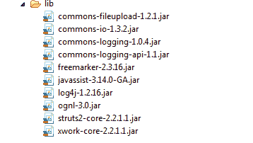
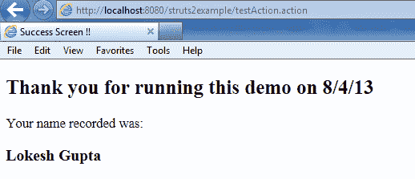

# Struts2 Hello World 示例

> 原文： [https://howtodoinjava.com/struts2/struts-2-hello-world-example-application/](https://howtodoinjava.com/struts2/struts-2-hello-world-example-application/)

在我以前的文章中，我写了许多关于 [**JAX-RS RESTEasy**](//howtodoinjava.com/restful-web-service/ "resteasy tutorials") ， [**Spring3**](//howtodoinjava.com "Spring3 tutorials") ， [**的示例和教程 ] Hibernate**](//howtodoinjava.com/hibernate-tutorials/ "hibernate tutorials") 和其他 Java 框架，例如 [**Maven**](//howtodoinjava.com/maven/ "maven tutorials") 或 [**junit**](//howtodoinjava.com/junit/ "junit tutorials") 。 我也有很多要求在 **Struts2** 上写一些东西。 好吧，这里我从世界示例开始。 在下一篇文章中，我将尝试涵盖涉及 Struts2 的最大领域和概念。因此，请继续关注。

```java
Sections in this post:
Create maven web project
Struts2 dependencies
web.xml changes
Know struts.xml configuration file
Using struts.properties file
Writing first action class
Composing view files
Testing the application
源码下载

```

## 创建 Maven Web 项目

我在这里不会吃太多空间。 您可以阅读有关 [**如何创建 Maven Eclipse Web 项目**](//howtodoinjava.com/maven/how-to-create-a-eclipse-web-application-using-maven/ "How to create a eclipse web application using maven") 的更多详细信息。 简而言之，使用以下命令。

```java
mvn archetype:generate -DgroupId=com.howtodoinjava.struts2.example -DartifactId=struts2example -DarchetypeArtifactId=maven-archetype-webapp -DinteractiveMode=false

cd struts2example

mvn eclipse:eclipse -Dwtpversion=2.0

```

## Struts2 依赖项

我正在使用 maven 导入 Struts2 运行时依赖项。 这样做的好处是，您无需手动记住和寻找必需的依赖项，一举就能掌握所有内容。

```java
	<dependency>
		<groupId>org.apache.struts</groupId>
		<artifactId>struts2-core</artifactId>
		<version>2.3.15.1</version>
	</dependency>

```

如果您想查看所有包含的内容，请查看下图：（获取最新版本的 jar 文件）



Struts2 jar files


## web.xml 更改了

需要以某种方式将 Struts 插入您的 Web 应用。 这意味着应将对应用的传入请求移交给 strut 进行处理。 这是通过在 web.xml 文件中添加过滤器定义来完成的。 此筛选器实质上将所有传入请求重定向到 [**StrutsPrepareAndExecuteFilter**](https://struts.apache.org/maven/struts2-core/apidocs/org/apache/struts2/dispatcher/filter/StrutsPrepareAndExecuteFilter.html "StrutsPrepareAndExecuteFilter") ，然后使用配置来处理该请求。

```java
<!DOCTYPE web-app PUBLIC
 "-//Sun Microsystems, Inc.//DTD Web Application 2.3//EN"
 "http://java.sun.com/dtd/web-app_2_3.dtd" >
<web-app>
  	<display-name>Archetype Created Web Application</display-name>

	<filter>
	    <filter-name>struts2</filter-name>
	    <filter-class>org.apache.struts2.dispatcher.ng.filter.StrutsPrepareAndExecuteFilter</filter-class>
	</filter>
	<filter-mapping>
	    <filter-name>struts2</filter-name>
	    <url-pattern>/*</url-pattern>
	</filter-mapping>

</web-app>

```

## 知道 struts.xml 配置文件

因此，StrutsPrepareAndExecuteFilter 有一个要处理的请求。 怎么办？ 它将使用该配置来知道如何处理特定请求。 此配置在 struts.xml 文件中定义。 该文件将具有特定于应用工作流及其操作处理器的 url 映射。 它还定义了输入/成功/错误视图。

```java
<?xml version="1.0" encoding="UTF-8"?>

<!DOCTYPE struts PUBLIC
"-//Apache Software Foundation//DTD Struts Configuration 2.0//EN"
"http://struts.apache.org/dtds/struts-2.0.dtd">

<struts>
	<include file="struts-default.xml"/>
	<package name="default" extends="struts-default">
	    <action name="">
            <result>/WEB-INF/jsp/index.jsp</result>
        </action>
	   <action name="testAction" class="com.howtodoinjava.struts2.example.web.TestAction">
	      <result name="input">/WEB-INF/jsp/index.jsp</result>
	      <result name="success">/WEB-INF/jsp/success.jsp</result>
	      <result name="error">/WEB-INF/jsp/index.jsp</result>
	   </action>
	</package>
</struts>

```

## 使用 struts.properties 文件

Struts 使用一些默认属性在运行时配置其行为。 您可以在 stuts.properties 文件中覆盖这些默认值。

```java
#see http://struts.apache.org/2.0.14/docs/strutsproperties.html
struts.devMode=true
//message resource
struts.custom.i18n.resources=global

```

## 编写第一个动作类

这很重要，因为您将在此处编写实际的应用逻辑。 Struts2 动作通常扩展 [**ActionSupport**](https://struts.apache.org/maven/struts2-core/apidocs/com/opensymphony/xwork2/ActionSupport.html "ActionSupport") 类，这些类提供了一些方法来覆盖和更改应用流，并在两者之间注入业务逻辑。

```java
package com.howtodoinjava.struts2.example.web;

import java.util.Date;
import com.opensymphony.xwork2.ActionSupport;

@SuppressWarnings("serial")
public class TestAction extends ActionSupport 
{
	private String name;
    private Date nowDate;

    @Override
    public void validate(){
        if (name==null || name.length()==0)
            addActionError(getText("error.enter.message"));
    }

    @Override
    public String execute() throws Exception {
        nowDate = new Date();
        return ActionSupport.SUCCESS;
    }
    public String getName() {
		return name;
	}
	public void setName(String name) {
		this.name = name;
	}
	public Date getNowDate() {
        return nowDate;
    }
}

```

**注意：** Struts2 动作看起来像 POJO 类，因为它们必须充当动作形式，它们也是 Struts 1 中的单独实体。

## 组成视图文件

这是一般步骤，涉及编写视图层，例如，在我们的例子中，我们正在编写 jsp 文件。 您可以使用消息资源从属性文件中获取消息，稍后在 i18n 中提供帮助。

**index.jsp**

```java
<%@ page language="java" contentType="text/html; charset=ISO-8859-1" pageEncoding="ISO-8859-1"%>
<%@ taglib prefix="s" uri="/struts-tags" %>
<?xml version="1.0" encoding="UTF-8" ?>
<!DOCTYPE html PUBLIC "-//W3C//DTD XHTML 1.0 Transitional//EN" "http://www.w3.org/TR/xhtml1/DTD/xhtml1-transitional.dtd">
<html>
    <head>
        <title>Struts2 hello world example</title>
        <s:head/>
    </head>

    <body>
        <h1><s:text name="welcome" /></h1>
        <s:if test="hasActionErrors()">
	        <div id="fieldErrors">
	            <s:actionerror/>
	        </div>
        </s:if>
        <s:form action="testAction" namespace="/" method="post" name="myForm" theme="xhtml">
            <s:textfield name="name" size="40" maxlength="40" key="your.message-label"/>
            <s:submit key="submit" />
        </s:form>
    </body>
</html>	

```

**success.jsp**

```java
<%@ page language="java" contentType="text/html; charset=ISO-8859-1"
    pageEncoding="ISO-8859-1"%>
<%@ taglib prefix="s" uri="/struts-tags" %>
<?xml version="1.0" encoding="UTF-8" ?>
<!DOCTYPE html PUBLIC "-//W3C//DTD XHTML 1.0 Transitional//EN" "http://www.w3.org/TR/xhtml1/DTD/xhtml1-transitional.dtd">
<html>
    <head>
        <title>Success Screen !!</title>
    </head>
    <body>
        <h2>Thank you for running this demo on <s:property value="nowDate" /></h2>
        <p>
            Your name recorded was: <h3><s:property value="name" /></h3>
        </p>
    </body>
</html>

```

他们正在使用的消息资源文件是：

**global.properties**

```java
submit=Submit
your.message-label=Your Name
welcome=Welcome to Struts2!
error.enter.message=Please enter your name !!

```

## 测试应用

现在好运行我们的 hello world 应用。 让我们点击浏览器。

**键入 http：// localhost：8080 / struts2example /，然后按 Enter**


**按提交而不输入任何内容**


**输入您的姓名，然后按提交**



这就是 Struts2 hello world 应用的全部朋友。 如果要下载本教程的源代码，请遵循以下给定的下载链接。

[**源码下载**](https://docs.google.com/file/d/0B7yo2HclmjI4d2sxRGtSS1pONEE/edit?usp=sharing "Struts2 hello world 源码下载")
**Happy Learning !!**