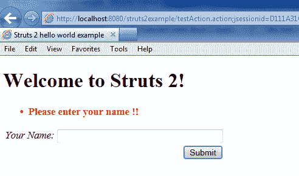
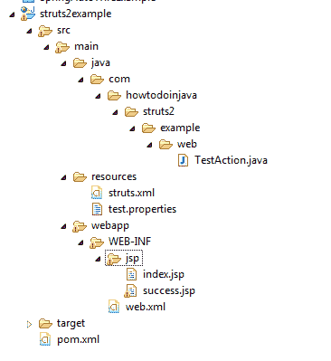

# Struts2 HelloWorld 注解示例

> 原文： [https://howtodoinjava.com/struts2/struts-2-hello-world-with-annotations/](https://howtodoinjava.com/struts2/struts-2-hello-world-with-annotations/)

在我以前的文章中，我写了许多关于 [**JAX-RS RESTEasy**](//howtodoinjava.com/restful-web-service/ "resteasy tutorials")，[**Spring3**](//howtodoinjava.com "Spring3 tutorials")，**Hibernate** 和其他 Java 框架，例如 [**Maven**](//howtodoinjava.com/maven/ "maven tutorials") 或 [**junit**](//howtodoinjava.com/junit/ "junit tutorials") 的示例和教程。 我还写了与 [**Struts2 helloworld 和 xml 配置**](//howtodoinjava.com/struts-2/struts-2-hello-world-example-application/ "Struts2 hello world example application") 相关的帖子。 在本文中，我将更新先前的示例，以使用注释来配置 Struts2 应用。

有关信息，struts 注解是 [**struts 常规插件**](https://struts.apache.org/docs/convention-plugin.html "Struts2 convention plugin")的一部分。

```java
Sections in this post: 
Create maven web project
Struts2 dependencies
web.xml changes
Writing first action class
Composing view files
Testing the application
源码下载
```

## 创建 Maven Web 项目

我在这里不会吃太多空间。 您可以阅读有关[**如何创建 Maven Eclipse Web 项目**](//howtodoinjava.com/maven/how-to-create-a-eclipse-web-application-using-maven/ "How to create a eclipse web application using maven")的更多详细信息。 简而言之，使用以下命令。

```java
mvn archetype:generate -DgroupId=com.howtodoinjava.struts2.example -DartifactIad=struts2example
-DarchetypeArtifactId=maven-archetype-webapp -DinteractiveMode=false

cd struts2example

mvn eclipse:eclipse -Dwtpversion=2.0

```

## Struts2 依赖项

我正在使用 maven 导入 Struts2 运行时依赖项。 这样做的好处是，您无需手动记住和寻找必需的依赖项，一举就能掌握所有内容。

```java
<dependency>
		<groupId>org.apache.struts</groupId>
		<artifactId>struts2-core</artifactId>
		<version>2.3.15.1</version>
	</dependency>
	<dependency>
        <groupId>org.apache.struts</groupId>
	  	<artifactId>struts2-convention-plugin</artifactId>
	  	<version>2.3.15.1</version>
    </dependency>
</dependencies>

```

## `web.xml`的更改

需要以某种方式将 Struts 插入您的 Web 应用。 这意味着应将对应用的传入请求移交给 strut 进行处理。 这是通过在`web.xml`文件中添加过滤器定义来完成的。 此筛选器实质上将所有传入请求重定向到 `StrutsPrepareAndExecuteFilter`，然后使用配置来处理该请求。

另外，我传递了“`actionPackages`”初始化参数，以便可以扫描此包以查找必需的带注释的类。

```java
<!DOCTYPE web-app PUBLIC
"-//Sun Microsystems, Inc.//DTD Web Application 2.3//EN"
"http://java.sun.com/dtd/web-app_2_3.dtd" >
<web-app>
  	<display-name>Archetype Created Web Application</display-name>

	<filter>
	    <filter-name>struts2</filter-name>
	    <filter-class>org.apache.struts2.dispatcher.ng.filter.StrutsPrepareAndExecuteFilter</filter-class>
	    <init-param>
			<param-name>actionPackages</param-name>
			<param-value>com.howtodoinjava.struts2.example.web</param-value>
		</init-param>
	</filter>
	<filter-mapping>
	    <filter-name>struts2</filter-name>
	    <url-pattern>/*</url-pattern>
	</filter-mapping>

</web-app>

```

## 编写第一个类

这很重要，因为您将在此处编写实际的应用逻辑。 Struts2 操作通常扩展`ActionSupport`类，该类提供了一些方法来覆盖和更改应用流，并在两者之间注入业务逻辑。

```java
@Namespace("/default")
@ResultPath(value="/")
@Results({
	   @Result(name="success", location="WEB-INF/jsp/success.jsp"),
	   @Result(name="input", location="WEB-INF/jsp/index.jsp")
})
public class TestAction extends ActionSupport
{
	private static final long serialVersionUID = 1L;

	private String name;

    private Date nowDate;

    @Override
    public void validate(){
        if (name==null || name.length()==0)
            addActionError(getText("error.enter.message"));
    }

    @Actions({
        @Action("/"),
        @Action("/test")
    })
    @Override
    public String execute() throws Exception {
        nowDate = new Date();
        return ActionSupport.SUCCESS;
    }

    public String getName() {
		return name;
	}

	public void setName(String name) {
		this.name = name;
	}

	public Date getNowDate() {
        return nowDate;
    }
}

```

注意：Struts2 动作看起来像 POJO 类，因为它们也必须充当动作形式，它们也是 Struts1 中的单独实体。

## 构建视图文件

这是一般步骤，涉及编写视图层，例如，在我们的例子中，我们正在编写 jsp 文件。 您可以使用消息资源从属性文件中获取消息，稍后在 i18n 中提供帮助。

**`index.jsp`**

```java
<%@ page language="java" contentType="text/html; charset=ISO-8859-1" pageEncoding="ISO-8859-1"%>
<%@ taglib prefix="s" uri="/struts-tags" %>
<?xml version="1.0" encoding="UTF-8" ?>
<!DOCTYPE html PUBLIC "-//W3C//DTD XHTML 1.0 Transitional//EN" "http://www.w3.org/TR/xhtml1/DTD/xhtml1-transitional.dtd">
<html>
    <head>
        <title>Struts2 hello world example</title>
        <s:head/>
    </head>

    <body>
        <h1><s:text name="welcome" /></h1>
        <s:if test="hasActionErrors()">
	        <div id="fieldErrors">
	            <s:actionerror/>
	        </div>
        </s:if>
        <s:form action="test" namespace="/" method="post" name="myForm" theme="xhtml">
            <s:textfield name="name" size="40" maxlength="40" key="your.message-label"/>
            <s:submit key="submit" />
        </s:form>
    </body>
</html>

```

**`success.jsp`**

```java
<%@ page language="java" contentType="text/html; charset=ISO-8859-1"
    pageEncoding="ISO-8859-1"%>
<%@ taglib prefix="s" uri="/struts-tags" %>
<?xml version="1.0" encoding="UTF-8" ?>
<!DOCTYPE html PUBLIC "-//W3C//DTD XHTML 1.0 Transitional//EN" "http://www.w3.org/TR/xhtml1/DTD/xhtml1-transitional.dtd">
<html>
    <head>
        <title>Success Screen !!</title>
    </head>
    <body>
        <h2>Thank you for running this demo on <s:property value="nowDate" /></h2>
        <p>
            Your name recorded was: <h3><s:property value="name" /></h3>
        </p>
    </body>
</html>

```

我正在使用的消息资源文件是：

**`TestAction.properties`**

```java
submit=Submit
your.message-label=Your Name
welcome=Welcome to Struts2!
error.enter.message=Please enter your name !!

```

## 测试应用

现在好运行我们的 helloworld 应用。 让我们点击浏览器。

**键入`http://localhost:8080/struts2example/`，然后按`Enter`**


**按提交而不输入任何内容**



**输入您的姓名，然后按提交**


**项目**的文件/文件夹树



就是这个带有注解的 Struts2 helloworld 应用的朋友。 如果要**下载本教程的源代码**，请按照以下给定的下载链接进行操作。

[**源码下载**](https://docs.google.com/file/d/0B7yo2HclmjI4Q0NZUlgxbm90Vk0/edit?usp=sharing "Struts2 annotations hello world source code")

**学习愉快！**