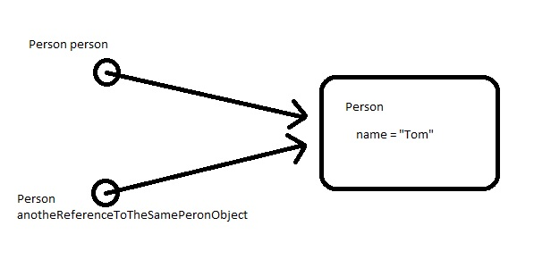

# Java 核心面试问题 – 第 1 部分

> 原文： [https://howtodoinjava.com/interview-questions/core-java-interview-questions-series-part-1/](https://howtodoinjava.com/interview-questions/core-java-interview-questions-series-part-1/)

您打算学习核心 Java 吗？ 还是计划在未来几天进行采访？ 不用担心，请阅读下面给出的所有**面试问题**，以刷新您的概念，并可能在最佳 Java 列表中添加一些新内容。

```java
Interview Questions List

How to create a immutable object in Java? Count all benefits?
Is Java Pass by Reference or Pass by Value?
What is the use of the finally block? Is finally block in Java guaranteed to be called? When finally block is NOT called?
Why there are two Date classes; one in java.util package and another in java.sql?
What is Marker interface?
Why main() in java is declared as public static void main?
What is the difference between creating String as new() and literal?
How does substring() inside String works?
Explain the working of HashMap.
Difference between interfaces and abstract classes?
When do you override hashCode and equals()?
```

## 如何用 Java 创建不可变的对象？ 算上所有好处？

不变类是一种一旦创建便无法更改其状态的类。 在这里，对象状态本质上是指存储在类的实例变量中的值，无论它们是原始类型还是引用类型。

要使类不可变，需要遵循以下步骤：

1.  不要提供设置器方法或修改字段或字段引用的对象的方法。 设置器方法旨在更改对象的状态，这是我们在此要避免的。
2.  将所有字段设为`final`和`private`。 声明为`private`的字段将无法在该类之外访问，将其设置为`final`将确保即使您不小心也无法更改它们。
3.  不允许子类覆盖方法。 最简单的方法是将类声明为`final`。 Java 中的最终类不能被覆盖。
4.  永远记住，您的实例变量将是可变的或不可变的。 标识它们并返回具有所有可变对象（对象引用）复制内容的新对象。 不变的变量（原始类型）可以安全地返回，而无需付出额外的努力。

另外，您应该记住不变类的以下好处。 面试期间您可能需要它们。 不变的类：

*   易于构建，测试和使用
*   自动是线程安全的，并且没有同步问题
*   不需要复制构造器
*   不需要克隆的实现
*   允许 hashCode 使用延迟初始化，并缓存其返回值
*   用作字段时不需要防御性地复制
*   制作好`Map`键和`Set`元素（这些对象在集合中时不得更改状态）
*   在构造时就建立了其类不变式，因此无需再次检查
*   始终具有“ **失败原子性**”（约书亚·布洛赫（Joshua Bloch）使用的术语）：如果不可变对象抛出异常，则永远不会处于不希望或不确定的状态。

看一下这篇在 中用 [**编写的示例。**](//howtodoinjava.com/java/related-concepts/how-to-make-a-java-class-immutable/ "How to make a java class immutable")

## Java 是按引用传递还是按值传递？

Java 规范说 Java 中的 ***都是按值传递*** 。 在 Java 中，没有“ *引用传递*”之类的东西。 这些术语与方法调用关联，并将变量作为方法参数传递。 好吧，原始类型总是按值传递而不会造成任何混淆。 但是，应该在复杂类型的方法参数的上下文中理解该概念。

在 Java 中，当我们将复杂类型的引用作为任何方法参数传递时，总是将内存地址一点一点地复制到新的引用变量中。 见下图：



在上面的示例中，第一个实例的地址位被复制到另一个引用变量，因此导致两个引用都指向存储实际对象的单个存储位置。 请记住，再次引用 null 不会使第一次引用也为 null。 但是，从任一参考变量更改状态也会对其他参考产生影响。

> 在此处详细阅读： [**通过值或引用传递 Java？**](//howtodoinjava.com/java/related-concepts/java-is-pass-by-value-lets-see-how/)

## finally 块的用途是什么？ Java 中的 finally 块是否可以保证被调用？ 最终何时不调用块？

当`try`块退出时，`finally`块总是执行。 这样可以确保即使发生意外异常也执行`finally`块。 但是`finally`不仅可以用于异常处理，还可以使清除代码意外地被`return`，`continue`或`break`绕过。 将清除代码放在`finally`块中始终是一个好习惯，即使没有异常的情况也是如此。

如果在执行`try`或`catch`代码时退出 JVM，则`finally`块可能不会执行。 同样，如果执行`try`或`catch`代码的线程被中断或杀死，则即使整个应用继续运行，`finally`块也可能不会执行。

## 为什么有两个 Date 类； 一个在 java.util 包中，另一个在 java.sql 中？

`java.util.Date`代表一天中的日期和时间，`java.sql.Date`仅代表日期。 `java.sql.Date`的补码为`java.sql.Time`，仅代表一天中的某个时间。
`java.sql.Date`是`java.util.Date`的子类（扩展）。 因此，`java.sql.Date`中发生了什么变化：

– `toString()`生成不同的字符串表示形式： **yyyy-mm-dd**
– 一种`static valueOf(String)`方法，从具有上述表示形式的字符串中创建日期
– 吸气器和设置器数小时 ，不建议使用分钟和秒

`java.sql.Date`类与 JDBC 一起使用，并且不应包含时间部分，即小时，分钟，秒和毫秒应为零…但是该类未强制执行。

## 解释标记界面？

标记器接口模式是计算机科学中的一种设计模式，与**提供有关对象**的运行时类型信息的语言一起使用。 它为**提供了一种方法，可将元数据与该语言不明确支持此类的类相关联。** 在 Java 中，它用作未指定方法的接口。

在 Java 中使用标记接口的一个很好的例子是[可序列化的](//howtodoinjava.com/java/serialization/a-mini-guide-for-implementing-serializable-interface-in-java/ "A mini guide for implementing serializable interface in java")接口。 一个类实现此接口，以指示可以将其非瞬态数据成员写入字节流或文件系统。

标记接口的*主要问题*是，接口定义用于实现类的协定，并且该协定被所有子类继承。 这意味着**您不能“取消实现”标记**。 在给定的示例中，如果创建不想序列化的子类（可能是因为它依赖于瞬态），则必须诉诸显式抛出 NotSerializableException。

## 为什么将 Java 中的 main()声明为 public static void？

***为什么公开*？** 的主要方法是`public`，因此它可以在任何地方访问，并且对于可能希望使用它启动应用的每个对象都可以访问。 在这里，我并不是说 JDK / JRE 具有类似的原因，因为 java.exe 或 javaw.exe（对于 Windows）使用 Java 本机接口（JNI）调用来调用方法，因此，无论使用哪种访问修饰符，他们都可以通过任何一种方式来调用它。 。

***为什么是静态*？** 假设我们没有像`static`那样的主要方法。 现在，要调用任何方法，您需要它的一个实例。 对？ 众所周知，Java 可以有重载的构造器。 现在，应该使用哪一个，重载的构造器的参数从何而来。

***为什么无效*？** 因此，没有任何将值返回给实际调用此方法的 JVM 的用途。 应用唯一想与调用过程进行通信的是：正常终止或异常终止。 使用`System.exit(int)`已经可以实现。 非零值表示异常终止，否则一切正常。

## 将 String 创建为 new()和文字之间有什么区别？

当我们使用`new()`创建`String`时，它会在堆中创建并添加到字符串池中，而使用文字创建的`String`仅在字符串池中创建，而字符串池仅存在于堆的 Perm 区域中。

那么，您真的需要非常深入地了解字符串池的概念，才能回答此问题或类似问题。 我的建议..关于[字符串类和字符串池](//howtodoinjava.com/java/string/interview-stuff-about-string-class-in-java/ "String pool concepts")的“认真学习”。

## String 中的 substring()如何工作？

Java 中的`String`与其他任何编程语言一样，都是字符序列。 这更像是用于该 char 序列的工具类。 此 char 序列在以下变量中维护：

`/** The value is used for character storage. */
**private final char value[];**`

要在不同情况下访问此数组，请使用以下变量：

`/** The offset is the first index of the storage that is used. */
**private final int offset;**`

/ **计数是字符串中的字符数。 * /
**私有最终 int 计数；**

每当我们从任何现有的字符串实例创建子字符串时，`substring()`方法都只会设置`offset`和`count`变量的新值。 内部 char 数组不变。 如果不小心使用`substring()`方法，这可能是内存泄漏的原因。 [在此处了解更多信息](//howtodoinjava.com/java/string/interview-stuff-about-string-class-in-java/ "interview stuff about string class")

## 解释 HashMap 的工作。 如何解决重复冲突？

你们大多数人都会同意，HashMap 是当今面试中最喜欢讨论的话题。 如果有人要我描述“ HashMap 如何工作？”，我只是回答：“ **关于哈希**的原理”。 就这么简单。

现在，以最简单的形式进行哈希处理是一种在对属性应用任何公式/算法之后为任何变量/对象分配唯一代码的方法。

**定义的映射是：“将键映射到值的对象”** 。 很容易..对吗？ 因此，`HashMap`有一个内部类`Entry`，它看起来像这样：

```java
static class Entry<k ,V> implements Map.Entry<k ,V>
{
final K key;
V value;
Entry<k ,V> next;
final int hash;
...//More code goes here
}
```

当某人尝试将键值对存储在`HashMap`中时，会发生以下情况：

*   首先，检查键对象是否为空。 如果 key 为 null，则值存储在 table [0]位置。 因为 null 的哈希码始终为 0。
*   然后，下一步，通过调用密钥的`hashCode()`方法，使用键的哈希码计算哈希值。 该哈希值用于计算数组中用于存储`Entry`对象的索引。 JDK 设计人员很好地假设可能存在一些编写不当的`hashCode()`函数，它们可能返回非常高或很低的哈希码值。 为解决此问题，他们引入了另一个`hash()`函数，并将对象的哈希码传递给此`hash()`函数，以将哈希值带入数组索引大小的范围内。
*   现在，调用`indexFor(hash, table.length)`函数来计算用于存储 Entry 对象的精确索引位置。
*   Here comes the main part. Now, as we know that two unequal objects can have same hash code value, how two different objects will be stored in same array location [called bucket]. Answer is `LinkedList`. If you remember, `Entry` class had an attribute “`next`”. This attribute always points to next object in chain. This is exactly the behavior of `LinkedList`.

    因此，在发生碰撞的情况下，`Entry`对象以`LinkedList`形式存储。 当`Entry`对象需要存储在特定索引中时，`HashMap`检查是否已经有一个条目？ 如果尚无条目，则`Entry`对象存储在此位置。

    如果已经有一个对象位于计算索引上，则检查其`next`属性。 如果为**，则为**，并且当前`Entry`对象成为`LinkedList`中的`next`节点。 如果`next`变量不为空，则遵循步骤直到`next`被求值为空。

    如果我们添加另一个具有与之前输入相同的键的值对象，该怎么办。 从逻辑上讲，它应该替换旧值。 怎么做的？ 好吧，在确定`Entry`对象的`index`位置之后，在对计算索引上的`LinkedList`进行迭代时，`HashMap`为每个`Entry`对象调用关键对象上的`equals()`方法。 `LinkedList`中的所有这些`Entry`对象将具有相似的哈希码，但`equals()`方法将测试真实相等性。 如果 **key.equals（k）**为 true，则两个键都被视为相同的键对象。 这将仅导致替换`Entry`对象中的 value 对象。

这样，`HashMap`确保键的唯一性。

## 接口和抽象类之间的区别？

如果您正在面试初级程序员，这是一个非常常见的问题。 好吧，最明显的区别如下：

*   在 Java 接口中声明的变量默认为`final`。 抽象类可能包含非最终变量。
*   Java 接口是隐式`abstract`，不能具有实现。 Java 抽象类可以具有实现默认行为的实例方法。
*   默认情况下，Java 接口的成员是公共的。 Java 抽象类可以具有类成员通常的风格，例如`private`或`abstract`等。
*   Java 接口应使用关键字“ **实现**”实现； Java 抽象类应使用关键字“ **extended** ”来扩展。
*   Java 类可以实现多个接口，但只能扩展一个抽象类。
*   接口是~~的绝对抽象，~~不能实例化； Java 抽象类也无法实例化，但是可以在存在 main()的情况下调用。 从 Java8 开始，您可以在接口 中定义 [**默认方法。**](//howtodoinjava.com/java8/default-methods-in-java-8/)
*   抽象类比接口要快一些，因为接口涉及在 Java 中调用任何重写方法之前进行的搜索。 在大多数情况下，这并不是显着的差异，但是如果您正在编写时间紧迫的应用，那么您可能不想无所事事。

## 何时覆盖 hashCode()和 equals()？

`hashCode()`和`equals()`方法已在`Object`类中定义，该类是 Java 对象的父类。 因此，所有 java 对象都继承这些方法的默认实现。

`hashCode()`方法用于获取给定对象的唯一整数。 当此对象需要存储在类似数据结构的`HashTable`中时，该整数用于确定存储桶位置。 默认情况下，对象的`hashCode()`方法返回并以整数形式表示存储对象的内存地址。 顾名思义，
`equals()`方法用于简单地验证两个对象的相等性。 默认实现只是检查两个对象的对象引用以验证它们的相等性。

请注意，通常有必要在每次重写此方法时都重写 hashCode 方法，以维护`hashCode()`方法的常规约定，该约定规定相等的对象必须具有相等的哈希码。

*   `equals()`必须定义一个相等关系（它必须是**自反，对称和可传递**）。 另外，它必须是一致的（如果未修改对象，则它必须保持返回相同的值）。 此外，`o.equals(null)`必须始终返回`false`。
*   `hashCode()`也必须保持一致（如果未根据`equals()`修改对象，则它必须保持返回相同的值）。

两种方法之间的关系为：

每当`a.equals(b)`时，`a.hashCode()`必须与`b.hashCode()`相同。

**祝您学习愉快！**