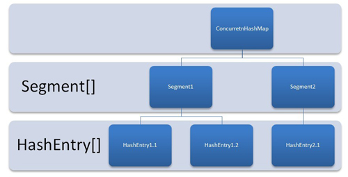

# HashMap 和 ConcurrentHashMap 面试问题

> 原文： [https://howtodoinjava.com/interview-questions/hashmap-concurrenthashmap-interview-questions/](https://howtodoinjava.com/interview-questions/hashmap-concurrenthashmap-interview-questions/)

在“ [**中，HashMap 如何在 Java**](//howtodoinjava.com/java/collections/how-hashmap-works-in-java/ "How hashmap works in java") 中工作”，我解释了`HashMap`或`ConcurrentHashMap`类的内部结构以及它们如何适合整个概念。 但是，当面试官向您询问有关`HashMap`相关概念时，他不仅会停留在核心概念上。 讨论通常会朝多个方向进行，以了解您是否真正了解该概念。

在这篇文章中，我将尝试在 **HashMap** 和 **ConcurrentHashMap** 上涵盖一些相关的 [**面试问题**](//howtodoinjava.com/java-interview-questions/ "interview questions") 。

## HashMap 和 ConcurrentHashMap 面试问题

1\. [您将如何为 HashMap 设计一个好的键？](#1)
2\. [HashMap 和 ConcurrentHashMap 之间的区别？](#2)
3\. [HashMap 和 Collections.synchronizedMap（HashMap）之间的区别吗？](#3)
4\. [ConcurrentHashMap 和 Collections.synchronizedMap（HashMap）之间的区别？](#4)
5\. [HashMap 和 HashTable 之间的区别？](#5)
6\. [HashTable 和 Collections.synchronized（HashMap）之间的区别？](#6)
7\. [键的随机/固定 hashCode()值的影响？](#7)
8\. [在多线程应用的非同步代码中使用 HashMap 吗？](#8)

## 1.如何为 HashMap 设计一个好的键

设计一个好的键的最基本的需求是“我们应该能够从映射中检索到价值对象而不会失败”，对吗？ 否则，无论您如何构建精美的数据结构，它都将毫无用处。 要确定我们已经创建了一个好的键，我们必须知道“ [**HashMap 如何工作？**](https://howtodoinjava.com/java/collections/how-hashmap-works-in-java/ "How hashmap works in java") 。 我将介绍哈希表的工作原理，让您从链接的文章中阅读内容，但总而言之，它是基于哈希原理的。

键的哈希码主要与 equals()方法结合使用，用于将键放入映射，然后从映射中搜索回来。 因此，如果在将键值对放入映射后，键对象的哈希码发生变化，则几乎不可能从映射取回值对象。 这是内存泄漏的情况。 为了避免这种情况，映射**键应该是不可变的**。 这些是 [**创建类**](https://howtodoinjava.com/java/basics/how-to-make-a-java-class-immutable/ "How to make a java class immutable") 不变的东西。

这就是为什么不可变类（例如 String，Integer 或其他包装器类）是好的关键对象候选对象的主要原因。

但是请记住，建议**不可变，而不是强制性**。 如果要将可变对象作为`HashMap`中的键，则必须确保键对象的**状态更改不会更改对象**的哈希码。 这可以通过重写 hashCode()方法来完成。 同样，键类必须遵守 [**hashCode()和 equals()方法协定**](https://howtodoinjava.com/java/basics/java-hashcode-equals-methods/ "Working with hashCode and equals methods in java") ，以避免在运行时出现不良行为。 在链接的文章中阅读有关此合同的更多信息。

更详细的信息可在 [**在此处**](https://howtodoinjava.com/java/collections/design-good-key-for-hashmap/ "How to design a good key for HashMap") 中找到。

## 2\. HashMap 和 ConcurrentHashMap 之间的区别

为了更好地可视化 ConcurrentHashMap，请将其视为一组 HashMap。 要从`HashMap`中获取和放置键值对，您必须计算哈希码并在 Collection.Entry 数组中查找正确的存储桶位置。 其余的，您已阅读了以前有关哈希表如何工作的相关文章。

在 currentHashMap 中，**的不同之处在于内部结构来存储这些键值对**。 ConcurrentHashMap 具有段的附加概念。 当您想到一个段等于一个 HashMap 时，[概念上]会更容易理解。 初始化时，并发 HashMap 被划分为段数[默认为 16]。 ConcurrentHashMap 允许相似数量（16）的线程同时访问这些段，以便在高并发期间每个线程都在特定的段上工作。

这样，如果您的键值对存储在第 10 段中； 代码不需要另外阻塞其他 15 个段。 这种结构提供了很高的并发性。



ConcurrentHashMap Internal Structure


换句话说， **ConcurrentHashMap 使用多个锁，每个锁控制映射**的一个段。 在特定段中设置数据时，将获得该段的锁。 因此，基本上**更新操作是同步的**。
**获取数据时，将使用易失性读取**，而不会进行任何同步。 如果易失性读取导致未命中，则将获得该段的锁定，并在同步块中再次搜索项目。

## 3\. HashMap 和 Collections.synchronizedMap（HashMap）之间的区别

这个问题很简单，对！ HashMap 是不同步的，并且 Collections.synchronizedMap()返回 HashMap 的包装实例，该实例具有同步的所有 get，put 方法。

本质上， **Collections.synchronizedMap()返回内部创建的内部类“ SynchronizedMap”** 的引用，该类包含作为参数传递的输入 HashMap 的键值对。

内部类的此实例与原始参数 HashMap 实例无关，并且是完全独立的。

## 4\. ConcurrentHashMap 和 Collections.synchronizedMap（HashMap）之间的区别

这一点要难一些。 两者都是 HashMap 的同步版本，其核心功能和内部结构有所不同。

如上所述，ConcurrentHashMap 由内部段组成，从概念上讲，这些内部段可以视为独立的 HashMap。 所有这样的段可以在高并发执行中被单独的线程锁定。 这样，**多个线程可以从 ConcurrentHashMap 获取/放置键值对，而不会互相阻塞/等待**。

在 Collections.synchronizedMap()中，我们获得了 HashMap 的同步版本，并且**以阻塞方式**进行访问。 这意味着如果多个线程尝试同时访问 syncedMap，将允许它们一次以同步方式获取/放置键值对。

## 5\. HashMap 和 HashTable 之间的区别

这也是一个很简单的问题。 主要区别在于 **HashTable 是同步的，而 HashMap 不是**。

如果由于其他原因而被告知，请告诉他们， **HashTable 是旧类**（JDK 1.0 的一部分），该类稍后通过实现 Map 接口而被提升为集合框架。 它仍然具有一些**附加功能，例如 HashMap 缺少的 Enumerator** 。

另一个较小的原因可能是： **HashMap 支持空键**（映射到零桶），HashTable 不支持空键，并且在这种尝试时抛出 NullPointerException。

## 6\. HashTable 和 Collections.synchronized（HashMap）之间的区别

到目前为止，您必须已经了解了它们之间相似性的核心思想。 两者都是集合的同步版本。 两者都在类内部具有同步方法。 两者本质上都是阻塞的，即在将实例中的任何内容放进去之前，多个线程将需要等待获取实例上的锁。

那么区别是什么呢。 好吧，由于上述原因，**没有重大差异**。 两个集合的性能也相同。

唯一将它们分开的是事实 **HashTable 是提升为集合框架的旧版**类。 它具有自己的额外功能，例如枚举器。

## 7.键的随机/固定 hashcode()值的影响

两种情况（键的固定哈希码或键的随机哈希码）的影响将产生相同的结果，即“ **意外行为**”。 HashMap 中哈希码最基本的需求是确定存储桶的位置，以将键值对放置在哪里，以及必须从哪里检索它。

如果键对象的哈希码每次都更改，则键值对的确切位置每次都将计算为不同。 这样，存储在 HashMap 中的一个对象将永远丢失，并且将其从映射取回的可能性极小。

出于同样的原因，建议键是不可变的，以便每次在同一键对象上请求时，它们都返回唯一且相同的哈希码。

## 8.在多线程应用中的非同步代码中使用 HashMap

在正常情况下，它**可使`HashMap`处于不一致状态**，在该状态下添加和检索的键值对可能不同。 除此之外，还会出现其他令人惊讶的行为，例如 NullPointerException。

在最坏的情况下，**会导致无限循环**。 是。 你答对了。 它可能导致无限循环。 你问什么，如何？ 好吧，这就是原因。

当 HashMap 达到其大小上限时，它具有重新哈希的概念。 重新哈希处理是创建新的内存区域，并在新的内存中复制所有已经存在的键值对的过程。 可以说，线程 A 尝试将键值对放入映射中，然后开始重新哈希。 同时，线程 B 来了，并开始使用 put 操作来操作存储桶。

在进行重新哈希处理时，有机会生成循环依赖关系，其中链表中的任何元素（在任何存储桶中）都可以指向同一存储桶中的任何先前节点。 这将导致无限循环，因为重新哈希处理的代码包含一个“ while（true）{//获取下一个节点； }”块，并且在循环依赖项下它将无限运行。

要仔细观察，请查看用于重新哈希处理的传输方法的艺术源代码：

```java
public Object get(Object key) {
	Object k = maskNull(key);
	int hash = hash(k);
	int i = indexFor(hash, table.length);
	Entry e = table[i];

	//While true is always a bad practice and cause infinite loops

	while (true) {
		if (e == null)
			return e;
		if (e.hash == hash & eq(k, e.key))
			return e.value;
		e = e.next;
	}
}

```

以后我会写一篇更详细的文章。

希望我能够为**`HashMap`面试问题**和 **ConcurrentHashMap 面试问题**投入更多知识。 如果您认为本文有帮助，请考虑与您的朋友分享。

学习愉快！

参考文献：

[ConcurrentHashMap Java 文档](https://docs.oracle.com/javase/10/docs/api/java/util/concurrent/ConcurrentHashMap.html)
[ConcurrentHashMap Java 文档](https://docs.oracle.com/javase/10/docs/api/java/util/HashMap.html)