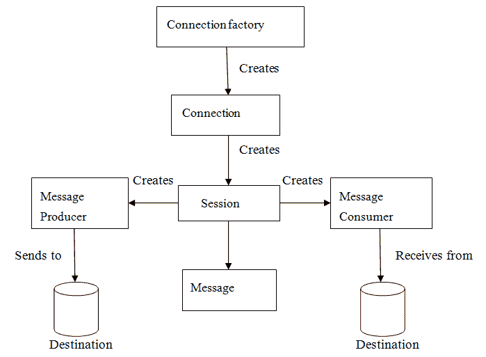

# JMS 教程 – Java 消息服务教程

> 原文： [https://howtodoinjava.com/jms/jms-java-message-service-tutorial/](https://howtodoinjava.com/jms/jms-java-message-service-tutorial/)

[Java 消息服务](https://en.wikipedia.org/wiki/Java_Message_Service)是一种 API，支持网络上计算机之间称为**消息传递的正式通信。 它为标准消息协议和消息服务提供了通用接口，以支持 Java 程序。 它提供了创建，发送和阅读消息的功能。 JMS API 减少了程序员必须学习使用消息传递服务/产品的概念，并且还提供了支持消息传递应用的功能。
**JMS** 是一种技术，在 J2EE 技术​​中用于使应用以松散耦合的方式与其他应用通信。 这意味着必须通信的应用没有直接连接，而是通过一个公共目标连接。 我们将在本 **jms 教程**中详细介绍。**

```java
Table of Contents

1\. Need of JMS
2\. Benefits of JMS
3\. Messaging Domains
4\. Message Consumption
5\. JMS participating objects
6\. JMS Message Components
```

## 1\. JMS 教程 - 需要 JMS

在 Java 中，如果一个人想要以一种方式将消息从一个应用发送到另一个应用，使得这两个应用彼此之间一无所知，那么即使它们可以完全不依赖地部署在单独的大陆上。 例如，一个应用 A 在印度运行，另一个应用在美国运行，而 B 则有兴趣从 A 获得一些更新/消息 - 每当 A 上发生独特的事情。可能有 N 个这样的应用对 来自 A 的此类更新。

在这种情况下，java 提供了 JMS 形式的最佳解决方案 - 解决了上面讨论的完全相同的问题。

当我们编写任何基于事件的应用（例如聊天服务器）时，JMS 也是有用的，在该应用中，它需要一种发布事件机制来在服务器之间向与服务器连接的客户端之间发送消息。 由于 JMS 与 RMI 不同，因此在将消息从客户端发送到服务器时，不需要使目标对象联机可用。 服务器发布消息并忘记它，每当客户端联机时，它将获取消息。 它是当今世界上非常常见的问题的强大解决方案。

## 2\. JMS 教程 - JMS 的好处

1.  #### 异步

    默认情况下，JMS 是异步的。 因此，要接收消息，不需要客户端发送请求。 消息将在可用时自动到达客户端。

2.  #### 可靠

    JMS 提供了保证消息将只传递一次的功能。 您知道重复的消息会造成问题。 JMS 帮助您避免此类问题。

## 3\. JMS 消息传递域

在 JMS API 出现之前，大多数消息传递产品都支持**点对点**或**发布/订阅**消息传递方法。 JMS 为每种方法提供一个单独的域，并定义每个域的合规性。 任何 JMS 提供商都可以实现这两个域或一个域，这是他自己的选择。 JMS 提供了公共接口，使我们能够使用 JMS API，而不是特定于任何一个域。

让我们更详细地了解两种消息传递域，以了解 **JMS 的工作原理**。

#### 3.1 点对点消息传递域

在点对点消息传递域中，该应用是基于消息队列，发送者和接收者构建的。 每个消息都寻址到特定的[**队列**](https://docs.oracle.com/javaee/6/api/javax/jms/Queue.html)。 队列保留发送给他们的所有消息，直到消息被消耗或过期。 PTP 消息传递具有一些特征：

1.  每个消息只有一个客户端。
2.  消息的发送者和接收者没有时间依赖项。
3.  当发送方发送消息时，接收方可以获取消息是否正在运行。
4.  接收者在收到消息后发送确认。


点对点 JMS 消息传递


#### 3.2 发布/订阅消息域

在发布/订阅消息传递域中，仅发布一条消息，该消息通过充当公告板的[**主题**](https://docs.oracle.com/javaee/6/api/javax/jms/Topic.html)传递给所有客户端。 发布者和订阅者通常是匿名的，可以动态发布或订阅主题。 主题负责保存和传递消息。 只要分发到当前客户端，该主题就会保留消息。

一些特征是：

1.  一条消息可以有多个订阅者。
2.  发布者和订阅具有时间依赖项。 订阅主题的客户端只能使用在客户端创建订阅后发布的消息，并且订阅者必须继续处于活动状态才能使用消息。


发布订阅 JMS 消息传递


阅读更多：[HornetQ 基本示例](//howtodoinjava.com/hornetq/basic-jms-messaging-example-using-hornetq-stand-alone-server/)

## 4.消息消耗

在 JMS 中，可以通过两种方式使用消息：

#### 4.1 同步

在同步消息使用中，订阅者/接收者通过调用[`receive()`](https://docs.oracle.com/javaee/7/api/javax/jms/MessageConsumer.html#receive--)方法从目标请求消息。 在`receive()`中，方法将阻塞直到消息到达或超时（如果消息在给定时间内未到达）。 就像普通的 java 方法调用一样，它带有一些返回值。

#### 4.2 异步

在异步消息消费中，订阅者可以向消费者注册（或订阅）为消息监听器。 消息监听器与事件监听器相同，每当消息到达目标时，JMS 提供者都会通过调用监听器的[`onMessage()`](https://docs.oracle.com/javaee/7/api/javax/jms/MessageListener.html#onMessage-javax.jms.Message-)方法来传递消息，该方法将对消息的内容起作用。

## 5\. JMS 参与对象

JMS 应用具有一些基本构建块，它们是：

1.  受管对象 – 连接工厂和目标
2.  连接
3.  会话
4.  消息生产者
5.  消息消费者
6.  消息监听器



JMS API 编程模型


#### 5.1 JMS 管理的对象

JMS 应用提供两种类型的管理对象：

*   连接工厂
*   目标

这两个受管理对象由 JMS 系统管理员在 JMS 生产者中通过使用应用服务管理控制台创建。 这两个对象都存储在应用服务器 JNDI 目录或 JNDI 注册表中。

#### 5.2 连接工厂

客户端使用的对象是[连接工厂](https://docs.oracle.com/javaee/6/api/javax/jms/ConnectionFactory.html)，用于创建与供应器的连接。 它在 JMS 生产者和 JMS 客户端之间创建连接。 当诸如发送者或接收者之类的 JMS 客户端在 JNDI 注册表中搜索该对象时，则 JMS 客户端会收到一个连接对象，这不仅仅是 JMS 生产者和 JMS 客户端之间的物理连接。 使用此连接，客户端可以与目标对象进行通信，以将消息发送或接收到队列或主题中。 让我们举一个例子来理解它发送消息：

```java
QueueConnectionFactory queueConnFactory = (QueueConnectionFactory) initialCtx.lookup ("primaryQCF");
Queue purchaseQueue = (Queue) initialCtx.lookup ("Purchase_Queue");
Queue returnQueue = (Queue) initialCtx.lookup ("Return_Queue");

```

#### 5.3 目标

客户端使用称为目标的对象，该对象用于指定其生成的消息的目标以及使用它的消息的源。 JMS 应用使用两种类型的目标队列或主题。 该代码指定队列和主题。

**创建队列会话**

```java
QueueSession ses = con.createQueueSession (false, Session.AUTO_ACKNOWLEDGE);  //get the Queue object  
Queue t = (Queue) ctx.lookup ("myQueue");  //create QueueReceiver  
QueueReceiver receiver = ses.createReceiver(t); 

```

**创建主题会话**

```java
TopicSession ses = con.createTopicSession (false, Session.AUTO_ACKNOWLEDGE); // get the Topic object  
Topic t = (Topic) ctx.lookup ("myTopic");  //create TopicSubscriber  
TopicSubscriber receiver = ses.createSubscriber(t);  

```

#### 5.4 JMS 连接

该连接封装了与 JMS 供应器的虚拟连接。 该连接实现了`Connection`接口，当它具有`ConnectionFactory`对象时，我们可以使用它来创建连接。

```java
Connection connection = connectionFactory.createConnection();
```

创建任何连接后，应在使用以下方法完成应用之前关闭它们：

```java
connection.close();
```

#### 5.5 JMS 会议

[会话](https://docs.oracle.com/javaee/7/api/javax/jms/Session.html)是用于生成和使用消息的单线程上下文。 这些会话用于创建以下内容：

*   消息生产者
*   消息消费者

会话实现了`Session`接口，并且在创建`Connection`对象之后，我们使用它来创建`Session`。

```java
Session session = connection.createSession(false, Session.AUTO_ACKNOWLEDGE);
```

#### 5.6 JMS 消息生产者

消息生产者是由会话创建的对象，用于将消息发送到目标。 这实现了[`MessageProducer`](https://docs.oracle.com/javaee/7/api/javax/jms/MessageProducer.html)接口。 我们使用`Session`为目标，队列或主题对象创建一个`MessageProducer`。

```java
MessageProducer producer = session.createProducer(dest);
MessageProducer producer = session.createProducer(queue);
MessageProducer producer = session.createProducer(topic);

```

创建消息后，将使用生成器来使用`send`方法发送消息。

```java
producer.send(message);
```

#### 5.7 JMS 消息使用者

消息使用者是一个由会话创建的对象，用于接收在目标发送的消息。 它将实现[`MessageConsumer`](https://docs.oracle.com/javaee/7/api/javax/jms/MessageConsumer.html)接口。 我们使用会话为目标，队列或主题对象创建`MessageConsumer`。

```java
MessageConsumer consumer = session.createConsumer(dest);
MessageConsumer consumer = session.createConsumer(queue);
MessageConsumer consumer = session.createConsumer(topic);

```

#### 5.8 JMS 消息监听器

消息监听器是一个对象，充当消息的异步事件处理器。 消息监听器实现[`MessageListener`](https://docs.oracle.com/javaee/7/api/javax/jms/MessageListener.html)接口，其中包含一个方法`onMessage()`。 在这种方法中，我们定义了消息到达时要执行的动作。 通过使用`setMessageListener()`，我们使用特定的`MessageConsumer`定义消息监听器。

```java
Listener myListener = new Listener();
consumer.setMessageListener(myListener);

```

## 6\. JMS 消息组件

JMS 客户端使用 JMS 消息在系统之间进行通信。 JMS 消息具有简单的格式，但具有高度的灵活性，它允许创建与格式匹配的消息。 JMS 消息分为三个部分。 他们是：

1.  #### 消息标题

    JMS 消息头包含许多预定义字段，这些字段包含客户机和提供者用来标识和发送消息的那些值。 预定义的标头是：

    - `JMSDestination`
    - `JMSDeliveryMode`
    - `JMSMessageID`
    - `JMSTimestamp`
    - `JMSCorrelationID`
    - `JMSReplyTo`
    - `JMSRelivered`
    - `JMSType`
    - `JMSExpiration`

2.  #### 消息属性

    在消息属性中，我们可以创建和设置消息的属性。 消息属性是由应用设置或读取的自定义名称值对。 消息属性对于支持过滤消息很有用。 JMS API 提供了供应器可以支持的一些预定义属性。 消息属性是可选的。

3.  #### 消息正文

    在消息正文中，JMS API 定义了五种消息正文格式，也称为消息类型，它们使我们能够以许多不同的形式发送和接收数据，并提供与现有消息传递格式的兼容性。 它基本上由从 JMS 发送方发送到接收方的实际消息组成。 不同的消息类型是：

    **文本消息**：由`javax.jms.TextMessage`表示。 它用于表示文本块。
    **对象消息**：由`javax.jms.ObjectMessage`表示。 它用来表示一个 Java 对象。
    **字节消息**：由`javax.jms.BytesMessage`表示。 它用来表示二进制数据。
    **流消息**：由`javax.jms.StreamMessage`表示。 它用于表示 Java 基本值的列表。
    **映射消息**：由`javax.jms.MapMessage`表示。 它用于表示一组关键字或值对。

**JMS 入门教程**及其相关术语就这些了。 在下一组帖子中。 我将举一些 JMS 的例子。

学习愉快！

参考文献：

[JSR 914：JavaTM 消息服务（JMS）API](https://www.jcp.org/en/jsr/detail?id=914)

[JMS 参考](https://docs.oracle.com/javaee/6/tutorial/doc/bncdq.html)