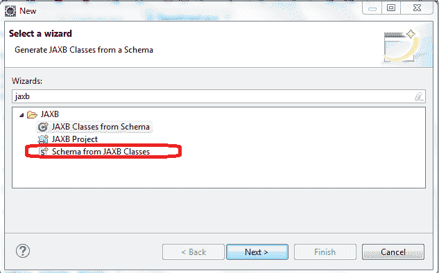
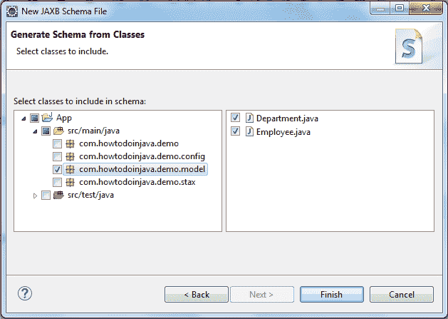

# 使用 Eclipse 从 JAXB Java 类生成 XSD

> 原文： [https://howtodoinjava.com/jaxb/java-class-to-xsd-eclipse/](https://howtodoinjava.com/jaxb/java-class-to-xsd-eclipse/)

学习**使用 Eclipse IDE 从带有 JAXB 注解的 Java 类**创建 XML 模式文档（xsd）。

## 1）将 JAXB 注解添加到 Java 类

第一步是向 Java 类添加`@XmlRootElement`，`@XmlAccessorType`和`@XmlElement`等注解。

```java
import java.io.Serializable;
import javax.xml.bind.annotation.XmlAccessType;
import javax.xml.bind.annotation.XmlAccessorType;
import javax.xml.bind.annotation.XmlRootElement;

@XmlRootElement(name = "employee")
@XmlAccessorType(XmlAccessType.PROPERTY)
public class Employee implements Serializable {

	private static final long serialVersionUID = 1L;

	private Integer id;
	private String firstName;
	private String lastName;
	private Department department;

	public Employee() {
		super();
	}

	//Setters and Getters
}

```

```java
import java.io.Serializable;
import javax.xml.bind.annotation.XmlAccessType;
import javax.xml.bind.annotation.XmlAccessorType;
import javax.xml.bind.annotation.XmlRootElement;

@XmlRootElement(name = "department")
@XmlAccessorType(XmlAccessType.PROPERTY)
public class Department implements Serializable {

	private static final long serialVersionUID = 1L;

	Integer id;
	String name;

	public Department() {
		super();
	}

	//Setters and Getters
}

```

## 2）从 JAXB 类生成 XSD

#### 2.1）导航到 Eclipse 选项

```java
File  -> New -> JAXB -> Schema from JAXB Classes
```



JAXB 类选项的模式


## 2.2）选择生成的模式文件的位置


生成的模式文件的位置


#### 2.3）选择 JAXB 类



选择 JAXB 类


#### 2.4）生成 xsd 文件

```java
<?xml version="1.0" encoding="UTF-8" standalone="yes"?>
<xs:schema version="1.0" xmlns:xs="http://www.w3.org/2001/XMLSchema">

  <xs:element name="department" type="department"/>

  <xs:element name="employee" type="employee"/>

  <xs:complexType name="employee">
    <xs:sequence>
      <xs:element ref="department" minOccurs="0"/>
      <xs:element name="firstName" type="xs:string" minOccurs="0"/>
      <xs:element name="id" type="xs:int" minOccurs="0"/>
      <xs:element name="lastName" type="xs:string" minOccurs="0"/>
    </xs:sequence>
  </xs:complexType>

  <xs:complexType name="department">
    <xs:sequence>
      <xs:element name="id" type="xs:int" minOccurs="0"/>
      <xs:element name="name" type="xs:string" minOccurs="0"/>
    </xs:sequence>
  </xs:complexType>
</xs:schema>

```

XSd 文件已生成，现在您可以将其用于各种应用用例。

学习愉快！