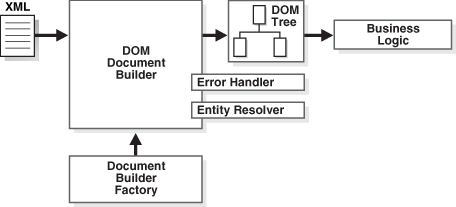

# Java 读取 XML – Java DOM 解析器示例

> 原文： [https://howtodoinjava.com/xml/read-xml-dom-parser-example/](https://howtodoinjava.com/xml/read-xml-dom-parser-example/)

在此 *Java xml 解析器教程*中，学习**用 Java 中的 DOM 解析器**读取 xml。 DOM 解析器旨在将 XML 作为内存中的对象图（树状结构）使用 – 称为“ **文档对象模型（DOM）**”。

首先，解析器遍历输入的 XML 文件并创建与 XML 文件中的节点相对应的 **DOM** 对象。 这些 DOM 对象以树状结构链接在一起。 一旦解析器完成了解析过程，我们就会从中获得这种树状 DOM 对象结构。 现在，我们可以根据需要来回遍历 DOM 结构 - 从中获取/更新/删除数据。

```java
Table of Contents

1\. DOM Parser API
   -Import XML-related packages
   -Create a DocumentBuilder
   -Create a Document from a file or stream
   -Validate Document structure
   -Extract the root element
   -Examine attributes
   -Examine sub-elements
2\. Read XML with DOM parser
3\. Read data to POJO objects
4\. Parse "unknown" xml with DOM parser
```

> 阅读更多： [DOM 解析器和 SAX 解析器](//howtodoinjava.com/xml/dom-vs-sax-parser-in-java/ "DOM Vs SAX Parser in Java")之间的区别

出于示例目的，我们将在所有代码示例中解析 xml 内容。

```java
<employees>
    <employee id="111">
        <firstName>Lokesh</firstName>
        <lastName>Gupta</lastName>
        <location>India</location>
    </employee>
    <employee id="222">
        <firstName>Alex</firstName>
        <lastName>Gussin</lastName>
        <location>Russia</location>
    </employee>
    <employee id="333">
        <firstName>David</firstName>
        <lastName>Feezor</lastName>
        <location>USA</location>
    </employee>
</employees>

```

## 1\. DOM 解析器 API

让我们记下一些主要步骤，以**创建并使用 DOM 解析器**来解析 Java 中的 XML 文件。



DOM Parser in Action


#### 1.1 导入 dom 解析器包

我们将需要首先在我们的应用程序中导入 dom 解析器包。

```java
import org.w3c.dom.*;
import javax.xml.parsers.*;
import java.io.*;

```

#### 1.2 创建 DocumentBuilder

下一步是创建 DocumentBuilder 对象。

```java
DocumentBuilderFactory factory = DocumentBuilderFactory.newInstance();
DocumentBuilder builder = factory.newDocumentBuilder();

```

#### 1.3 从 xml 文件创建 Document 对象

将 XML 文件读取到`Document`对象。

```java
Document document = builder.parse(new File( file ));

```

#### 1.4 验证文件结构

XML 验证是可选的，但最好在开始解析之前进行验证。

```java
Schema schema = null;
try {
  String language = XMLConstants.W3C_XML_SCHEMA_NS_URI;
  SchemaFactory factory = SchemaFactory.newInstance(language);
  schema = factory.newSchema(new File(name));
} catch (Exception e) {
    e.printStackStrace();
}
Validator validator = schema.newValidator();
validator.validate(new DOMSource(document));

```

#### 1.5 提取根元素

我们可以使用以下代码从 XML 文档中获取根元素。

```java
Element root = document.getDocumentElement();

```

#### 1.6 检查属性

我们可以使用以下方法检查 xml 元素属性。

```java
element.getAttribute("attributeName") ;    //returns specific attribute
element.getAttributes();                //returns a Map (table) of names/values

```

#### 1.7 检查子元素

子元素可以以下方式查询。

```java
node.getElementsByTagName("subElementName") //returns a list of sub-elements of specified name
node.getChildNodes()                         //returns a list of all child nodes

```

## 2.使用 DOM 解析器读取 XML

在下面的示例代码中，我假设用户已经知道`employees.xml`文件的结构（它的节点和属性）； 因此，示例直接开始获取信息并开始在控制台中打印信息。 在现实生活中的应用程序中，我们将这些信息用于某些实际目的，而不是在控制台上打印并离开。

```java
//Get Document Builder
DocumentBuilderFactory factory = DocumentBuilderFactory.newInstance();
DocumentBuilder builder = factory.newDocumentBuilder();

//Build Document
Document document = builder.parse(new File("employees.xml"));

//Normalize the XML Structure; It's just too important !!
document.getDocumentElement().normalize();

//Here comes the root node
Element root = document.getDocumentElement();
System.out.println(root.getNodeName());

//Get all employees
NodeList nList = document.getElementsByTagName("employee");
System.out.println("============================");

for (int temp = 0; temp < nList.getLength(); temp++)
{
 Node node = nList.item(temp);
 System.out.println("");    //Just a separator
 if (node.getNodeType() == Node.ELEMENT_NODE)
 {
    //Print each employee's detail
    Element eElement = (Element) node;
    System.out.println("Employee id : "    + eElement.getAttribute("id"));
    System.out.println("First Name : "  + eElement.getElementsByTagName("firstName").item(0).getTextContent());
    System.out.println("Last Name : "   + eElement.getElementsByTagName("lastName").item(0).getTextContent());
    System.out.println("Location : "    + eElement.getElementsByTagName("location").item(0).getTextContent());
 }
}

```

程序输出：

```java
employees
============================

Employee id : 111
First Name : Lokesh
Last Name : Gupta
Location : India

Employee id : 222
First Name : Alex
Last Name : Gussin
Location : Russia

Employee id : 333
First Name : David
Last Name : Feezor
Location : USA

```

## 3.将数据读取到 POJO 对象

现实生活中另一个应用程序的要求可能是使用上面示例代码中提取的信息填充 DTO 对象。 我写了一个简单的程序来帮助您了解如何轻松完成它。

假设我们必须填充`Employee`对象，其定义如下。

```java
public class Employee
{
   private Integer id;
   private String firstName;
   private String lastName;
   private String location;

   //Setters and Getters

   @Override
   public String toString()
   {
      return "Employee [id=" + id + ", firstName=" + firstName + ", lastName=" + lastName + ", location=" + location + "]";
   }
}

```

现在查看示例代码以填充员工对象列表。 就像在代码之间插入几行，然后将值复制到 DTO 而不是控制台中一样简单。

Java 程序，用于使用 DOM 解析器读取 XML 文件。

```java
public class PopulateDTOExamplesWithParsedXML
{
   public static void main(String[] args) throws ParserConfigurationException, SAXException, IOException
   {
        List<Employee> employees = parseEmployeesXML();
        System.out.println(employees);
   }

   private static List<Employee> parseEmployeesXML() throws ParserConfigurationException, SAXException, IOException
   {
      //Initialize a list of employees
      List<Employee> employees = new ArrayList<Employee>();
      Employee employee = null;

      DocumentBuilderFactory factory = DocumentBuilderFactory.newInstance();
      DocumentBuilder builder = factory.newDocumentBuilder();
      Document document = builder.parse(new File("employees.xml"));
      document.getDocumentElement().normalize();
      NodeList nList = document.getElementsByTagName("employee");
      for (int temp = 0; temp < nList.getLength(); temp++)
      {
         Node node = nList.item(temp);
         if (node.getNodeType() == Node.ELEMENT_NODE)
         {
            Element eElement = (Element) node;
            //Create new Employee Object
            employee = new Employee();
            employee.setId(Integer.parseInt(eElement.getAttribute("id")));
            employee.setFirstName(eElement.getElementsByTagName("firstName").item(0).getTextContent());
            employee.setLastName(eElement.getElementsByTagName("lastName").item(0).getTextContent());
            employee.setLocation(eElement.getElementsByTagName("location").item(0).getTextContent());

            //Add Employee to list
            employees.add(employee);
         }
      }
      return employees;
   }
}

```

程序输出。

```java
[Employee [id=111, firstName=Lokesh, lastName=Gupta, location=India], 
Employee [id=222, firstName=Alex, lastName=Gussin, location=Russia], 
Employee [id=333, firstName=David, lastName=Feezor, location=USA]]

```

## 4.使用 DOM 解析器解析“未知” xml

上一个示例显示了在编写代码时，我们如何遍历具有已知或几乎不知道的结构的 XML 文档。 在某些情况下，我们可能必须以某种方式编写代码，以便即使在编码时假定的 XML 结构存在某些差异，程序也必须能够正常运行。

在这里，我们遍历 XML 文档树中存在的所有元素。 我们可以添加我们的知识并修改代码，以便在遍历树时只要获得所需信息，我们就可以使用它。

```java
public class ParseUnknownXMLStructure
{
   public static void main(String[] args) throws ParserConfigurationException, SAXException, IOException
   {
      //Get Document Builder
      DocumentBuilderFactory factory = DocumentBuilderFactory.newInstance();
      DocumentBuilder builder = factory.newDocumentBuilder();

      //Build Document
      Document document = builder.parse(new File("employees.xml"));

      //Normalize the XML Structure; It's just too important !!
      document.getDocumentElement().normalize();

      //Here comes the root node
      Element root = document.getDocumentElement();
      System.out.println(root.getNodeName());

      //Get all employees
      NodeList nList = document.getElementsByTagName("employee");
      System.out.println("============================");

      visitChildNodes(nList);
   }

   //This function is called recursively
   private static void visitChildNodes(NodeList nList)
   {
      for (int temp = 0; temp < nList.getLength(); temp++)
      {
         Node node = nList.item(temp);
         if (node.getNodeType() == Node.ELEMENT_NODE)
         {
            System.out.println("Node Name = " + node.getNodeName() + "; Value = " + node.getTextContent());
            //Check all attributes
            if (node.hasAttributes()) {
               // get attributes names and values
               NamedNodeMap nodeMap = node.getAttributes();
               for (int i = 0; i < nodeMap.getLength(); i++)
               {
                   Node tempNode = nodeMap.item(i);
                   System.out.println("Attr name : " + tempNode.getNodeName()+ "; Value = " + tempNode.getNodeValue());
               }
               if (node.hasChildNodes()) {
                  //We got more childs; Let's visit them as well
                  visitChildNodes(node.getChildNodes());
               }
           }
         }
      }
   }
}

```

Program Output.

```java
employees
============================
Node Name = employee; Value = 
        Lokesh
        Gupta
        India

Attr name : id; Value = 111
Node Name = firstName; Value = Lokesh
Node Name = lastName; Value = Gupta
Node Name = location; Value = India
Node Name = employee; Value = 
        Alex
        Gussin
        Russia

Attr name : id; Value = 222
Node Name = firstName; Value = Alex
Node Name = lastName; Value = Gussin
Node Name = location; Value = Russia
Node Name = employee; Value = 
        David
        Feezor
        USA

Attr name : id; Value = 333
Node Name = firstName; Value = David
Node Name = lastName; Value = Feezor
Node Name = location; Value = USA

```

这就是 **Java XML DOM 解析器**的概念。 如果不清楚或需要更多说明，请给我评论。

[Download Source code/a>](https://drive.google.com/file/d/0B7yo2HclmjI4d1dwd2hZb19IbEU/edit?usp=sharing "dom parser example sourcecode")

学习愉快！

参考：

[http://www.w3c.org/DOM/](http://www.w3c.org/DOM/ "DOM")