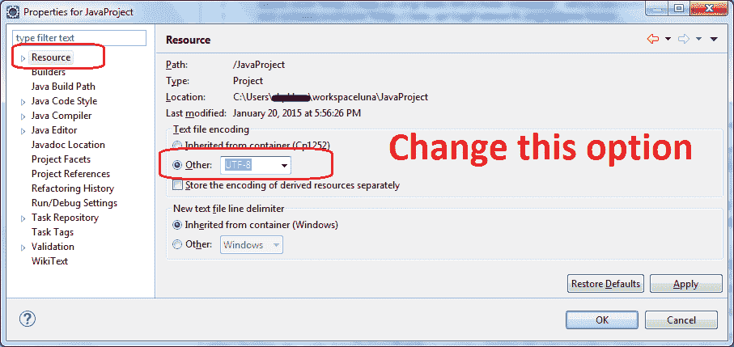
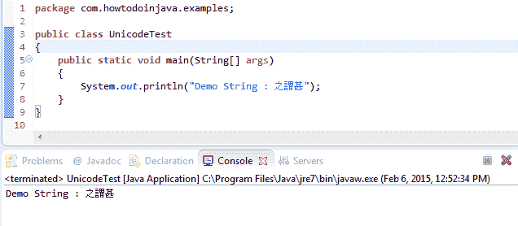
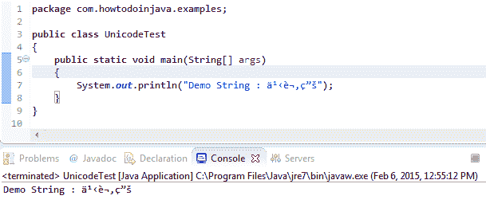

# 如何在 Eclipse 中显示非英文 unicode（例如中文）字符

> 原文： [https://howtodoinjava.com/eclipse/how-to-display-non-english-unicode-e-g-chinese-characters-in-eclipse/](https://howtodoinjava.com/eclipse/how-to-display-non-english-unicode-e-g-chinese-characters-in-eclipse/)

如果您不是讲英语的国家/地区的原住民，并且正在针对您的语言环境测试应用，则可能会难以通过 Eclipse 控制台测试应用。 默认情况下，Eclipse 会将非英语字符转换为问号（`?`）或一些奇怪的字符，因为默认情况下 **eclipse 的控制台编码为 CP1252 或 ASCII**，它们无法显示其他非英语单词。

通过设置以下选项，您可以轻松地**将默认编码更改为 UTF-8**，即 Unicode。



将 Eclipse 默认编码更改为 unicode


现在，当您在 IDE 中使用任何非英语字符甚至在控制台中进行打印时，它都可以完美工作。



成功的 Eclipse Unicode 转换


在这里，如果不添加 Unicode 支持，则上述程序将如下所示。



不正确的 Eclipse Unicode 转换


如果要一直将 Unicode UTF-8 应用到所有项目，则应在`eclipse.ini`文件中进行设置。

```java
-Dfile.encoding=UTF-8
```

如果有不清楚的地方，请给我留言。

**祝您学习愉快！**