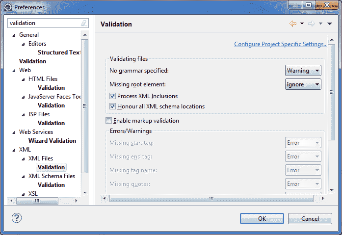

# 在 5 分钟内使 Eclipse 更快

> 原文： [https://howtodoinjava.com/eclipse/how-to-quickly-make-eclipse-faster/](https://howtodoinjava.com/eclipse/how-to-quickly-make-eclipse-faster/)

一旦我们开始进行日食工作，它就会逐渐变慢。 为了提高性能并加快食蚀的速度，可以使用某些方法来查看明显的差异。 这些有效的方法如下：

```java
1) Clean up history and indexes
2) Remove structured text validation
3) Do not use subclipse plugin
4) Configure appropriate start-up arguments
```

让我们一一详细了解它们：

## 1）清理历史和索引

清理历史记录和索引可以减少 RAM 上的负载以及整体 HDD 的使用。 这会对性能产生很大的影响。 要删除索引和历史记录文件夹，请清除以下两个文件夹中的所有文件/文件夹：

**用于清理索引**

{workspace path} \。metadata \ .plugins \ org.eclipse.jdt.core

**用于清除历史记录**

{工作区路径} \。metadata \ .plugins \ org.eclipse.core.resources \ .history

这里{workspace path}是您在其中创建所有项目的 Eclipse 工作区的路径。

Please note that deleting the files from above both folders does not impact any of your project sourcecode in any way.

## 2）删除结构化文本验证

这也产生了很大的影响。 这里的验证必定意味着 eclipse 在后台会对源代码文件执行多项操作以检查其有效性。 这些有时有时也不必要并且令人讨厌。 我参与了一些由许多 XML / XSLT 和 WSDL 文件组成的项目，并且其中一些文件总是显示一些危险信号。 但是他们实际上在大多数情况下在运行时都产生了问题，即使这实际上也是正确的处理方式。

您可以关闭这些验证（对于您认为不必要的所有类型），并享受日食。

要关闭这些文本验证，请打开 Windows >首选项，然后在搜索栏中键入“验证”。 它将列出所有文件类型并对其进行验证。 禁用任何您认为不必要的东西。 然后单击“确定”。



## 3）不要使用 subclipse 插件

该技术确实有效，但难以遵循。 它说您应该只在 eclipse 中使用代码来编写/修改和执行。 与 SVN / perforce 或任何代码存储库相关的所有其他事情都应在 eclipse 之外完成。 这可以来自命令行工具或任何可视客户端。

Subversion 插件占用了过多的系统资源，严重影响了 Eclipse 的性能。

即使您确实想使用它，也可以通过子剪辑仅检出部分代码，并将其余代码导入为外部项目。 它也将为您提供帮助。

## 4）配置适当的启动参数

在您的 eclipse.ini 文件（位于 Eclipse 安装文件夹中）中，根据需要更改默认的-Xms40m -Xmx256m 参数。 此选项定义传递给 Java 虚拟内存以管理 Eclipse 应用程序的内存分配容限的最小和最大内存使用范围。 您不应将它们设置为最大可用，因为您需要并行运行其他软件。

You should try different combinations of -Xms and -Xmx options, and then decide which one works for you best and make eclipse fastest.

示例配置如下所示：

```java
-startup
plugins/org.eclipse.equinox.launcher_1.3.0.v20120522-1813.jar
--launcher.library
plugins/org.eclipse.equinox.launcher.win32.win32.x86_1.1.200.v20120522-1813
-product
org.eclipse.epp.package.jee.product
--launcher.defaultAction
openFile
--launcher.XXMaxPermSize
256M
-showsplash
org.eclipse.platform
--launcher.XXMaxPermSize
256m
--launcher.defaultAction
openFile
-vmargs
-Dosgi.requiredJavaVersion=1.5
-Dhelp.lucene.tokenizer=standard
-Xms256m
-Xmx1024m

```

## 温馨提示：在 eclipse.ini 中使用-Xverify：none，-Xquickstart 和-server OR -client

##### -Xquickstart

您可以使用-Xquickstart 进行初始编译，而优化级别要比默认模式低。 以后，根据采样结果，您可以在默认模式下重新编译为初始编译的级别。 对于早期中等速度比长期吞吐量更重要的应用程序，请使用-Xquickstart。 在某些调试方案，测试工具和短期运行的工具中，您可以将启动时间缩短 15％至 20％。

##### -Xverify：无

如果要在类加载期间跳过类验证阶段，可以使用-Xverify：none。 使用-Xverify：none 将禁用 Java 类验证，这可以将启动时间缩短 10-15％。 但是，指定此选项时，不会检测到损坏或无效的类数据。 如果加载了损坏的类数据，则 Java 虚拟机（JVM）可能会以意外的方式运行，或者 JVM 可能会失败。 但这只有在您自己修改字节码时才会发生。

##### 服务器| -客户

基于 Sun 的 Java 开发工具包（JDK）1.4.2 版中的 Java HotSpot 技术引入了一种自适应 JVM，其中包含用于随着时间的推移优化字节代码执行的算法。 JVM 以两种模式运行-server 和-client。 如果使用默认的-client 模式，将有更快的启动时间和较小的内存占用，但扩展性能较低。 如果允许 HotSpot JVM 通过连续执行字节代码来预热足够的时间，则可以使用-server 模式来提高性能。 在大多数情况下，请使用-server 模式，该模式可在更长的时间内产生更有效的运行时执行。 您可以监视进程大小和服务器启动时间，以检查-client 和-server 之间的差异。

现在就这样。 如果您知道除上述技术以外的任何其他技术，请与我们分享。

**祝您学习愉快！**