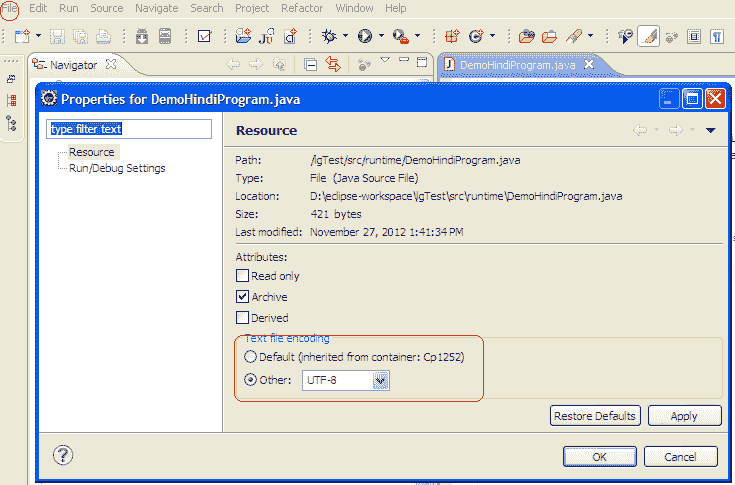
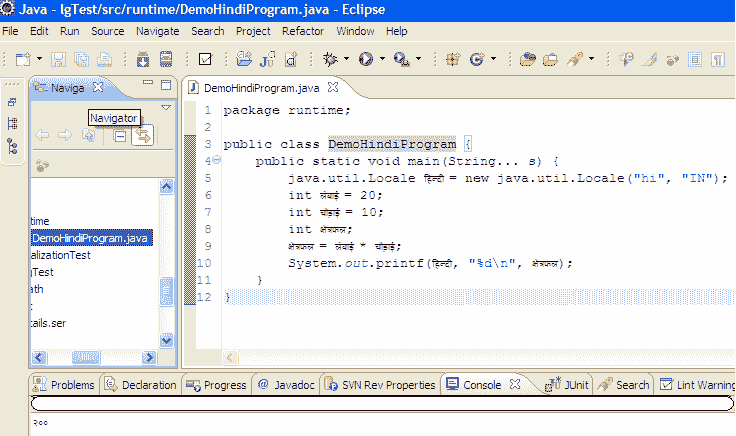

# 如何在印地语中编译和运行 Java 程序

> 原文： [https://howtodoinjava.com/eclipse/how-to-compile-and-run-java-program-written-in-another-language/](https://howtodoinjava.com/eclipse/how-to-compile-and-run-java-program-written-in-another-language/)

我们都知道如何编写 [Java](https://howtodoinjava.com/java/basics/what-is-java-programming-language/) 程序。 我们也使用英语来做到这一点。 今天，我尝试使用 eclipse 用印地语编写 **Java 程序，然后执行它。**

## 印地语中的 Java 程序

让我们看看如何做到这一点。 以下是可以使用任何语言翻译器轻松编写的代码示例。

```java
package runtime;

public class DemoHindiProgram {
	public static void main(String... s) {
		java.util.Locale हिन्दी = new java.util.Locale("hi", "IN");
		int लंबाई = 20;
		int चौड़ाई = 10;
		int क्षेत्रफल;
		क्षेत्रफल = लंबाई * चौड़ाई;
		System.out.printf(हिन्दी, "%dn", क्षेत्रफल);
	}
}

```

## 2.问题

实际问题始于在 eclipse 插件中复制以上代码时。 一旦您在 eclipse 中复制了以上代码，它就会开始报错各种编译问题。

这些问题基本上是由于 Eclipse 中的默认字符编码为“**CP1252**”。 我们需要改变这一点。

## 3.解决方案 – 更改 Eclipse 默认编码

可以从以下位置更改此默认编码：“File -> Properties”。 将其更改为 **UTF-8**。



现在创建一个名为“`DemoHindiProgram.java`”的类。

该文件不会有编译问题，如果您通过“**右键单击 -> 以 Java 程序运行**”来执行上述程序，您将能够在控制台输出中看到输出为“200” 。

有趣的事实是，控制台输出也使用印地语字母。



学习愉快！