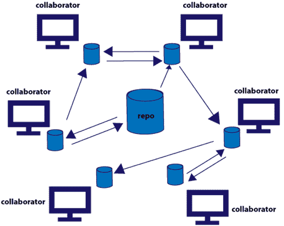

# 分布式版本控制系统如何工作？

> 原文： [https://howtodoinjava.com/vcs/how-distributed-version-control-system-works/](https://howtodoinjava.com/vcs/how-distributed-version-control-system-works/)

在上一篇文章中，我们对[集中式版本控制系统](//howtodoinjava.com/2015/07/16/how-version-control-system-vcs-works/)进行了介绍。 在这篇文章中，我将向您介绍“**分布式版本控制系统**”。

与集中式 VCS 不同，在集中式 VCS 中，所有繁重的工作都在服务器端完成，并作为所有操作的单点操作，而客户端仅拥有代码库的工作副本。 在分布式 VCS 中，每个客户端（称为**协作者**）都有自己的本地仓库，大部分将在其本地仓库上工作。

## 分布式版本控制系统如何工作？

颠倒中央 VCS 的整个方法，**每个协作者将在其本地计算机上拥有完整的仓库，即完整的修订历史记录，所有分支，标签，提交信息都存在于本地计算机**上。 我们没有中央服务器的概念，但是我们可以将任何仓库配置为中央仓库，以将其视为真相来源并与 [**Jenkins**](https://jenkins-ci.org/)，[**Chef**](https://www.chef.io/) 之类的构建和部署工具集成。

下面是不同协作者如何与分布式版本控制系统一起工作的框图。

分布式 VCS

从上图可以看出，与传统的 VCS 不同，在分布式 VCS 中，我们的协作者在分散式系统中与其他协作者一起工作。

在分布式 VCS 中，客户不仅仅签出文件的最新快照，还需要查看文件的最新快照。 而是完全镜像仓库。 因此，如果有任何服务器故障，并且这些系统通过它进行协作，则可以将任何客户端存​​储库复制回服务器以恢复该服务器。 每个克隆实际上都是所有数据的完整备份。

另请注意，分布式 VCS 中使用的术语不同于集中式 VCS。 我们在中央 VCS 中使用“检出”和“提交”的地方； 在分布式 VCS 中，我们使用“推”和“拉”。

1.  **推送**：将更改发送到另一个仓库（可能需要许可）
2.  **拉取**：从仓库中获取更改

有很多分布式版本控制系统，例如 [**Git**](https://git-scm.com/) ， [**Mercurial**](https://mercurial.selenic.com/) 等。在即将发布的系列文章中，我将介绍 Git 并将 每当提到“分布式版本控制系统”时，都指的是 Git。

## 分布式版本控制系统的优点

让我们看看这种方法相对于传统/集中版本控制系统的优势。

#### 快速

每个协作者都将代码库签出到其本地仓库中并在本地仓库上工作。 因此，由于不会有网络呼叫任何服务器，因此所有操作将很快进行。

#### 低成本的分支和合并

由于代码库位于本地硬盘上，因此创建分支和合并非常简单容易。 这是强大的功能之一，因为如果使用集中式仓库，则使用分支和合并太复杂了。

#### 本地分支

开发人员可以创建尽可能多的本地分支并在分支上工作，然后将其合并回主分支。 合并完成后，可以安全地删除本地分支。 此处最大的优势是，与集中式 VCS 不同，该分支对其他人将不可见，在集中式 VCS 中，所有分支都驻留在一台服务器上，并且在处理大型项目时会造成很多混乱。

#### 快照而不是差异

这是主要好处之一。 我们可以为执行的每个提交获取完整的代码仓库。 因此，与中央 VCS 一样，我们可以轻松地恢复到任何提交，而无需手动应用来自基本版本的更改。

#### 简单而高效的工具

一旦开发人员对核心概念和功能了如指掌，开发人员将变得更有生产力。 开发人员还可以采用模块化方式提交代码，并与其他开发人员进行协作，而不会影响其他开发人员的工作区。

#### 可扩展

与“集中式 VCS”相比，“分布式 VCS”具有高度可扩展性，尤其是在开源项目中，该项目中数百万开发人员做出了贡献，而传统的版本控制系统无法完成这项任务。

#### 开源

Git 是开源的，免费的。 此外，开发人员可以在各种平台（如 Github）上从事开源项目。

## 分布式版本控制系统的缺点

现在，让我们看看分布式版本控制系统的一些缺点。

#### 陡峭的学习曲线

学习 Git 将经历一些陡峭的学习过程，并且对于来自其他传统 VCS 工具的开发人员而言，通常会感到困惑和沮丧。 但是，一旦理解了核心概念，就可以与之合作。

#### 支持工具和 IDE

尽管有很多工具和插件可以与 IDE 集成，但与 SVN 或 perforce 相比，它们并不多。 虽然 git bash 是一种流行的工具，如果它来自 unix 背景，可以利用。

在下一篇文章中，让我们进一步了解 Git 基础知识。

**关于作者：**

以上文章由该博客的其中一位读者 Pradeep Kumar（[**@pradeepkumarl**](https://twitter.com/pradeepkumarl)）提供。 他是一位拥有 10 多年经验的软件开发人员，并且曾使用过各种版本控制工具，例如 SVN，Perforce，ClearCase 和 Git。 他对技术充满热情，并热爱教技术。 您可以在 [**Git – 新手到专家**](http://prashdeep.usefedora.com)上查看他的在线课程之一。

**祝您学习愉快！**