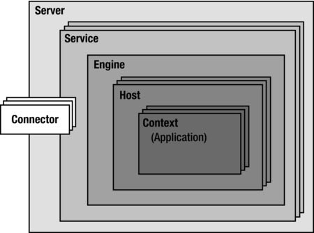

# Tomcat – 架构和`server.xml`配置

> 原文： [https://howtodoinjava.com/tomcat/tomcats-architecture-and-server-xml-configuration-tutorial/](https://howtodoinjava.com/tomcat/tomcats-architecture-and-server-xml-configuration-tutorial/)

我们已经学习了，[**当您在服务器上部署 Web 应用并通过浏览器进行访问时，Web 服务器通常是如何工作的**](//howtodoinjava.com/for-fun-only/a-birds-eye-view-on-how-web-servers-work/ "A birds-eye view on “how web servers work?”")。 现在，让我们学习一下服务器内部可能无法在日常工作中使用的东西，但是当您初次配置应用时，它们肯定会为您提供帮助。 我长期以来一直在使用 **tomcat 服务器**，因此我将其用作教程。 将来，只要时间允许，我将尝试在其他服务器上分享我的经验。

[**Apache Tomcat**](https://tomcat.apache.org/ "tomcat") 是由 Apache 软件基金会（ASF）开发的开源 Web 服务器和 Servlet 容器。 Tomcat 实现了几种 Java EE 规范，包括 Java Servlet，JavaServer Pages（JSP），Java EL 和 WebSocket，并提供了运行 Java 代码的“纯 Java” HTTP Web 服务器环境（[Wiki](https://en.wikipedia.org/wiki/Apache_Tomcat "wiki tomcat")）。

## Tomcat 的架构

**Tomcat 的架构**由一系列功能组件组成，可以根据明确定义的规则进行组合。



Tomcat 架构


每个服务器安装的结构（通过这些功能组件）在文件`server.xml`中定义，该文件位于 **Tomcat 的安装文件夹**的`/conf`子目录中。 让我们详细讨论这些组件。

## `server.xml`组件

默认情况下，`server.xml`文件随附此配置，我们将详细研究其元素。

```java
<?xml version='1.0' encoding='utf-8'?>
<Server port="8005" shutdown="SHUTDOWN">
   <Listener className="org.apache.catalina.core.AprLifecycleListener" SSLEngine="on" />
   <Listener className="org.apache.catalina.core.JasperListener" />
   <Listener className="org.apache.catalina.core.JreMemoryLeakPreventionListener" />
   <Listener className="org.apache.catalina.mbeans.GlobalResourcesLifecycleListener" />
   <Listener className="org.apache.catalina.core.ThreadLocalLeakPreventionListener" />
   <GlobalNamingResources>
     <Resource name="UserDatabase" auth="Container"
               type="org.apache.catalina.UserDatabase"
               description="User database that can be updated and saved"
               factory="org.apache.catalina.users.MemoryUserDatabaseFactory"
               pathname="conf/tomcat-users.xml" />
   </GlobalNamingResources>
   <Service name="Catalina">
     <Connector port="8080" protocol="HTTP/1.1"
                connectionTimeout="20000"
                redirectPort="8443" />
     <Connector port="8009" protocol="AJP/1.3" redirectPort="8443" />
     <Engine name="Catalina" defaultHost="localhost">
       <Realm className="org.apache.catalina.realm.LockOutRealm">
         <Realm className="org.apache.catalina.realm.UserDatabaseRealm"
                resourceName="UserDatabase"/>
       </Realm>
       <Host name="localhost"  appBase="webapps"
             unpackWARs="true" autoDeploy="true">
         <Valve className="org.apache.catalina.valves.AccessLogValve" directory="logs"
                prefix="localhost_access_log." suffix=".txt"
                pattern="%h %l %u %t &quot;%r&quot; %s %b" />
       </Host>
     </Engine>
   </Service>
</Server>

```

让我们从内到外讨论 **tomcat 配置文件**的功能组件，以更好地关联事物。

#### 上下文

上下文是一组称为容器的 Tomcat 组件的最里面的元素，它**代表单个 Web 应用**。 Tomcat 在加载应用时自动实例化并配置标准上下文。 作为配置的一部分，Tomcat 还处理应用文件夹的`\WEB-INF\web.xml`文件中定义的属性，并使这些属性可用于应用。

#### 连接器（第 16-19 行）

**连接器处理与客户端的通信。** Tomcat 提供了多个连接器，例如 HTTP 连接器用于大多数 HTTP 通信，AJP 连接器实现将 Tomcat 连接到另一个 Web 服务器（例如 Apache HTTPD 服务器）时使用的 AJP 协议。

Tomcat 的默认配置包括一个用于处理 HTTP 通信的连接器。 默认情况下，此连接器等待通过端口 **8080** 发出的请求。 这就是我们示例的 URL 始终以`http://localhost:8080/`开头的原因。 请注意，对所有应用的请求都通过此连接器的单个实例。 每个新请求都会导致实例化一个新线程，该新线程在请求​​期间将保持活动状态。 互联网上有关 Tomcat 的文章通常将此连接器称为“**`Coyote`**”。

`connectionTimeout`属性设置为 20,000 表示会话在闲置 5 小时，33 分钟和 20 秒后终止，而`redirectPort="8443"`表示需要安全套接字层（SSL）传输的传入请求将重定向到端口 8443。

AJP 连接器使 Tomcat 只处理动态网页，而让纯 HTML 服务器（例如 Apache Web 服务器）处理对静态页面的请求。 这样可以最大程度地处理请求。 您可能可以注释掉此连接器，因为 tomcat 本身今天已经非常快，或者只是如果您不打算将 Web 服务器与 Tomcat 一起使用，则可以将其注释掉。

#### 主机（第 25-30 行）

**主机是网络名称的关联，例如`www.yourdomain.com`，访问 Tomcat 服务器。** 主机可以包含任意数量的上下文（即应用）。 您可以在同一服务器上定义多个主机。 例如，如果您已注册域`yourdomain.com`，则可以定义主机名，例如`w1.yourdomain.com`和`w2.yourdomain.com`。 请记住，只有当域名服务器将其名称映射到计算机的 IP 地址时，才可以从互联网访问它。

Tomcat 的默认配置包括名为 **localhost** 的主机。 可以通过在文件`C:\Windows\System32\drivers\etc\hosts`中写入一个项目来完成 **localhost** 与您的计算机之间的关联。

主机属性“`appBase`”定义了 Tomcat 安装文件夹中的应用目录。 然后，每个应用通过该目录中的路径进行标识。 唯一的例外是根路径，该路径已映射到空字符串。 本地主机的应用基本目录是`webapps`。 这意味着目录“`C:\Program Files\Apache Software Foundation\Tomcat 6.0\webapps\ROOT\`”中的应用由空字符串标识。 因此，其 URL 为“`http://localhost:8080/`”。 对于驻留在根以外的目录中的其他应用，如“`C:\Program Files\Apache Software Foundation\Tomcat 6.0\webapps\myapp\`”，URL 类似于“`http://localhost:8080/myapp/`”。

属性`unpackWARs="true"`表示，如果将 WAR 文件拖放到`appBase`目录中，Tomcat 将自动将其扩展到普通文件夹中。 如果将此属性设置为`false`，则应用将直接从 WAR 文件运行。 这显然意味着应用的执行速度较慢，因为 Tomcat 需要在执行时解压缩 WAR 文件。

属性`autoDeploy="true"`表示，如果在 Tomcat 运行时将应用放置在`appBase`目录中，它将被自动部署。

#### 引擎（第 20 行）

**引擎代表特定服务的请求处理管道。** 由于服务可能具有多个连接器，因此引擎从这些连接器接收并处理所有请求，将响应传递回适当的连接器以传输到客户端。

引擎必须包含一个或多个主机，其中之一被指定为默认主机。 Tomcat 的默认配置包括引擎 Catalina，该引擎包含主机 localhost（显然是默认主机，因为它是唯一的主机）。 Catalina 引擎处理通过 HTTP 连接器收到的所有传入请求，并发回相应的响应。 它根据请求头中包含的信息将每个请求转发到正确的主机和上下文。

#### 服务（第 15 行）

**服务是驻留在服务器内部的一个中间组件，并且将一个或多个连接器与一个引擎完全绑定在一起。** Tomcat 的默认配置包括服务 Catalina，该服务将 HTTP 和 AJP 连接器关联到 Catalina 引擎。 因此，连接器和引擎是 Service 元素的子元素。

用户很少自定义 Service 元素，因为默认实现很简单并且足够。

#### 服务器（第 2 行）

**服务器是最重要的组件，代表 Tomcat 的一个实例。** 它可以包含一个或多个服务，每个服务都有自己的引擎和连接器。

现在，让我们讨论以上`server.xml`中使用的其他一些概念。

#### 监听器（第 3-7 行）

监听器是一个 Java 对象，通过实现`org.apache.catalina.LifecycleListener`接口，它可以响应特定的事件。

*   **`AprLifecycleListener`**：启用 Apache 可移植运行时（APR）库。 该库为 tomcat 提供了操作系统级别的支持。
*   **`JasperListener`**：启用 Jasper，它是 JSP 引擎。 该监听器使重新编译已更新的 JSP 文档成为可能。
*   **`JreMemoryLeakPreventionListener`**：处理可能导致内存泄漏的各种已知情况。
*   **`GlobalResourcesLifecycleListener`**：负责实例化与全局 Java 命名和目录接口（JNDI）相关联的托管 Bean。
*   **`ThreadLocalLeakPreventionListener`**：还处理可能导致内存泄漏的各种已知情况。

#### 全局命名资源

`GlobalNamingResources`元素只能在服务器组件内部定义。 **它定义了整个服务器都可以访问的 JNDI 资源。** 默认`server.xml`中定义的唯一资源是通过文件`conf/tomcat-users.xml`定义的基于用户和密码存储的数据库。

#### 领域（第 21-24 行）

领域组件可以出现在任何容器组件（引擎，主机和上下门）内。 **它代表用户，密码和用户角色的数据库。 其目的是支持基于容器的认证。**

除了`UserDatabaseRealm`之外，还提供以下领域类：`JDBCRealm`（用于通过其 JDBC 驱动程序连接到关系数据库），`DataSourceRealm`（用于连接到通过 JNDI 命名的 JDBC 数据源），`JNDIRealm`（用于连接 到轻型目录访问协议目录）和`MemoryRealm`（将 XML 文件加载到内存中）。

#### 阀门（行 27-29）

阀门是类似于拦截器的元素，当插入到容器（上下文，主机或引擎）中时，**会在所有传入的 HTTP 请求到达应用**之前拦截它们。 这使您能够预处理针对特定应用的请求。 虚拟主机中运行的应用或引擎中运行的所有应用。

阀门可以有多种用途，例如：

通过`RemoteAddrValve`阀，您可以根据源 IP 地址有选择地允许或阻止请求。 它支持两个属性 – `allow`和`block`。

```java
<Valve className="org.apache.catalina.valves.RemoteAddrValve" block="192\.168.*"/>
```

`RemoteHostValve`阀的操作类似于远程地址过滤器，但在客户端主机名而不是客户端 IP 地址上。

```java
<Valve className="org.apache.catalina.valves.RemoteHostValve" deny=".*badweb\.com"/>
```

`RequestDumperValve`记录传入请求的详细信息，因此对于调试目的很有用。

```java
<Valve className="org.apache.catalina.valves.RequestDumperValve"/>
```

当`single sign on valve`包含在主机容器中时，其作用是仅对该主机的所有应用进行一次认证。 如果没有此阀，则用户必须在使用每个单独的应用之前输入其 ID 和密码。

```java
<Valve className="org.apache.catalina.valves.SingleSignOn"/>
```

仅限于`server.xml`内部元素的介绍。 将来我将介绍与 tomcat 服务器有关的更多任务/概念。

**祝您学习愉快！**

**参考**： [http://tomcat.apache.org/tomcat-7.0-doc/architecture/overview.html](https://tomcat.apache.org/tomcat-7.0-doc/architecture/overview.html "overview")