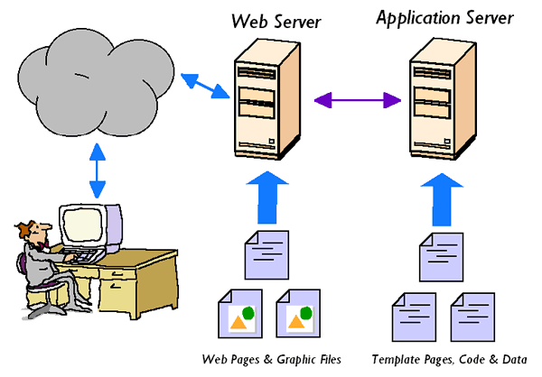
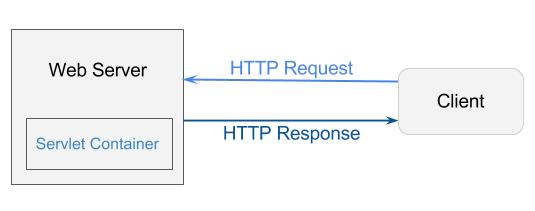

# Web 服务器如何工作？

> 原文： [https://howtodoinjava.com/tomcat/a-birds-eye-view-on-how-web-servers-work/](https://howtodoinjava.com/tomcat/a-birds-eye-view-on-how-web-servers-work/)

许多时候，我们想知道 **Web 容器/ Web 服务器（例如 tomcat 或 jboss）如何工作？** 他们如何处理来自世界各地的传入 HTTP 请求？ 幕后发生的原因是什么？ Java Servlet API（例如 ServletContext，ServletRequest，ServletResponse 和 Session 之类的类）如何适应图片？ 这些是非常重要的问题/概念，如果您是 Web 应用开发人员或渴望成为，则必须知道。 在这篇文章中，我将尝试找出上述问题的答案，即使不是全部。 从这里保持集中。

```java
Table of Contents:

What are web server, application server and web container?
What are Servlets? How they help?
What is ServletContext? Who creates it?
Where ServletRequest and ServletResponse fits into life cycle?
How Session is managed? Know the cookie?
How thread safety should be ensured?
```

## 什么是 Web 服务器，应用服务器和 Web 容器？

我将首先讨论 **Web 服务器**和应用服务器。 我说一句

“Historically they were different, but these two previously distinct categories slowly merged, and now should be seen as one entity in most of the cases and uses.”

在 [**Mosaic**](https://en.wikipedia.org/wiki/Mosaic_%28web_browser%29 "Mosaic") 浏览器（通常被称为第一个图形化 Web 浏览器）和超链接内容的早期，出现了一种新概念“ Web 服务器”，用于服务静态网页内容 和 [**HTTP**](https://en.wikipedia.org/wiki/Hypertext_Transfer_Protocol "http") 协议上的图像。 很简单。 如今，大多数内容都是静态的，HTTP 1.0 协议只是一种随身携带文件的方式。 但是很快，Web 服务器就发展为具有 [**CGI**](http://www.invir.com/int-prog-cgi.html "cgi") 功能。 这意味着在每个 Web 请求上有效启动一个流程以生成动态内容。 到那时，HTTP 协议也已经成熟，Web 服务器变得更加复杂，并具有诸如缓存，安全性和会话管理之类的附加功能。 随着技术的进一步成熟，我们从 Kiva 和 [**NetDynamics**](https://en.wikipedia.org/wiki/NetDynamics_Application_Server) 中获得了基于公司的基于 Java 的服务器端技术，最终它们全部合并为 JSP（java 服务器页面）， 在当今大多数应用开发中使用。



这是关于网络服务器的。 现在，我们来讨论**应用服务器**。

在并行类别中，应用服务器已经发展并存在了很长时间。 一些公司为 Unix 提供了诸如 [**Tuxedo**](https://en.wikipedia.org/wiki/Tuxedo_%28software%29 "Tuxedo") （面向事务的中间件）， **TopEnd** ， **Encina** 等产品，这些产品从大型机应用管理中衍生而来 和监视环境，例如 IMS 和 CICS。 这些产品大多数都指定了“封闭式”产品特定的通信协议，以将“胖”客户端互连到服务器。 在 90 年代，这些传统的应用服务器产品首先通过网关开始嵌入基本的 HTTP 通信功能。 很快，这两类之间的界限开始模糊。

到那时，Web 服务器在处理更高的负载，更多的并发和更好的功能方面变得越来越成熟。 应用服务器开始提供越来越多的基于 HTTP 的通信功能。 所有这些都导致 Web 服务器和应用服务器之间的界限很窄。

在这一点上，“应用服务器”和“网络服务器”之间的界线是模糊的。 但是，作为重点，人们继续使用不同的术语。

When someone says “web server” you often think HTTP-centric, web UI oriented applications. When someone says “Application server” you may think “heavier loads, enterprise features, transactions and queuing, multi-channel communication (HTTP + more)”. But mostly it is the same product that serves both sets of requirements now-a-days.

这就是有关 Web 服务器和应用服务器的一切。 现在进入第三学期，即网络容器。



[**Web 容器**](https://en.wikipedia.org/wiki/Web_container) ，尤其是 java 中的，应引用 servlet 容器。 Servlet 容器是与 Java Servlet 交互的 Web 服务器的组件。 Web 容器负责管理 Servlet 的生命周期，将 URL 映射到特定的 Servlet，并确保 URL 请求者具有正确的访问权限以及更多此类服务。 基本上，综合以上所有事实， **Servlet 容器是 Servlet 运行**并维持其生命周期的运行时环境。

## 什么是 Servlet？ 他们如何提供帮助？

在 Java 中， **servlet 使您可以编写服务器端组件，以根据请求帮助生成动态内容**。 实际上，Servlet 是在 javax.servlet 包中定义的接口。 它声明了 Servlet 生命周期的三种基本方法 -init（），service（）和 destroy（）。 它们由每个 servlet（在 SDK 中定义或由用户定义）实现，并在服务器的生命周期中由服务器在特定时间调用。

Servlet 类由其类加载器通过**延迟加载或急切加载**动态地加载到容器中。 **每个请求都在其自己的线程**中，并且 servlet 对象可以同时服务多个线程。 当不再使用它时，它将被 JVM 垃圾回收。

**延迟加载 servlet**

 

**渴望加载 **Servlet****

 

## 什么是 ServletContext？ 谁创造的？

当 Servlet 容器启动时，它将部署并加载所有 Web 应用。 加载 Web 应用后，Servlet 容器将为每个应用创建一次 **ServletContext，并将其保留在服务器的内存中。 该 Web 应用的 web.xml 将被解析，并且在 web.xml 中找到的每个 Servlet，Filter 和 Listener 都将被创建一次并保存在服务器的内存中。 当 Servlet 容器关闭时，它将卸载所有 Web 应用，并且 ServletContext 以及所有 Servlet，Filter 和 Listener 实例都将被丢弃。**

根据 Java 文档， **ServletContext 定义了 Servlet 用于与其 Servlet 容器**通信的一组方法，例如，获取文件的 MIME 类型，调度请求或写入日志文件。 对于 Web 应用**在其部署描述符**中标记为“已分发”的情况，每个虚拟机都有一个上下文实例。 在这种情况下，上下文**不能用作共享全局信息**的位置（因为该信息不是真正的全局信息）。 请改用外部资源，例如数据库。

## ServletRequest 和 ServletResponse 适合生命周期的地方？

Servlet 容器连接到 Web 服务器，该服务器在特定端口号（通常为 80）上监听 HTTP 请求。当客户端（具有 Web 浏览器的用户）发送 HTTP 请求时， **Servlet 容器将创建新的 HttpServletRequest。** **和 HttpServletResponse** 对象将其传递给 URL 样式与请求 URL 匹配的已创建 Filter 和 Servlet 实例的方法，所有这些都在同一线程中。

请求对象提供对 HTTP 请求的所有信息的访问，例如请求标头和请求正文。 响应对象提供了以所需方式控制和发送 HTTP 响应的功能，例如设置标头和正文（通常带有 JSP 文件中的 HTML 内容）。 提交并完成 HTTP 响应后，请求和响应对象都将被丢弃。

## 如何管理会话？ 知道 cookie 吗？

当客户端首次访问 Web 应用和/或要通过 request.getSession（）首次获取 HttpSession 时，则 Servlet 容器将创建它，并生成一个长而唯一的 ID（您可以 通过 session.getId（）获取并存储在服务器的内存中。 servlet 容器还将在 HTTP 响应中设置 Cookie，其中 **JSESSIONID** 为 cookie 名称，唯一会话 ID 为 cookie 值。

根据 [**HTTP cookie 规范**](http://www.faqs.org/rfcs/rfc2965.html "http cookie") （体面的 Web 浏览器和 Web 服务器必须遵守的合同），要求客户端（Web 浏览器）在后续请求中将该 Cookie 发送回 只要 Cookie 有效即可。 Servlet 容器将确定每个传入的 HTTP 请求标头中是否存在名为 JSESSIONID 的 cookie，并使用其值从服务器的内存中获取关联的 HttpSession。

HttpSession 会一直存在，直到没有被使用为止，您可以在 web.xml 中指定该设置，该设置**默认为 30 分钟**。 因此，如果客户端超过 30 分钟不再访问该 Web 应用，则 Servlet 容器将破坏该会话。 即使指定了 cookie，每个后续请求都将无法再访问同一会话。 servlet 容器将创建一个新的。

**现有会话**


**新会话**


另一方面，客户端上的会话 cookie **具有默认生存期，该生存期只要浏览器实例正在运行**即可。 因此，当客户端关闭浏览器实例（所有选项卡/窗口）时，会话将在客户端被丢弃。 在新的浏览器实例中，与该会话关联的 cookie 将不再发送。 一个新的 request.getSession（）将返回一个全新的 HttpSession 并设置一个具有全新会话 ID 的 cookie。

## 应如何确保线程安全？

您现在应该已经了解到，Servlet 和过滤器在所有请求之间共享。 这是 Java 的优点，因为它是 [**多线程**](//howtodoinjava.com/category/java/multi-threading/ "multi-threading") ，并且不同的线程（即 HTTP 请求）可以使用同一实例。 否则，在每个请求上重新创建它会太昂贵。


但是，您还应该意识到，永远不要将任何请求或会话范围的数据分配为 Servlet 或过滤器的实例变量。 它将在其他会话中的所有其他请求之间共享。 那是线程不安全的！ 下面的示例说明：

```java
public class MyServlet extends HttpServlet
{
	private Object thisIsNOTThreadSafe; //Don't to this

	protected void doGet(HttpServletRequest request, HttpServletResponse response) throws ServletException, IOException
	{
		Object thisIsThreadSafe;

		thisIsNOTThreadSafe = request.getParameter("foo"); // BAD!! Shared among all requests!
		thisIsThreadSafe = request.getParameter("foo"); // OK, this is thread safe.
	}
}

```

不要这样做。 这将导致软件错误。

以上就是这个主题。 请继续关注更多此类帖子。 最好订阅电子邮件新闻信，以在收件箱中获得通知。

**祝您学习愉快！**

**推荐链接：**

[http://www.invir.com/int-prog-cgi.html](http://www.invir.com/int-prog-cgi.html)