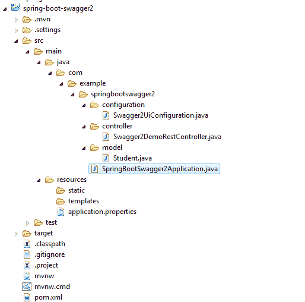
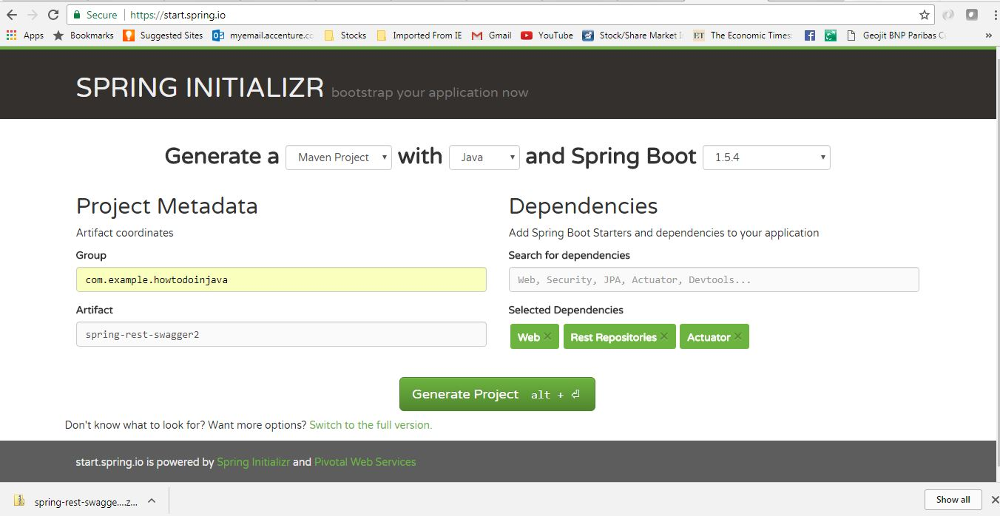
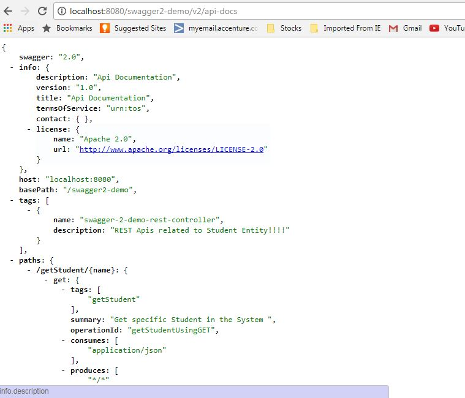
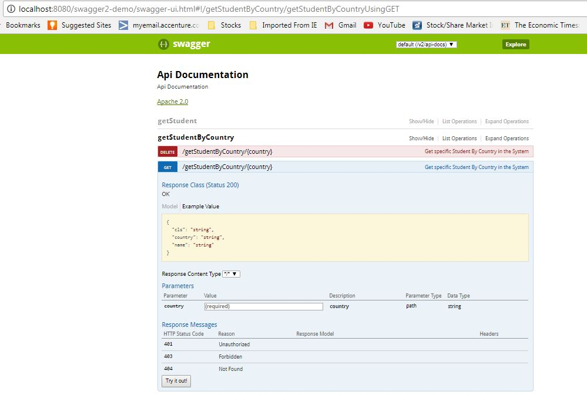

# Swagger – Spring REST 示例

> 原文： [https://howtodoinjava.com/swagger2/swagger-spring-mvc-rest-example/](https://howtodoinjava.com/swagger2/swagger-spring-mvc-rest-example/)

如今， [REST](http://restfulapi.net) 和[微服务](//howtodoinjava.com/microservices/microservices-definition-principles-benefits/)势头强劲。 同时，实际的 REST 规范并未建议任何标准方法来记录我们将要公开的 REST API（例如 WSDL for SOAP）。 结果，每个人都以自己的方式记录自己的 API，从而导致通用结构中的空白，所有这些都可以轻松地遵循，理解和使用。 我们需要一个通用的模式和工具。

[Swagger](https://swagger.io/) （得到了 Google，IBM，Microsoft 等公司的支持）完成了相同工作，以填补常见文档样式的空白。 在本教程中，我们将学习**使用 Swagger 来使用 **swagger 2 注释**来生成 REST API 文档**。

```java
Table of Contents

What is Swagger
Project Structure and Technology Stack
Create REST APIs
Swagger2 Configuration
Swagger2 Annotations
Demo
```

## 昂首阔步

Swagger（现为“ Open API Initiative”）是一种规范和框架，用于使用所有人都可以理解的通用语言来描述 REST API。 还有其他一些流行的框架，例如 RAML，Summation 等。但是，考虑到它的功能和在开发者社区中的接受程度，Swagger 在这一点上最受欢迎。

它提供了人类可读和机器可读的文档格式。 它同时提供 JSON 和 UI 支持。 JSON 可以用作机器可读格式，`Swagger-UI`用于可视化显示，人类只需浏览 api 文档即可轻松理解。

## 项目结构与技术栈

项目的文件夹结构为：



Swagger2 Project Structure


在本演示中，我们将使用以下技术。

1.  Eclipse 作为 IDE
2.  [Maven](//howtodoinjava.com/maven/) 作为构建工具
3.  Spring Boot 作为应用框架
4.  Spring Rest 作为 REST API 框架
5.  Swagger2 作为 REST 文档框架
6.  [Java 1.8](//howtodoinjava.com/java-8-tutorial/)

## 创建 REST API

我们将首先创建一些 REST API，这些 API 将用于展示 Swagger 文档功能。 我们将使用 Spring 引导样式公开剩余的 API，以缩短开发时间。

1.  Create a Spring boot project from [Spring Boot initializer](https://start.spring.io/) portal with `Web`, `Rest Repositories`, `Actuator` dependencies. Give other maven GAV coordinates and download the project. This screen will look like:

    [](//howtodoinjava.com/wp-content/uploads/2017/07/Project_Generation.jpg)

    Spring Boot REST Project Generation

    

    将项目解压缩并将其作为现有的 maven 项目导入 Eclipse。 在此步骤中，将从 maven 仓库下载所有必需的依赖项。 在此步骤中执行全新的`mvn clean install`，以便正确下载所有与Spring启动相关的工件。

2.  打开`application.properties`并添加以下属性。 这将在`/swagger2-demo`上下文路径中启动应用。

    ```java
    server.contextPath=/swagger2-demo
    ```

3.  Add one REST controller `Swagger2DemoRestController` which will provide basic REST based functionalities on `Student` entity.

    **Swagger2DemoRestController.java**

    ```java
    package com.example.springbootswagger2.controller;

    import java.util.ArrayList;
    import java.util.List;
    import java.util.stream.Collectors;
    import org.springframework.web.bind.annotation.PathVariable;
    import org.springframework.web.bind.annotation.RequestMapping;
    import org.springframework.web.bind.annotation.RestController;
    import com.example.springbootswagger2.model.Student;

    @RestController
    public class Swagger2DemoRestController {

    	List<Student> students = new ArrayList<Student>();
    	{
    		students.add(new Student("Sajal", "IV", "India"));
    		students.add(new Student("Lokesh", "V", "India"));
    		students.add(new Student("Kajal", "III", "USA"));
    		students.add(new Student("Sukesh", "VI", "USA"));
    	}

    	@RequestMapping(value = "/getStudents")
    	public List<Student> getStudents() {
    		return students;
    	}

    	@RequestMapping(value = "/getStudent/{name}")
    	public Student getStudent(@PathVariable(value = "name") String name) {
    		return students.stream().filter(x -> x.getName().equalsIgnoreCase(name)).collect(Collectors.toList()).get(0);
    	}

    	@RequestMapping(value = "/getStudentByCountry/{country}")
    	public List<Student> getStudentByCountry(@PathVariable(value = "country") String country) {
    		System.out.println("Searching Student in country : " + country);
    		List<Student> studentsByCountry = students.stream().filter(x -> x.getCountry().equalsIgnoreCase(country))
    				.collect(Collectors.toList());
    		System.out.println(studentsByCountry);
    		return studentsByCountry;
    	}

    	@RequestMapping(value = "/getStudentByClass/{cls}")
    	public List<Student> getStudentByClass(@PathVariable(value = "cls") String cls) {
    		return students.stream().filter(x -> x.getCls().equalsIgnoreCase(cls)).collect(Collectors.toList());
    	}
    }

    ```

    **Student.java**

    ```java

    package com.example.springbootswagger2.model;

    public class Student {

    	private String name;
    	private String cls;
    	private String country;

    	public Student(String name, String cls, String country) {
    		super();
    		this.name = name;
    		this.cls = cls;
    		this.country = country;
    	}

    	public String getName() {
    		return name;
    	}

    	public String getCls() {
    		return cls;
    	}

    	public String getCountry() {
    		return country;
    	}

    	@Override
    	public String toString() {
    		return "Student [name=" + name + ", cls=" + cls + ", country=" + country + "]";
    	}
    }

    ```

4.  作为 Spring 启动应用启动该应用。 测试几个 REST 端点，以检查它们是否工作正常：
    *   http：// localhost：8080 / swagger2-demo / getStudents
    *   http：// localhost：8080 / swagger2-demo / getStudent / sajal
    *   http：// localhost：8080 / swagger2-demo / getStudentByCountry / india
    *   http：// localhost：8080 / swagger2-demo / getStudentByClass / v

## Swagger2 配置

我们的 REST API 已准备就绪。 现在将 swagger 2 支持添加到 project.ff

#### 添加 Swagger2 Maven 依赖项

打开`spring-boot-swagger2`项目的 pom.xml 文件，并在下面添加两个与 swagger 相关的依赖项，即`springfox-swagger2`和`springfox-swagger-ui`。

```java
     <dependency>
			<groupId>io.springfox</groupId>
			<artifactId>springfox-swagger2</artifactId>
			<version>2.6.1</version>
		</dependency>

		<dependency>
			<groupId>io.springfox</groupId>
			<artifactId>springfox-swagger-ui</artifactId>
			<version>2.6.1</version>
		</dependency>

```

Actually `swagger` API has couple of varieties and maintained in different artifacts. Today we will use the `springfox` because this version adapts well with any spring based configurations. We can try other configurations also easily and that should give same functionality – with no/little change in configuration.

#### 添加 Swagger2 配置

在代码库中添加以下配置。 为了帮助您理解配置，我添加了嵌入式注释。

```java
package com.example.springbootswagger2.configuration;

import org.springframework.context.annotation.Bean;
import org.springframework.context.annotation.Configuration;
import org.springframework.web.servlet.config.annotation.ResourceHandlerRegistry;
import org.springframework.web.servlet.config.annotation.WebMvcConfigurerAdapter;
import com.google.common.base.Predicates;
import springfox.documentation.builders.RequestHandlerSelectors;
import springfox.documentation.spi.DocumentationType;
import springfox.documentation.spring.web.plugins.Docket;
import springfox.documentation.swagger2.annotations.EnableSwagger2;

@Configuration
@EnableSwagger2
public class Swagger2UiConfiguration extends WebMvcConfigurerAdapter 
{
	@Bean
	public Docket api() {
		// @formatter:off
		//Register the controllers to swagger
		//Also it is configuring the Swagger Docket
		return new Docket(DocumentationType.SWAGGER_2).select()
				// .apis(RequestHandlerSelectors.any())
				.apis(Predicates.not(RequestHandlerSelectors.basePackage("org.springframework.boot")))
				// .paths(PathSelectors.any())
				// .paths(PathSelectors.ant("/swagger2-demo"))
				.build();
		// @formatter:on
	}

	@Override
	public void addResourceHandlers(ResourceHandlerRegistry registry) 
	{
		//enabling swagger-ui part for visual documentation
		registry.addResourceHandler("swagger-ui.html").addResourceLocations("classpath:/META-INF/resources/");
		registry.addResourceHandler("/webjars/**").addResourceLocations("classpath:/META-INF/resources/webjars/");
	}
}

```

#### 验证 Swagger2 JSON 格式文档

执行 maven 并启动服务器。 打开链接 [http：// localhost：8080 / swagger2-demo / v2 / api-docs](http://localhost:8080/swagger2-demo/v2/api-docs) ，它应该以`JSON`格式提供整个文档。 这并不是那么容易阅读和理解，实际上 Swagger 已经提供了将其用于其他系统中的功能，例如如今流行的 API 管理工具，它提供了 API 网关，API 缓存，API 文档等功能。

[](//howtodoinjava.com/wp-content/uploads/2017/07/JSON_documenatation.jpg)

JSON documentation


#### 验证 Swagger2 UI 文档

打开 [http：// localhost：8080 / swagger2-demo / swagger-ui.html](http://localhost:8080/swagger2-demo/swagger-ui.html) 在浏览器中查看 Swagger UI 文档。


Swagger2 UI 文档（无注释）


## Swagger2 注释

默认生成的 API 文档很好，但是缺少详细的 API 级别信息。 Swagger 提供了一些注释，可以将这些详细信息添加到 API。 例如

1.  `@Api` – 我们可以将此注释添加到控制器，以添加有关控制器的基本信息。

    ```java
    @Api(value = "Swagger2DemoRestController", description = "REST APIs related to Student Entity!!!!")
    @RestController
    public class Swagger2DemoRestController {
    	...
    }
    ```

2.  `@ApiOperation and @ApiResponses` – We can add these annotations to any rest method in the controller to add basic information related to that method. e.g.

    ```java
    @ApiOperation(value = "Get list of Students in the System ", response = Iterable.class, tags = "getStudents")
    @ApiResponses(value = { 
    			@ApiResponse(code = 200, message = "Success|OK"),
    			@ApiResponse(code = 401, message = "not authorized!"), 
    			@ApiResponse(code = 403, message = "forbidden!!!"),
    			@ApiResponse(code = 404, message = "not found!!!") })

    @RequestMapping(value = "/getStudents")
    public List<Student> getStudents() {
        return students;
    }

    ```

    在这里，我们可以将`tags`添加到方法中，以在`swagger-ui`中添加一些分组。

3.  `@ApiModelProperty` – 在 Model 属性中使用此注释可为该 Model 属性的 Swagger 输出添加一些描述。 例如

    ```java
    @ApiModelProperty(notes = "Name of the Student",name="name",required=true,value="test name")
    private String name;
    ```

添加 swagger2 注释后的 Controller 和 Model 类代码。

**Swagger2DemoRestController.java**

```java
package com.example.springbootswagger2.controller;

import java.util.ArrayList;
import java.util.List;
import java.util.stream.Collectors;
import org.springframework.web.bind.annotation.PathVariable;
import org.springframework.web.bind.annotation.RequestMapping;
import org.springframework.web.bind.annotation.RestController;
import com.example.springbootswagger2.model.Student;
import io.swagger.annotations.Api;
import io.swagger.annotations.ApiOperation;
import io.swagger.annotations.ApiResponse;
import io.swagger.annotations.ApiResponses;

@Api(value = "Swagger2DemoRestController", description = "REST Apis related to Student Entity!!!!")
@RestController
public class Swagger2DemoRestController {

	List<Student> students = new ArrayList<Student>();
	{
		students.add(new Student("Sajal", "IV", "India"));
		students.add(new Student("Lokesh", "V", "India"));
		students.add(new Student("Kajal", "III", "USA"));
		students.add(new Student("Sukesh", "VI", "USA"));
	}

	@ApiOperation(value = "Get list of Students in the System ", response = Iterable.class, tags = "getStudents")
	@ApiResponses(value = { 
			@ApiResponse(code = 200, message = "Suceess|OK"),
			@ApiResponse(code = 401, message = "not authorized!"), 
			@ApiResponse(code = 403, message = "forbidden!!!"),
			@ApiResponse(code = 404, message = "not found!!!") })

	@RequestMapping(value = "/getStudents")
	public List<Student> getStudents() {
		return students;
	}

	@ApiOperation(value = "Get specific Student in the System ", response = Student.class, tags = "getStudent")
	@RequestMapping(value = "/getStudent/{name}")
	public Student getStudent(@PathVariable(value = "name") String name) {
		return students.stream().filter(x -> x.getName().equalsIgnoreCase(name)).collect(Collectors.toList()).get(0);
	}

	@ApiOperation(value = "Get specific Student By Country in the System ", response = Student.class, tags = "getStudentByCountry")
	@RequestMapping(value = "/getStudentByCountry/{country}")
	public List<Student> getStudentByCountry(@PathVariable(value = "country") String country) {
		System.out.println("Searching Student in country : " + country);
		List<Student> studentsByCountry = students.stream().filter(x -> x.getCountry().equalsIgnoreCase(country))
				.collect(Collectors.toList());
		System.out.println(studentsByCountry);
		return studentsByCountry;
	}

	// @ApiOperation(value = "Get specific Student By Class in the System ",response = Student.class,tags="getStudentByClass")
	@RequestMapping(value = "/getStudentByClass/{cls}")
	public List<Student> getStudentByClass(@PathVariable(value = "cls") String cls) {
		return students.stream().filter(x -> x.getCls().equalsIgnoreCase(cls)).collect(Collectors.toList());
	}
}

```

**Student.java**

```java
package com.example.springbootswagger2.model;

import io.swagger.annotations.ApiModelProperty;

public class Student 
{
	@ApiModelProperty(notes = "Name of the Student",name="name",required=true,value="test name")
	private String name;

	@ApiModelProperty(notes = "Class of the Student",name="cls",required=true,value="test class")
	private String cls;

	@ApiModelProperty(notes = "Country of the Student",name="country",required=true,value="test country")
	private String country;

	public Student(String name, String cls, String country) {
		super();
		this.name = name;
		this.cls = cls;
		this.country = country;
	}

	public String getName() {
		return name;
	}

	public String getCls() {
		return cls;
	}

	public String getCountry() {
		return country;
	}

	@Override
	public String toString() {
		return "Student [name=" + name + ", cls=" + cls + ", country=" + country + "]";
	}
}

```

## 演示版

现在，在正确注释我们的 REST API 之后，我们来看一下最终输出。 打开 [http：// localhost：8080 / swagger2-demo / swagger-ui.html](http://localhost:8080/swagger2-demo/swagger-ui.html) 在浏览器中查看 Swagger ui 文档。



Final Swagger2 REST API Output


这一切都将通过 Spring 启动应用[swagger2] **创建 REST API 文档。 将我的问题放在评论部分。**

[Download Source code](//howtodoinjava.com/wp-content/uploads/2017/07/spring-boot-swagger2.zip)

学习愉快！