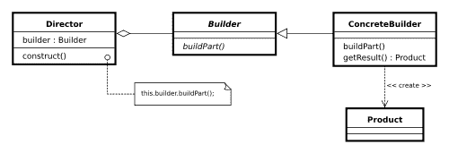

# Java 中的生成器设计模式

> 原文： [https://howtodoinjava.com/design-patterns/creational/builder-pattern-in-java/](https://howtodoinjava.com/design-patterns/creational/builder-pattern-in-java/)

顾名思义， [**构建器模式**](https://en.wikipedia.org/wiki/Builder_pattern "Builder Pattern") 是构建复杂对象的**替代方法。 仅当您要使用相同的对象构建过程构建不同的不可变对象时，才应使用此方法。**

在开始讨论之前，我想弄清楚我将在本文中讨论的构建器模式**与 GangOfFour“设计模式”书中提到的**稍有不同。 这本书说：

The builder pattern is a design pattern that allows for the step-by-step creation of complex objects using the correct sequence of actions. The construction is controlled by a director object that only needs to know the type of object it is to create.

本书给出如下示例：



我真的很难在现实生活中的编程和应用中利用以上示例。 上面的过程与 [**抽象工厂**](//howtodoinjava.com/design-patterns/creational/abstract-factory-pattern-in-java/ "Abstract factory pattern in java") 模式非常相似（并非完全相似），在该模式中，您找到了特定类型对象的工厂（或生成器），然后工厂为您提供了具体的 该对象的实例。 **这个构建器模式与抽象工厂模式之间唯一的不同之处在于，构建器为您提供了对对象创建过程的更多控制，仅此而已。 除此之外，没有重大差异。**

In one sentence, abstract factory pattern is the answer to `"WHAT"` and the builder pattern to `"HOW"`.

对我来说，构建器模式更像 [**流利接口**](https://en.wikipedia.org/wiki/Fluent_interface "Fluent_interface") 。 通常使用**方法级联**（或方法链接）来实现流利的接口。

现在，从这里开始，我将以我认为在实际情况下特别有用的方式来讨论构建器模式。 我也希望说服你们。

```java
Sections in this post:

Definition of Builder Pattern
Where we need Builder Pattern
A sample implementation using Builder Pattern
Existing implementations in JDK
Benefits and Advantages
Costs and Disadvantages
Conclusion

```

## 建造者模式的定义

首先，给构建器模式一个定义：

> 生成器模式的目标是“将复杂对象的构造与其表示分开，以便同一构造过程可以创建不同的表示。”

## 我们需要构建器模式的地方

我们已经知道 [**不可变**](//howtodoinjava.com/java/related-concepts/how-to-make-a-java-class-immutable/ "How to make a java class immutable") 和不可变实例在应用中的好处。 如果对此有任何疑问，请让我想起 Java 中的`String`类。 正如我已经说过的那样，构建器模式可以帮助我们创建具有大量状态属性的不可变类。

让我们讨论一下我们应用中的一个常见问题。 假设在任何用户管理模块中，主要实体都是`User`。 理想情况下，实际上，一旦完全创建了用户对象，您就不想更改其状态。 根本没有道理，对吧？ 现在，假设我们的 User 对象具有以下 5 个属性，即`firstName`，`lastName`，`age`，`phone`和`address`。

在通常的实践中，如果要创建不可变的`User`类，则必须将所有五个信息作为参数传递给构造函数。 它看起来像这样：

```java
public User (String firstName, String lastName, int age, String phone, String address){
	this.firstName = firstName;
	this.lastName = lastName;
	this.age = age;
	this.phone = phone;
	this.address = address;
}

```

很好。 现在，如果只有`firstName`和`lastName`是必不可少的**，剩下的 3 个字段是可选的，该怎么办。 问题！ 我们需要更多的构造函数。**

```java
public User (String firstName, String lastName, int age, String phone){ ...	}
public User (String firstName, String lastName, String phone, String address){ ...	}
public User (String firstName, String lastName, int age){ ...	}
public User (String firstName, String lastName){ ...	}

```

我们将需要更多类似上面的内容。 还能管理吗？ 现在，让我们介绍我们的第六个属性，即薪水。 现在是问题。

*一种创建更多构造函数的方法，另一种方法是放松不变性并引入设置器方法。 您选择这两个选项中的任何一个，就松了点，对吧？*

在这里，构建器模式将帮助您使用其他属性，同时保留 Use 类的不变性。

## 使用构建器模式的示例实现

下面是我们上面讨论的问题的编码解决方案。 这使用附加的类`UserBuilder`，该类可帮助我们构建具有所有必需属性和可选属性组合的所需 User 对象，而不会失去不变性。

```java
public class User 
{
	//All final attributes
	private final String firstName; // required
	private final String lastName; // required
	private final int age; // optional
	private final String phone; // optional
	private final String address; // optional

	private User(UserBuilder builder) {
		this.firstName = builder.firstName;
		this.lastName = builder.lastName;
		this.age = builder.age;
		this.phone = builder.phone;
		this.address = builder.address;
	}

	//All getter, and NO setter to provde immutability
	public String getFirstName() {
		return firstName;
	}
	public String getLastName() {
		return lastName;
	}
	public int getAge() {
		return age;
	}
	public String getPhone() {
		return phone;
	}
	public String getAddress() {
		return address;
	}

	@Override
	public String toString() {
		return "User: "+this.firstName+", "+this.lastName+", "+this.age+", "+this.phone+", "+this.address;
	}

	public static class UserBuilder 
	{
		private final String firstName;
		private final String lastName;
		private int age;
		private String phone;
		private String address;

		public UserBuilder(String firstName, String lastName) {
			this.firstName = firstName;
			this.lastName = lastName;
		}
		public UserBuilder age(int age) {
			this.age = age;
			return this;
		}
		public UserBuilder phone(String phone) {
			this.phone = phone;
			return this;
		}
		public UserBuilder address(String address) {
			this.address = address;
			return this;
		}
		//Return the finally consrcuted User object
		public User build() {
			User user =  new User(this);
			validateUserObject(user);
			return user;
		}
		private void validateUserObject(User user) {
			//Do some basic validations to check 
			//if user object does not break any assumption of system
		}
	}
}

```

下面是方法，我们将在代码中使用`UserBuilder`：

```java
public static void main(String[] args) {
	User user1 = new User.UserBuilder("Lokesh", "Gupta")
	.age(30)
	.phone("1234567")
	.address("Fake address 1234")
	.build();

	System.out.println(user1);

	User user2 = new User.UserBuilder("Jack", "Reacher")
	.age(40)
	.phone("5655")
	//no address
	.build();

	System.out.println(user2);

	User user3 = new User.UserBuilder("Super", "Man")
	//No age
	//No phone
	//no address
	.build();

	System.out.println(user3);
}

Output:

User: Lokesh, Gupta, 30, 1234567, Fake address 1234
User: Jack, Reacher, 40, 5655, null
User: Super, Man, 0, null, null

```

请注意，上面创建的用户对象**没有任何设置方法**，因此一旦建立，便无法更改其状态。 这提供了所需的不变性。

有时，开发人员将属性添加到 User 类时，可能会忘记为构建器添加对新属性的支持。 为了最大程度地减少这种情况，我们应该将构建器封装在它们所构建的类中（如上例所示），以使开发人员更清楚地知道也需要更新一个相关的构建器。

> 有时，我认为应该有一个**驱逐舰模式**（与构建器相对），该模式应该以系统的方式从复杂对象中拆除某些属性。 你怎么看？

## JDK 中的现有实现

[java.lang.Appendable](https://docs.oracle.com/javase/7/docs/api/java/lang/Appendable.html "Appendable") 的所有实现实际上都是在 Java 中使用 Builder 模式的良好示例。 例如：

[java.lang.StringBuilder＃append()](https://docs.oracle.com/javase/7/docs/api/java/lang/StringBuilder.html#append%28java.lang.CharSequence%29 "StringBuilder") [未同步的类]

[java.lang.StringBuffer＃append()](https://docs.oracle.com/javase/1.5.0/docs/api/java/lang/StringBuffer.html#append%28java.lang.CharSequence%29 "StringBuffer") [同步类]

[java.nio.ByteBuffer＃put()](https://docs.oracle.com/javase/6/docs/api/java/nio/ByteBuffer.html#put%28java.nio.ByteBuffer%29 "ByteBuffer")（也在 CharBuffer，ShortBuffer，IntBuffer，LongBuffer，FloatBuffer 和 DoubleBuffer 上）

另一种用法可以在 [javax.swing.GroupLayout.Group＃addComponent()](https://docs.oracle.com/javase/6/docs/api/javax/swing/GroupLayout.Group.html#addComponent%28java.awt.Component%29 "GroupLayout")中找到。

看看这些实现与我们上面讨论的相似。

```java
StringBuilder builder = new StringBuilder("Temp");
String data = builder.append(1)
				.append(true)
				.append("friend")
				.toString();
System.out.println(data);
Output:
Temp1truefriend

```

## 构建者模式的优点和优点

毫无疑问，在构建器模式中，**代码行数增加了**至少增加了一倍，但是在**设计灵活性**和更多**可读代码**方面，努力得到了回报 。 构造函数的**参数被简化**，并在**高可读性方法调用**中提供。

构建器模式还有助于最大程度地减少构造函数中的参数数量，因此**不需要将可选参数**的 null 传递给构造函数。 真的吸引了我

另一个好处是，对象总是以`complete`状态实例化，而不是处于不完整的状态，直到开发人员调用（如果曾经调用）适当的设置器方法来设置其他字段。

最后，我可以在对象构建过程中构建**不可变对象**，而无需太多复杂的逻辑。

## 建造者模式的成本与劣势

尽管 Builder 模式减少了一些代码行，从而消除了使用设置器方法的需要，但仍然**中通过引入 Builder 对象使总行数**翻了一番。 此外，尽管客户代码更具可读性，但客户代码也更为冗长。 虽然对我而言，可读性比代码行更重要。

我能想到的唯一缺点。

仅此而已。 如果您也分享您的想法，我会很高兴。

**祝您学习愉快！**

参考文献

[http://en.wikipedia.org/wiki/Builder_pattern](https://en.wikipedia.org/wiki/Builder_pattern)
[http://www.javaspecialists.eu/archive/Issue163.html](http://www.javaspecialists.eu/archive/Issue163.html)
[http ：//en.wikipedia.org/wiki/Fluent_interface](https://en.wikipedia.org/wiki/Fluent_interface)
[http://martinfowler.com/bliki/FluentInterface.html](http://martinfowler.com/bliki/FluentInterface.html)