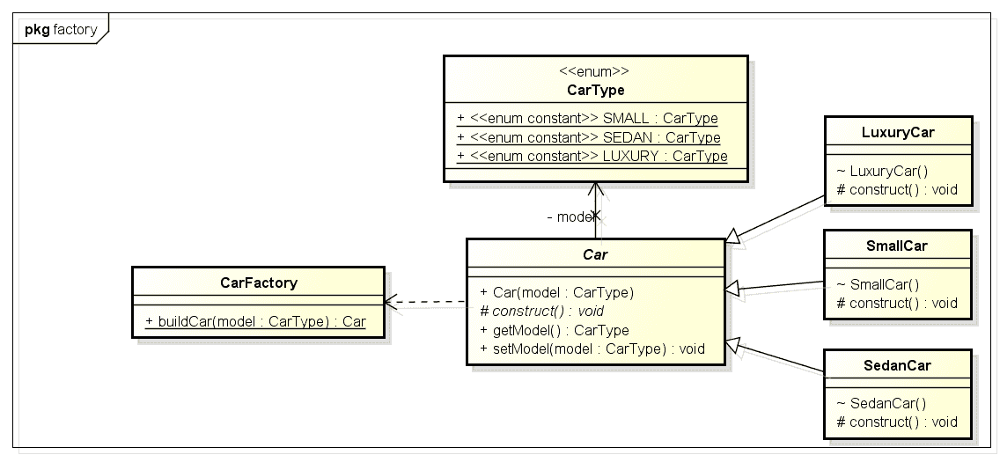

# Java 工厂模式说明

> 原文： [https://howtodoinjava.com/design-patterns/creational/implementing-factory-design-pattern-in-java/](https://howtodoinjava.com/design-patterns/creational/implementing-factory-design-pattern-in-java/)

在 Java 中创建类实例的最常用方法是什么？ 大多数人会回答这个问题：“ *使用新关键字*”。 好吧，它现在被认为是老式的。 让我们看看如何？

如果对象创建代码散布在整个应用程序中，并且如果您需要更改对象创建过程，则需要在每个地方进行必要的更改。 在完成本文之后，在编写应用程序时，请考虑使用 **Java 工厂模式**。

在我以前的文章“ Java 中的 **[单例设计模式”中，我们讨论了创建类实例的各种方法，以使同一 JVM 中不存在同一类的另一个实例。 。](//howtodoinjava.com/design-patterns/singleton-design-pattern-in-java/ "Singleton design pattern in java")**

在这篇文章中，我将演示另一个创建模式，即[工厂模式](https://en.wikipedia.org/wiki/Factory_method_pattern "Factory pattern")，用于为您的类创建实例。 顾名思义，工厂是一个创建一些不同产品的地方，这些产品在功能上有些相似，但又分为几类。

在 Java 中，工厂模式用于创建相同类型的不同类的实例。

```java
Table of Contents

1\. When to implement factory pattern?
2\. Factory Pattern Implementation
3\. Advantages of factory pattern
4\. Final notes
```

## 1.什么时候使用工厂模式？

工厂模式引入了**类之间的松散耦合**，这是在设计应用程序体系结构时应考虑并应用的最重要的原理。 通过针对抽象实体（而不是具体的实现）进行编程，可以在应用程序体系结构中引入松耦合。 这不仅使我们的体系结构更加灵活，而且不那么脆弱。

一张图片胜过千言万语。 让我们看看工厂实施的样子。

[](https://howtodoinjava.files.wordpress.com/2012/10/class_diagram_of_factory_pattern_in_java1.png)

上图以汽车工厂为例描述了一种常见情况，该工厂能够制造 3 种类型的汽车，即小型，轿车和豪华型汽车。 制造汽车需要从分配配件到最终化妆的许多步骤。 这些步骤可以作为方法编写在程序中，并在创建特定汽车类型的实例时调用。

如果很不幸，那么我们将在我们的应用程序类中创建汽车类型的实例（例如`SmallCar`），因此我们会将汽车制造逻辑暴露给外界，这当然不好。 这也阻止了我们对汽车制造过程的更改，因为代码不是集中的，并且在所有组成类中进行更改似乎都不可行。

## 2\. Java 工厂模式示例

到目前为止，我们已经设计了用于制造 **CarFactory** 的类。 现在创建它们。

#### 2.1。 对象类型

`CarType`将保留汽车类型，并将为所有其他类别提供汽车类型。

```java
package designPatterns.creational.factory;

public enum CarType {
    SMALL, SEDAN, LUXURY
}

```

#### 2.2。 对象实现

`Car`是所有汽车实例的父类，并且还将包含适用于所有类型汽车的通用逻辑。

```java
package designPatterns.creational.factory;

public abstract class Car {

	public Car(CarType model) {
		this.model = model;
		arrangeParts();
	}

	private void arrangeParts() {
		// Do one time processing here
	}

	// Do subclass level processing in this method
	protected abstract void construct();

	private CarType model = null;

	public CarType getModel() {
		return model;
	}

	public void setModel(CarType model) {
		this.model = model;
	}
}

```

`LuxuryCar`是`LUXURY`型汽车的具体实现。

```java
package designPatterns.creational.factory;

public class LuxuryCar extends Car {

	LuxuryCar() {
		super(CarType.LUXURY);
		construct();
	}

	@Override
	protected void construct() {
		System.out.println("Building luxury car");
		// add accessories
	}
}

```

`SmallCar`是`SMALL`型汽车的具体实现。

```java
package designPatterns.creational.factory;

public class SmallCar extends Car {

	SmallCar() {
		super(CarType.SMALL);
		construct();
	}

	@Override
	protected void construct() {
		System.out.println("Building small car");
		// add accessories
	}
}

```

`SedanCar`是`SEDAN`型汽车的具体实现。

```java
package designPatterns.creational.factory;

public class SedanCar extends Car {

	SedanCar() {
		super(CarType.SEDAN);
		construct();
	}

	@Override
	protected void construct() {
		System.out.println("Building sedan car");
		// add accessories
	}
}

```

#### 2.3。 工厂创建对象

`CarFactory.java`是我们使用工厂模式实现的主要类。 仅在确定实例类型之后，才会实例化实例。

```java
package designPatterns.creational.factory;

public class CarFactory {
	public static Car buildCar(CarType model) {
		Car car = null;
		switch (model) {
		case SMALL:
			car = new SmallCar();
			break;

		case SEDAN:
			car = new SedanCar();
			break;

		case LUXURY:
			car = new LuxuryCar();
			break;

		default:
			// throw some exception
			break;
		}
		return car;
	}
}

```

#### 2.4。 测试工厂模式

在`TestFactoryPattern`中，我们将测试我们的工厂代码。 让我们运行这个类。

```java
package designPatterns.creational.factory;

public class TestFactoryPattern {
	public static void main(String[] args) {
		System.out.println(CarFactory.buildCar(CarType.SMALL));
		System.out.println(CarFactory.buildCar(CarType.SEDAN));
		System.out.println(CarFactory.buildCar(CarType.LUXURY));
	}
}

```

程序输出。

```java
Building small car
designPatterns.creational.factory.SmallCar@7c230be4
Building sedan car
designPatterns.creational.factory.SedanCar@60e1e567
Building luxury car
designPatterns.creational.factory.LuxuryCar@e9bfee2

```

如您所见，工厂可以退回所要求的任何类型的汽车实例。 这将帮助我们在汽车制造过程中进行任何形式的更改，甚至无需触及组成类，即使用`CarFactory`的类。

## 3.工厂模式的好处

到目前为止，您应该能够算出使用工厂模式的主要优势。 让我们记下：

1.  对象的创建可避免其重用，而无需大量重复代码。
2.  创建对象需要访问不应包含在组成类中的信息或资源。
3.  必须集中管理所生成对象的生命周期管理，以确保应用程序内行为的一致性。

## 4.最后的笔记

**工厂模式最适合涉及一些复杂的对象创建步骤的地方**。 为确保这些步骤集中进行，并且不暴露于编写类中，应使用工厂模式。 我们可以在 JDK 本身中看到许多实时的工厂模式示例，例如

*   [java.sql.DriverManager＃getConnection（）](https://docs.oracle.com/javase/10/docs/api/java/sql/DriverManager.html#getConnection%28java.lang.String%29 "driver manager get connection")
*   [java.net.URL＃openConnection（）](https://docs.oracle.com/javase/10/docs/api/java/net/URL.html#openConnection%28%29 "url open connection")
*   [java.lang.Class＃newInstance（）](https://docs.oracle.com/javase/10/docs/api/java/lang/Class.html#newInstance%28%29 "class new instance")
*   [java.lang.Class＃forName（）](https://docs.oracle.com/javase/10/docs/api/java/lang/Class.html#forName%28java.lang.String%29 "class forname")

希望我在此 **Java 工厂模式示例**中包含了足够的信息，以使该帖子内容丰富。

如果您对 Java 中的抽象工厂设计模式仍有疑问，请发表评论。 我很乐意与您讨论。

学习愉快！